# Flowchart Web App NUSANTARAYA

## Navigasi Utama Sejarah, Aksara, Narasi, Tradisi, Alam, Rasa, dan Yatra

### Tagline

**Satu Peta, Ribuan Cerita**

---

# 1. Flowchart Utama Web App NUSANTARAYA

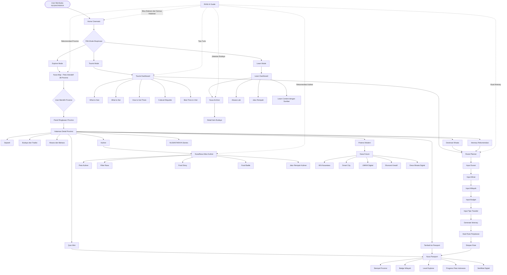

---

# 2. Flowchart Sitemap dan Struktur Navigasi

```mermaid
flowchart TD
    A[NUSANTARAYA] --> B[Beranda]
    A --> C[Jelajahi]
    A --> D[Budaya]
    A --> E[Wisata]
    A --> F[Kuliner]
    A --> G[Masa Depan]
    A --> H[Passport]
    A --> I[Events]
    A --> J[Tentang]
    A --> K[RANI AI Guide]

    B --> B1[Hero Cinematic]
    B --> B2[Preview Peta]
    B --> B3[Highlight 7 Pilar]
    B --> B4[Preview Fitur Utama]
    B --> B5[CTA Mulai Jelajah]

    C --> C1[Nusa Map 38 Provinsi]
    C --> C2[Per Wilayah]
    C --> C3[Detail Provinsi]
    C2 --> C21[Sumatera]
    C2 --> C22[Jawa]
    C2 --> C23[Kalimantan]
    C2 --> C24[Sulawesi]
    C2 --> C25[Bali dan Nusa Tenggara]
    C2 --> C26[Maluku]
    C2 --> C27[Papua]

    D --> D1[Nusa Archive]
    D --> D2[Nusa Aksara Lab]
    D --> D3[Nusa Jalur Rempah]
    D --> D4[Nusa 3D Gallery]
    D1 --> D11[Rumah Adat]
    D1 --> D12[Tarian]
    D1 --> D13[Alat Musik]
    D1 --> D14[Pakaian Adat]
    D1 --> D15[Upacara Adat]
    D1 --> D16[Cerita Rakyat]
    D1 --> D17[Aksara dan Bahasa]
    D1 --> D18[Kerajinan]

    E --> E1[Route Planner]
    E --> E2[Rute Populer]
    E --> E3[Heritage Trail]
    E --> E4[Destinasi Wisata]

    F --> F1[NusaRasa Atlas]
    F --> F2[Peta Kuliner]
    F --> F3[Food Battle]
    F --> F4[Jalur Rempah Kuliner]
    F --> F5[Hidden Food Gems]

    G --> G1[IKN Nusantara]
    G --> G2[Smart City Indonesia]
    G --> G3[UMKM Digital]
    G --> G4[Ekonomi Kreatif]
    G --> G5[Desa Wisata Digital]
    G --> G6[Green Tourism]

    H --> H1[Dashboard Passport]
    H --> H2[Koleksi Stempel]
    H --> H3[Koleksi Badge]
    H --> H4[Level Explorer]
    H --> H5[Sertifikat Digital]

    I --> I1[Kalender Festival]
    I --> I2[Filter Bulan]
    I --> I3[Filter Wilayah]
    I --> I4[Detail Event]
    I --> I5[Simpan ke Itinerary]

    J --> J1[Visi Misi]
    J --> J2[Tujuan Produk]
    J --> J3[Sumber Data]
    J --> J4[Roadmap]

    K --> K1[Chat Rekomendasi]
    K --> K2[Itinerary Generator]
    K --> K3[Culture Explainer]
    K --> K4[Food Recommender]
    K --> K5[Tourist Assistant]
```

---

# 3. Flowchart Nusa Map dan Detail Provinsi

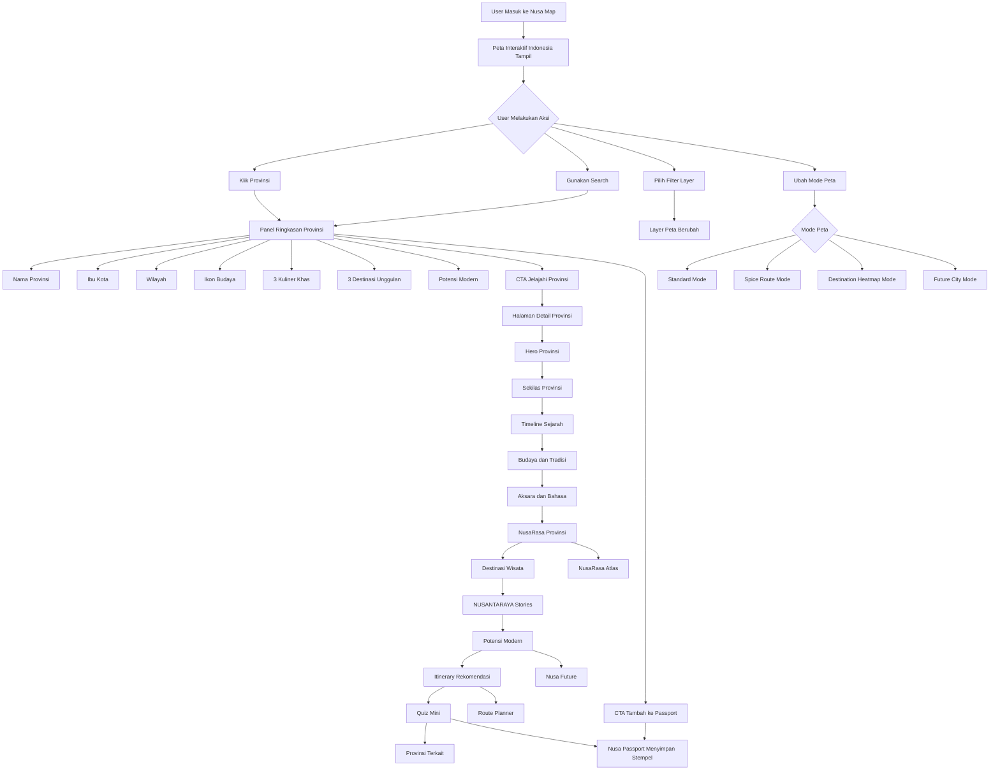

---

# 4. Flowchart RANI AI Guide

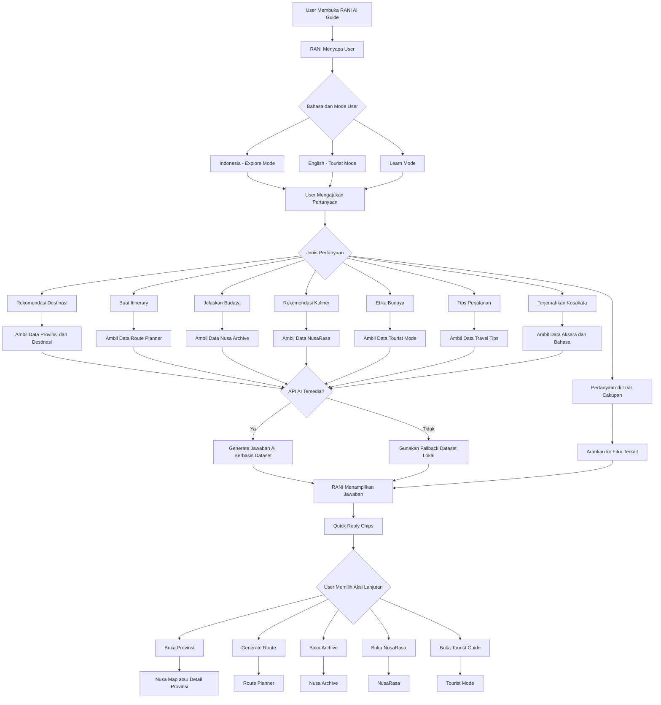

---

# 5. Flowchart Route Planner

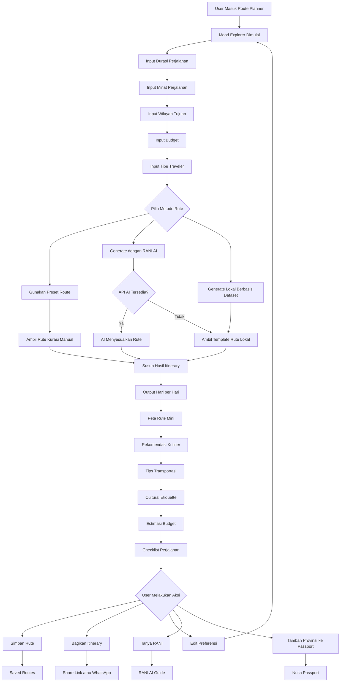

---

# 6. Flowchart Nusa Passport

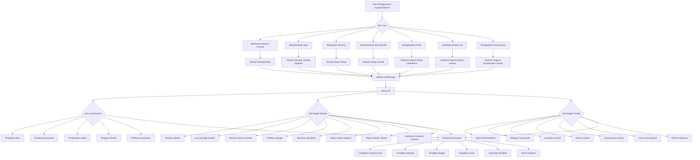

---

# 7. Flowchart Nusa Archive

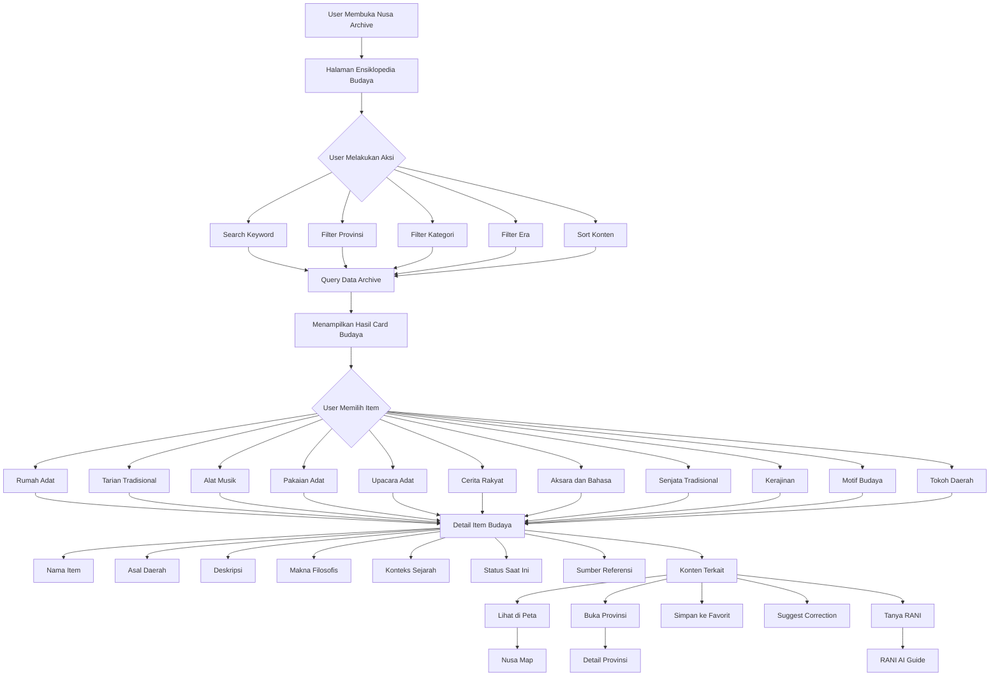

---

# 8. Flowchart NusaRasa Atlas Kuliner

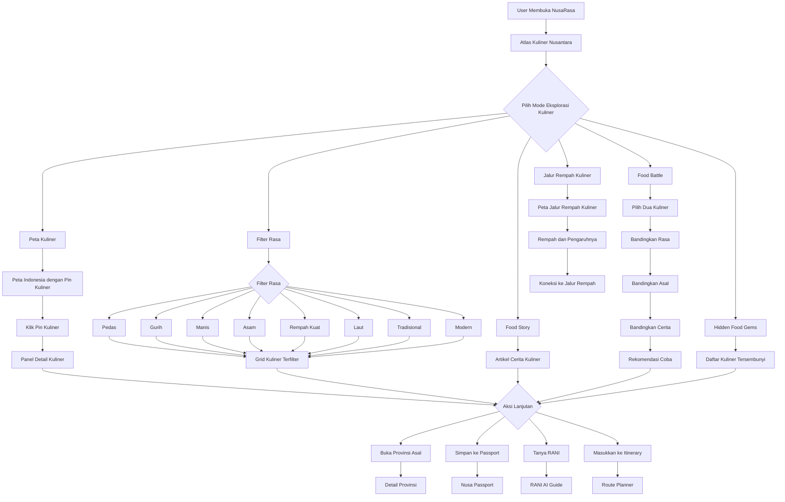

---

# 9. Flowchart Nusa Future

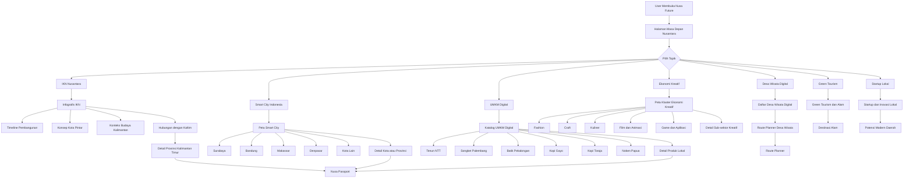

---

# 10. Flowchart Bilingual dan Tourist Mode

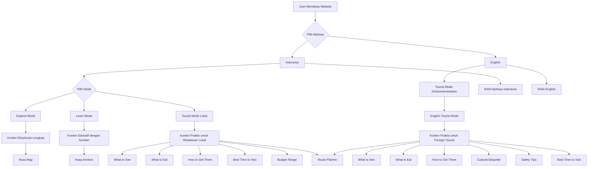

---

# 11. Flowchart Aksara Lab

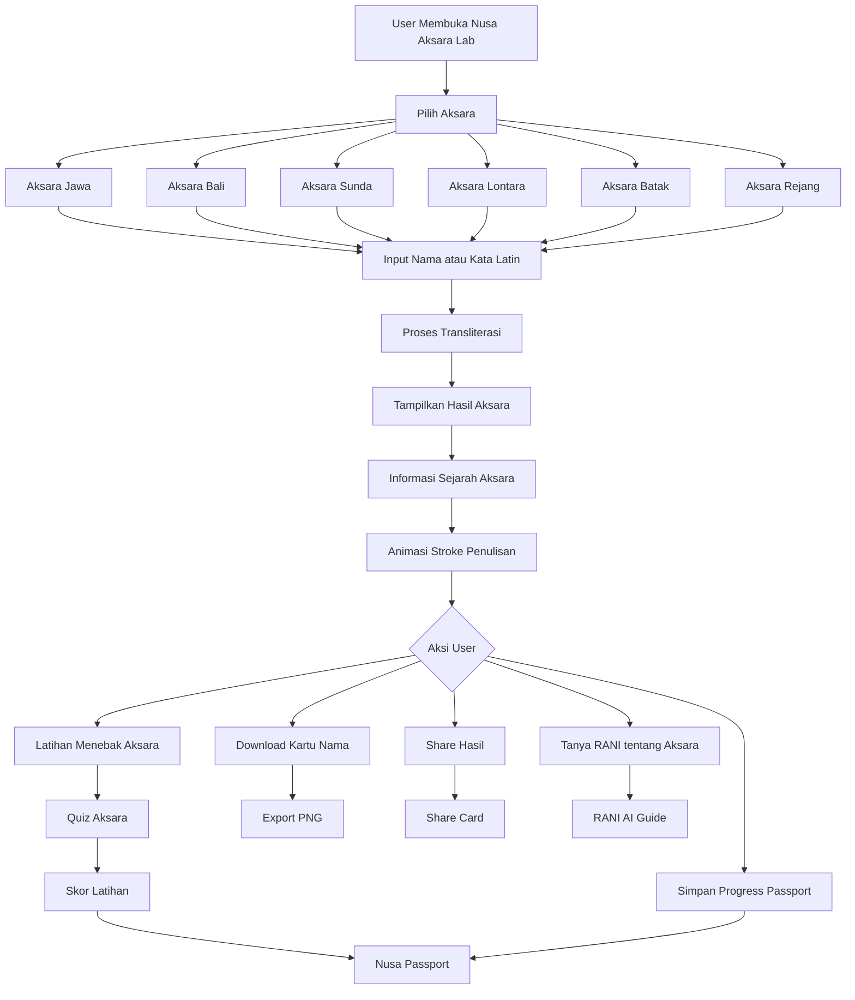

---

# 12. Flowchart Soundscape

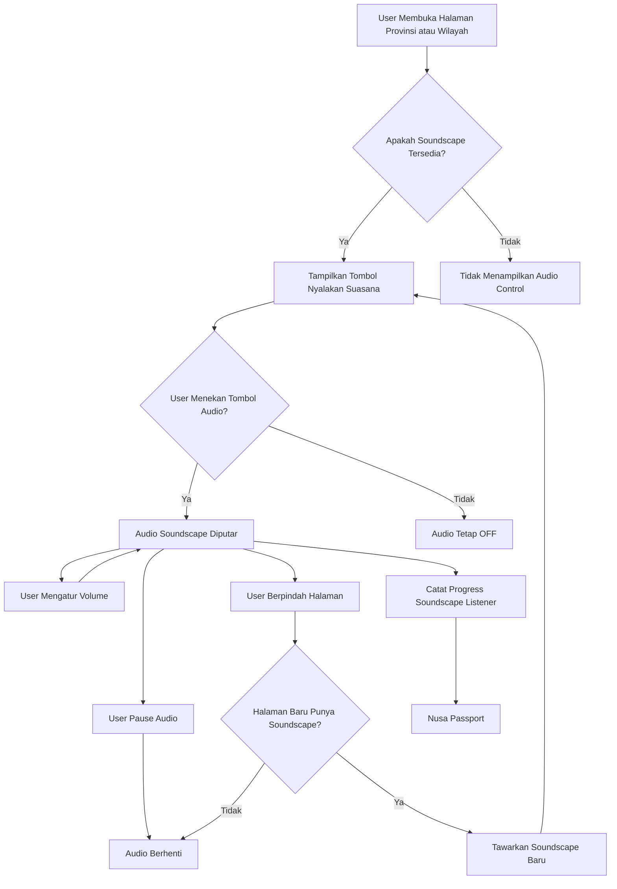

---

# 13. Flowchart Event Calendar

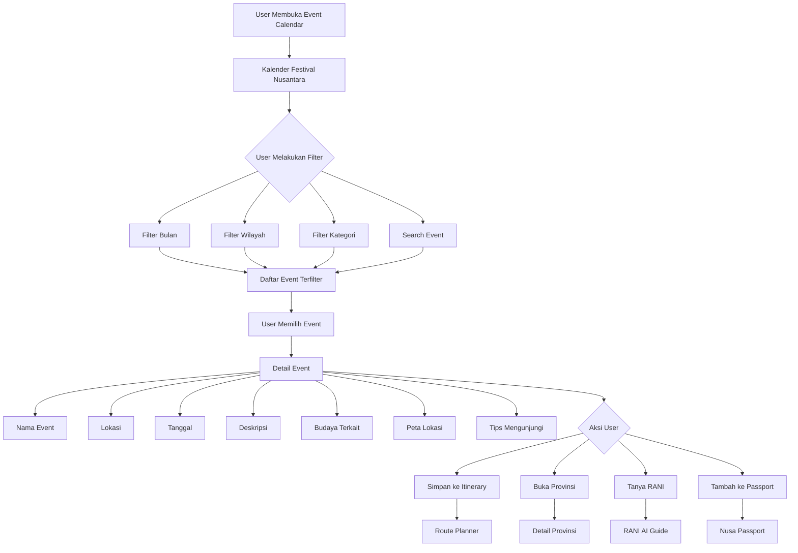

---

# 14. Flowchart Data dan Konten

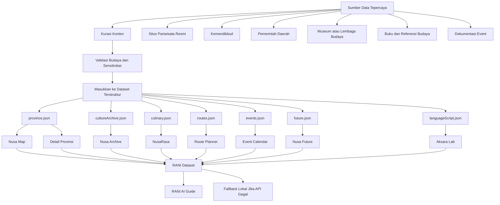

---

# 15. Flowchart Demo Juri 10 Menit

```mermaid
flowchart TD
    A([Mulai Presentasi]) --> B[Home Cinematic]
    B --> C[Tampilkan Tagline: Satu Peta Ribuan Cerita]
    C --> D[Klik Mulai Jelajah]
    D --> E[Nusa Map 38 Provinsi]

    E --> F[Pilih Provinsi Flagship]
    F --> G[Panel Ringkasan Provinsi]
    G --> H[Masuk Detail Provinsi]

    H --> I[Tunjukkan Sejarah]
    I --> J[Tunjukkan Budaya dan Tradisi]
    J --> K[Tunjukkan Kuliner]
    K --> L[Tunjukkan Destinasi]
    L --> M[Tunjukkan Potensi Modern]

    M --> N[Buka Route Planner]
    N --> O[Generate Itinerary 5 Hari]
    O --> P[Tampilkan Rute dan Tips]

    P --> Q[Buka RANI AI Guide]
    Q --> R[Tanya Rekomendasi atau Etika Budaya]
    R --> S[RANI Menjawab dan Mengarahkan]

    S --> T[Jawab Quiz Mini]
    T --> U[Dapat Stempel Passport]
    U --> V[Buka Dashboard Passport]

    V --> W[Buka Nusa Future]
    W --> X[Tunjukkan IKN, Smart City, UMKM Digital]

    X --> Y[Aktifkan English Tourist Mode]
    Y --> Z[Tampilkan Konten Turis Internasional]

    Z --> AA[Closing Pitch]
    AA --> AB([Selesai])
```

---

# 16. Flowchart Roadmap Pengembangan

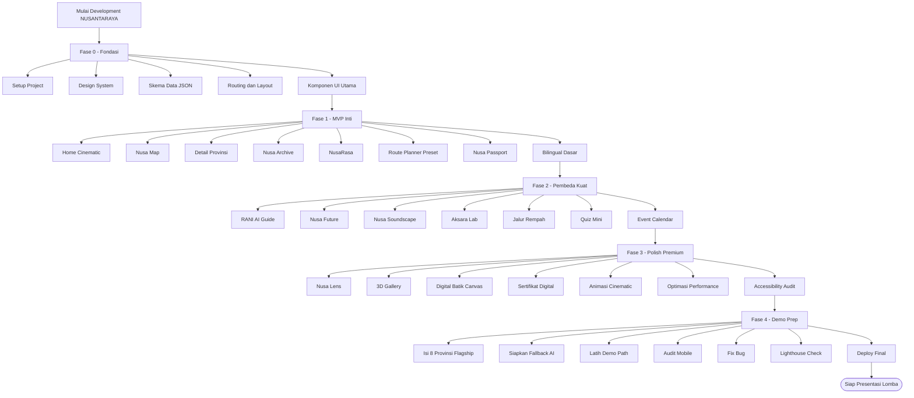

---

# 17. Flowchart Arsitektur Teknis

```mermaid
flowchart TD
    A[Frontend Web App] --> B[Next.js atau React]
    B --> C[Routing Pages]
    B --> D[Reusable Components]
    B --> E[State Management]
    B --> F[Animation Layer]
    B --> G[Internationalization]

    C --> C1[Home]
    C --> C2[Explore Map]
    C --> C3[Province Detail]
    C --> C4[Route Planner]
    C --> C5[Archive]
    C --> C6[NusaRasa]
    C --> C7[Passport]
    C --> C8[Future]

    D --> D1[Card]
    D --> D2[Button]
    D --> D3[Modal]
    D --> D4[Bottom Sheet]
    D --> D5[Map Panel]
    D --> D6[Badge]
    D --> D7[Timeline]
    D --> D8[Search Filter]

    E --> E1[localStorage Passport]
    E --> E2[User Mode]
    E --> E3[Language State]
    E --> E4[Saved Routes]
    E --> E5[Audio State]

    F --> F1[Framer Motion]
    F --> F2[GSAP]
    F --> F3[Scroll Reveal]
    F --> F4[Map Hover Animation]

    G --> G1[ID Content]
    G --> G2[EN Content]
    G --> G3[Tourist Mode Content]

    A --> H[Data Layer]
    H --> H1[province.json]
    H --> H2[cultureArchive.json]
    H --> H3[culinary.json]
    H --> H4[routes.json]
    H --> H5[events.json]
    H --> H6[future.json]
    H --> H7[aksara.json]

    A --> I[Map Layer]
    I --> I1[SVG Indonesia Map]
    I --> I2[Leaflet atau Mapbox Mini Map]

    A --> J[AI Layer]
    J --> J1[RANI UI]
    J --> J2[LLM API]
    J --> J3[RAG Dataset]
    J --> J4[Fallback Local Answer]

    A --> K[Media Layer]
    K --> K1[Optimized Images]
    K --> K2[Soundscape Audio]
    K --> K3[3D Model Lazy Load]
    K --> K4[OpenGraph Assets]

    A --> L[Deployment]
    L --> L1[Vercel atau Netlify]
    L --> L2[Domain .ID]
    L --> L3[SEO Sitemap]
```

---

# 18. Flowchart Error Handling dan Fallback

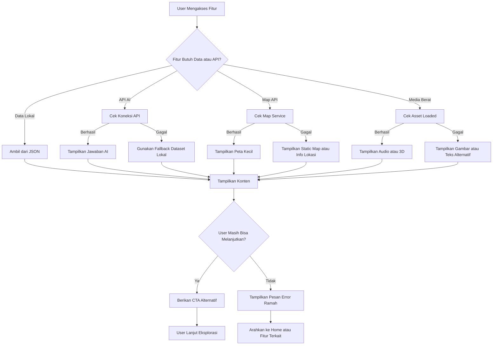

---

# 19. Flowchart Keterhubungan 7 Pilar NUSANTARAYA

```mermaid
flowchart TD
    A[NUSANTARAYA] --> B[Navigasi Utama]
    B --> C[Nusa Map 38 Provinsi]

    C --> D[S - Sejarah]
    C --> E[A - Aksara]
    C --> F[N - Narasi]
    C --> G[T - Tradisi]
    C --> H[A - Alam]
    C --> I[R - Rasa]
    C --> J[Y - Yatra]

    D --> D1[Timeline Provinsi]
    D --> D2[Jalur Rempah]
    D --> D3[Tokoh Daerah]
    D --> D4[Situs Warisan]

    E --> E1[Aksara Lab]
    E --> E2[Bahasa Lokal]
    E --> E3[Audio Pengucapan]
    E --> E4[Transliterasi]

    F --> F1[NUSANTARAYA Stories]
    F --> F2[Cerita Rakyat]
    F --> F3[Micro Story]
    F --> F4[Narasi Daerah]

    G --> G1[Rumah Adat]
    G --> G2[Tarian]
    G --> G3[Alat Musik]
    G --> G4[Festival]
    G --> G5[Soundscape]

    H --> H1[Destinasi Alam]
    H --> H2[Hidden Gems]
    H --> H3[Green Tourism]
    H --> H4[Desa Wisata]

    I --> I1[NusaRasa]
    I --> I2[Peta Kuliner]
    I --> I3[Food Battle]
    I --> I4[Bumbu Nusantara]

    J --> J1[Route Planner]
    J --> J2[Nusa Passport]
    J --> J3[RANI AI Guide]
    J --> J4[Nusa Future]
```

---

# 20. Ringkasan Alur Produk

NUSANTARAYA dimulai dari **Home Cinematic** sebagai pintu masuk emosional. User kemudian memilih mode eksplorasi sesuai kebutuhan: Explore Mode, Tourist Mode, atau Learn Mode. Dari sana, pusat pengalaman diarahkan ke **Nusa Map**, yaitu peta interaktif 38 provinsi yang menghubungkan seluruh fitur.

Setiap provinsi memiliki halaman detail yang menampilkan sejarah, budaya, aksara, kuliner, destinasi, cerita, potensi modern, itinerary, dan quiz. Aktivitas user di dalam web akan masuk ke **Nusa Passport**, sehingga eksplorasi terasa seperti perjalanan digital yang punya progress.

Untuk kebutuhan perjalanan nyata, user dapat menggunakan **Route Planner** dan dibantu oleh **RANI AI Guide**. Untuk eksplorasi edukatif, user dapat membuka **Nusa Archive**, **Nusa Aksara Lab**, dan **Nusa Jalur Rempah**. Untuk pengalaman visual dan emosional, user dapat menikmati **NusaRasa**, **Soundscape**, **3D Gallery**, dan **Digital Batik Canvas**. Untuk menjawab tema Digital City, web menyediakan **Nusa Future** yang membahas IKN, smart city, UMKM digital, ekonomi kreatif, dan desa wisata digital.

Dengan alur ini, NUSANTARAYA tidak hanya menjadi website informasi, tetapi menjadi ekosistem eksplorasi digital Indonesia yang lengkap, imersif, dan siap dipresentasikan sebagai produk lomba yang menargetkan Juara 1.

---
