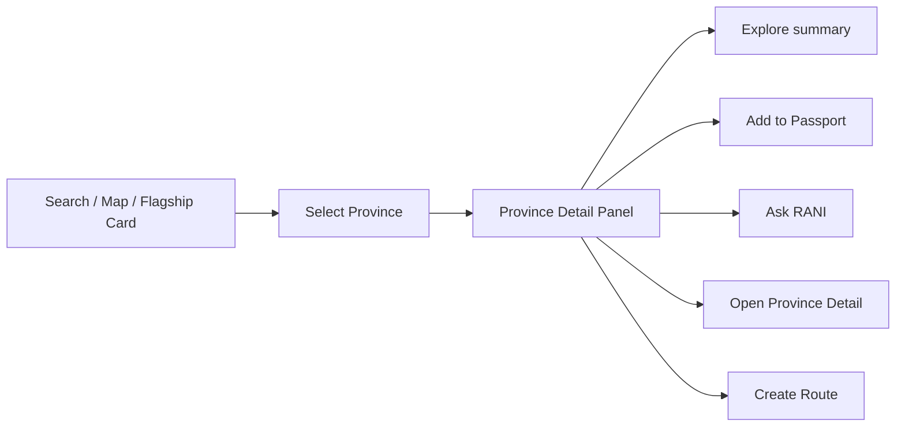

# Planning Lengkap — Province Detail Panel / Bottom Sheet NUSANTARAYA

<aside>
🪟

**Source of truth untuk Section 4 — Province Detail Panel / Bottom Sheet pada halaman Nusa Map NUSANTARAYA.** Komponen ini mengubah pilihan provinsi dari peta menjadi ringkasan yang informatif, visual, cepat dipahami, dan terasa premium—tanpa menggantikan halaman detail provinsi.

</aside>

---

## 1. Ringkasan Eksekutif

**Province Detail Panel / Bottom Sheet** adalah lapisan eksplorasi yang muncul setelah user memilih provinsi dari Interactive Indonesia Map, hasil pencarian, kartu flagship, atau daftar provinsi aksesibel.

Komponen ini bukan modal informasi biasa. Ia harus terasa seperti **curated digital travel-and-culture dossier**: sebuah editorial mini portal yang menyajikan identitas provinsi, budaya, rasa, destinasi, dan potensi masa depan secara bertahap dalam satu panel yang cepat, kaya visual, tetapi tidak padat berlebihan.

Jika Interactive Indonesia Map menjawab:

> “Provinsi mana yang ingin saya jelajahi?”
> 

Maka panel ini menjawab:

> “Apa identitas provinsi ini, apa yang paling menarik, dan ke mana saya harus melanjutkan?”
> 

### 1.1 Konsep final

```
The Curated Province Dossier
```

Versi Indonesia:

```
Dossier provinsi terkurasi yang menghubungkan identitas, budaya, rasa, perjalanan, dan masa depan.
```

### 1.2 Target rasa pengalaman

- **Premium editorial:** seperti museum digital dan travel publication kelas atas.
- **App-like:** state, tombol, tab, dan feedback terasa nyata.
- **Informatif:** user memahami karakter provinsi dalam 10–20 detik.
- **Cinematic:** hero image, gradient, typography, dan motion membangun atmosfer.
- **Progressive disclosure:** informasi penting tampil dahulu; detail tambahan muncul saat diperlukan.
- **Context-preserving:** user tetap merasa berada di dalam pengalaman peta.
- **Action-oriented:** selalu jelas langkah berikutnya—jelajahi, simpan Passport, buat rute, atau tanya RANI.

### 1.3 Hasil akhir yang diharapkan

Dalam satu panel, user harus bisa:

1. Mengenali provinsi dan wilayahnya.
2. Memahami satu kalimat identitas utama.
3. Melihat highlight budaya, kuliner, destinasi, dan potensi modern.
4. Mengetahui apakah provinsi termasuk flagship dan kedalaman kontennya.
5. Menyesuaikan informasi berdasarkan Explore, Tourist, atau Learn Mode.
6. Menyimpan provinsi ke Passport.
7. Masuk ke halaman detail provinsi tanpa kehilangan konteks.

---

## 2. Hubungan dengan Sistem Nusa Map

Urutan halaman `/explore`:

```
1. Map Hero / Page Header
2. Explore Control Bar
3. Interactive Indonesia Map
4. Province Detail Panel / Bottom Sheet ← dokumen ini
5. Flagship Provinces
6. Explore by Layer
7. Recommended Journey
8. Regional Explorer
9. Passport Progress
10. RANI Map Assistant
11. Final CTA
```

### 2.1 Peran dalam user journey



### 2.2 Batas tanggung jawab

| Lapisan | Tanggung jawab |
| --- | --- |
| Interactive Map | Memilih, menyorot, dan memberi konteks geografis provinsi. |
| Province Panel | Memberi ringkasan terkurasi, perbandingan cepat, dan jalur tindakan. |
| Province Detail Page | Menampilkan mini portal lengkap dengan 12 section. |

Panel tidak boleh mencoba memuat seluruh isi halaman detail. Target panel adalah **cukup kaya untuk meyakinkan, cukup ringkas untuk tetap cepat**.

### 2.3 Dokumen terkait

- [Planning Lengkap — Interactive Indonesia Map NUSANTARAYA](https://app.notion.com/p/Planning-Lengkap-Interactive-Indonesia-Map-NUSANTARAYA-a6aef2d2c0cf483a8def5e4df8a65ffb?pvs=21)
- [PRD NUSANTARAYA FIX](https://app.notion.com/p/PRD-NUSANTARAYA-FIX-165098210a3c83fea99181f526f0367e?pvs=21)
- [Konsep Logo & Identitas Visual NUSANTARAYA](https://app.notion.com/p/Konsep-Logo-Identitas-Visual-NUSANTARAYA-a87098210a3c8354abde01087aabdec8?pvs=21)
- [Roadmap & Workflow Pengembangan NUSANTARAYA](https://app.notion.com/p/Roadmap-Workflow-Pengembangan-NUSANTARAYA-02a098210a3c83dfb7688147846399f4?pvs=21)

---

## 3. Tujuan Produk, UX, dan Demo

### 3.1 Tujuan pengguna

User dapat:

- Mendapat gambaran provinsi tanpa berpindah halaman.
- Menemukan alasan kuat untuk membuka detail.
- Berpindah ke provinsi lain dengan cepat.
- Melihat konten yang relevan dengan mode dan layer aktif.
- Menyimpan progres eksplorasi.
- Memulai rute atau percakapan kontekstual.

### 3.2 Tujuan emosional

User harus merasa:

```
Saya baru saja membuka pintu kecil menuju sebuah provinsi.
Informasinya kaya, tetapi tidak membuat kewalahan.
Setiap provinsi punya karakter visual dan cerita yang berbeda.
Saya ingin melihat provinsi berikutnya.
```

### 3.3 Tujuan demo lomba

- Menjadi payoff setelah interaksi peta.
- Membuktikan data provinsi benar-benar hidup, bukan sekadar SVG clickable.
- Memperlihatkan hubungan warisan, masa kini, dan masa depan.
- Menunjukkan personalisasi tiga mode pengguna.
- Mengarahkan juri ke halaman detail, Passport, Route Planner, dan RANI.

### 3.4 KPI pengalaman

| Metrik | Target |
| --- | --- |
| Waktu memahami identitas provinsi | ≤ 10 detik |
| Panel open setelah selection | Feedback visual ≤ 100 ms; konten utama ≤ 500 ms bila aset tersedia |
| Province detail CTR | ≥ 35% dari panel yang dibuka |
| Add to Passport | ≥ 20% dari panel flagship |
| Provinsi dibuka per sesi | ≥ 3 |
| Close tanpa aksi | Dipantau; target ≤ 55% |
| Error gambar/data | 0 broken state tanpa fallback |

---

## 4. Prinsip Desain Utama

### 4.1 Prinsip 1 — Identitas sebelum inventaris

Jangan langsung menampilkan daftar panjang. Urutkan pengalaman sebagai:

```
Identitas → alasan menarik → highlight terkurasi → aksi berikutnya
```

### 4.2 Prinsip 2 — Satu visual hero yang kuat

Hero image adalah pembuka atmosfer. Jangan menampilkan mosaic enam gambar sekaligus pada viewport pertama.

### 4.3 Prinsip 3 — Progressive disclosure

- Peek state: nama, region, hero, tagline.
- Medium state: fakta utama dan highlight.
- Full state: tab lengkap dan action area.
- Detail panjang: pindah ke halaman provinsi.

### 4.4 Prinsip 4 — Mode mengubah prioritas, bukan identitas

Desain dasar tetap konsisten. Explore/Tourist/Learn hanya mengubah urutan informasi, CTA utama, dan microcopy.

### 4.5 Prinsip 5 — Panel menyatu dengan peta

- Warna selection di peta hadir sebagai accent tipis pada panel.
- Menutup panel tidak harus menghapus selection.
- Pergantian provinsi tidak menutup lalu membuka ulang container; isi cukup crossfade.

### 4.6 Prinsip 6 — Premium berarti terkurasi

Premium bukan berarti banyak glass, glow, atau ornamen. Premium dibangun melalui:

- Hierarki jelas.
- Foto konsisten.
- Ruang napas.
- Typography editorial.
- Motion tenang.
- Copy ringkas dan spesifik.
- State yang matang.

---

## 5. Scope dan Prioritas

### 5.1 Wajib ada — MVP

- Panel desktop dan bottom sheet mobile.
- Hero image dengan fallback.
- Nama, ibu kota, region, tagline, tier/flagship.
- 3 highlight budaya.
- 3 kuliner.
- 3 destinasi.
- 1–3 potensi modern.
- CTA Jelajahi Provinsi.
- CTA Tambah ke Passport.
- Close action dan keyboard Escape.
- Loading, error, dan missing data state.

### 5.2 Recommended

- Tab Ringkasan, Budaya, Rasa, Destinasi, Masa Depan.
- Mode-aware content ordering.
- Tourist quick facts.
- Learn source count.
- Ask RANI action.
- Previous/next province navigation.
- Snap points mobile.
- Lazy loading supporting image.
- Toast Passport.

### 5.3 Premium polish

- Hero focal point per provinsi.
- Subtle regional accent.
- Image crossfade per tab.
- Related province rail.
- Route Planner context handoff.
- Share deep link.
- Analytics lengkap.
- Haptic feedback ringan pada perangkat yang mendukung.

### 5.4 Di luar scope panel

- Timeline sejarah penuh.
- Semua item budaya dan destinasi.
- Peta jalan interaktif.
- Quiz lengkap.
- Artikel panjang.
- Audio autoplay.
- Form kontribusi.
- Seluruh 12 section detail provinsi.

---

## 6. Information Architecture

### 6.1 Urutan informasi final

1. **System controls:** drag handle mobile, close, previous/next optional.
2. **Hero visual:** image, gradient, flagship/tier badge.
3. **Province identity:** name, official name optional, region, capital.
4. **Editorial statement:** tagline + summary 1–2 kalimat.
5. **Quick facts:** capital, language, best known for, source count/mode-specific item.
6. **Highlight tabs:** Ringkasan, Budaya, Rasa, Destinasi, Masa Depan.
7. **Contextual tip:** tourist tip atau learn note.
8. **Primary actions:** Jelajahi Provinsi, Passport.
9. **Secondary actions:** Buat Rute, Tanya RANI, Bagikan.
10. **Related navigation:** provinsi sebelumnya/berikutnya atau wilayah terkait.

### 6.2 Konten viewport pertama desktop

Tanpa scroll, user idealnya melihat:

- 35–42% hero.
- Nama provinsi dan region.
- Tagline.
- Quick facts.
- Awal tab/highlight.
- Indikasi CTA di bawah.

### 6.3 Konten peek state mobile

Pada snap 32–36%:

- Drag handle.
- Nama provinsi.
- Region + ibu kota.
- Tagline satu baris.
- Primary CTA ringkas atau chevron “Lihat ringkasan”.
- Sebagian hero atau thumbnail horizontal.

### 6.4 Konten medium state mobile

Pada snap 62–68%:

- Hero penuh.
- Identitas.
- Quick facts.
- Horizontal tabs.
- 3 highlight aktif.
- CTA sticky terlihat.

### 6.5 Konten full state mobile

Pada snap 90–94%:

- Seluruh ringkasan.
- Semua tab bisa diakses.
- Tip dan source note.
- Secondary actions.
- Related province.

---

## 7. Anatomi Visual Desktop

### 7.1 Rekomendasi layout final

```
┌─────────────────────────────────────────────────────────────┐
│ Interactive Map                          ┌─────────────────┐ │
│ Map bergeser ringan                      │ ×      Flagship │ │
│                                          │                 │ │
│ [Selected province tetap terlihat]       │  HERO IMAGE     │ │
│                                          │  gradient       │ │
│                                          ├─────────────────┤ │
│                                          │ DI Yogyakarta   │ │
│                                          │ Jawa · Yogyakarta│ │
│                                          │ Jantung budaya… │ │
│                                          │                 │ │
│                                          │ [Quick Facts]   │ │
│                                          │ [Tabs........]  │ │
│                                          │ [3 highlights]  │ │
│                                          │                 │ │
│                                          │ [Jelajahi]      │ │
│                                          │ [Passport]      │ │
│                                          └─────────────────┘ │
└─────────────────────────────────────────────────────────────┘
```

### 7.2 Dimensi desktop

| Viewport | Lebar panel | Catatan |
| --- | --- | --- |
| ≥ 1440px | 420–460px | Ideal 440px; map masih dominan. |
| 1280–1439px | 390–430px | Padding panel 24–28px. |
| 1024–1279px | 350–390px | Quick facts 2 kolom; secondary action disederhanakan. |

### 7.3 Posisi

Rekomendasi utama:

```
Docked overlay di sisi kanan map card
```

- Top dan bottom mengikuti inner boundary map card.
- Radius 28–32px.
- Tidak menempel langsung ke tepi viewport.
- Gap ke map 12–20px jika layout split; 0 jika panel menjadi sisi kanan internal map card.

### 7.4 Scroll strategy

- Panel container tetap.
- Hero dan identity ikut scroll secara normal.
- Action bar boleh sticky di bawah setelah user melewati identity.
- Jangan memakai dua area scroll vertikal di dalam panel.
- Scrollbar tipis dan tidak terlalu kontras.

### 7.5 Map response

Saat panel terbuka:

- Peta bergeser 8–14% ke kiri atau menyesuaikan transform origin.
- Selected province tetap terlihat.
- Jangan zoom ekstrem.
- Jika selected province berada di timur, auto-pan cukup agar tidak tertutup panel.

---

## 8. Anatomi Visual Tablet

### 8.1 Portrait tablet

Gunakan bottom sheet atau overlay 46–52% lebar. Rekomendasi:

```
Bottom sheet landscape-style dengan tinggi 58–72%
```

### 8.2 Landscape tablet

- Panel kanan 42–46%.
- Hero lebih pendek.
- Tab horizontal scroll.
- Action bar dua tombol.

### 8.3 Aturan tablet

- Toolbar peta tidak boleh tertutup panel.
- Close button selalu terlihat.
- Panel tidak boleh menutupi seluruh konteks peta kecuali full state dipilih user.
- Touch target minimal 44×44px.

---

## 9. Anatomi Bottom Sheet Mobile

### 9.1 Struktur

```
┌───────────────────────────────┐
│          drag handle          │
│ [Flagship]                [×] │
│                               │
│ HERO IMAGE 16:9               │
│ gradient + regional accent    │
│                               │
│ DI Yogyakarta                 │
│ Jawa · Ibu kota Yogyakarta    │
│ Jantung Budaya Jawa...        │
│                               │
│ [Ibu Kota] [Bahasa] [Tier]    │
│                               │
│ [Ringkas][Budaya][Rasa]... →  │
│ active tab content            │
│                               │
│ tourist/learn contextual tip  │
│                               │
│ [Jelajahi Provinsi]           │
│ [Passport] [RANI]             │
└───────────────────────────────┘
```

### 9.2 Snap points

Rekomendasi:

```tsx
const snapPoints = [0.34, 0.66, 0.93];
```

- **34% Peek:** identitas cepat, peta masih dominan.
- **66% Explore:** state default setelah selection mobile.
- **93% Full:** membaca seluruh ringkasan.

Jika library snap point tidak stabil, gunakan dua state:

```
Collapsed 38% · Expanded 92%
```

### 9.3 Gesture

- Drag handle untuk mengubah snap.
- Swipe down dari peek menutup sheet.
- Swipe di konten hanya menggeser sheet saat scrollTop = 0.
- Jangan mencegah page scroll secara agresif.
- Tap backdrop menutup hanya jika tidak ada proses penting.

### 9.4 Safe area

```css
padding-bottom: calc(16px + env(safe-area-inset-bottom));
```

Action bar harus berada di atas bottom navigation mobile. Jika bottom navigation tinggi 64–72px, tambahkan offset yang sesuai.

### 9.5 Body scroll lock

- Kunci body hanya pada full state jika sheet berfungsi sebagai dialog modal.
- Pada peek/medium, pertahankan pengalaman peta tetapi cegah gesture conflict.
- Pastikan focus tidak tersesat di belakang sheet.

---

## 10. Hero dan Identitas Provinsi

### 10.1 Hero image

File:

```
/assets/province/[slug]/hero.webp
```

Spesifikasi:

- 16:9.
- 1200×675 minimum.
- 150–250 KB setelah optimasi.
- `object-fit: cover`.
- Focal point tersimpan per provinsi bila crop standar tidak aman.

### 10.2 Hero overlays

Gunakan tiga lapisan:

1. Gradient bawah navy untuk keterbacaan.
2. Vignette lembut di tepi.
3. Regional accent sangat tipis.

Jangan menambahkan filter gold kuat ke semua foto. Identitas visual provinsi harus tetap otentik.

### 10.3 Badge

Prioritas badge:

1. `Flagship` jika `isFlagship = true`.
2. `Deep Content`, `Standard`, atau `Basic` hanya jika bermanfaat.
3. Active layer icon optional.

Jangan menampilkan lebih dari dua badge pada hero.

### 10.4 Identity block

Urutan:

```
Province name
Official name optional
Region · Capital
Tagline
Short summary
```

Contoh:

```
DI Yogyakarta
Jawa · Ibu kota Yogyakarta
Jantung budaya Jawa dan kota pelajar
Daerah istimewa yang mempertemukan warisan Keraton, seni, pendidikan, kuliner, dan ekonomi kreatif.
```

### 10.5 Panjang copy

- Nama: 1–2 baris.
- Tagline: maksimal 70 karakter.
- Summary: 160–220 karakter desktop; 120–170 karakter mobile.
- Hindari paragraf lebih dari 3 baris pada viewport pertama.

---

## 11. Quick Facts System

### 11.1 Fakta default

- Ibu kota.
- Wilayah/pulau.
- Bahasa utama.
- Tier/flagship.

### 11.2 Tourist Mode

- Best time to visit.
- Travel style.
- Budget range optional.
- Cultural etiquette headline.

### 11.3 Learn Mode

- Bahasa/aksara.
- Jumlah sumber.
- Timeline entries.
- Archive items.

### 11.4 Visual

Gunakan grid 2×2 atau horizontal pills. Setiap item:

```
Icon kecil
Label mikro
Value 1–2 baris
```

Contoh:

```
Ibu Kota
Yogyakarta
```

Jangan gunakan icon tanpa label. Angka/simbol tidak boleh menggantikan informasi tekstual.

---

## 12. Sistem Tab dan Konten

### 12.1 Tab final

```
Ringkasan · Budaya · Rasa · Destinasi · Masa Depan
```

Short labels mobile:

```
Ringkas · Budaya · Rasa · Wisata · Future
```

### 12.2 Ringkasan

Menampilkan:

- 3 signature highlights.
- 1 kalimat “mengapa penting”.
- Quick route ke konten utama.

Contoh:

```
Keraton · Batik · Gudeg
Warisan kerajaan, seni hidup, dan energi kota pelajar bertemu dalam satu provinsi yang mudah dijelajahi.
```

### 12.3 Budaya

Data:

- 3 budaya/tradisi.
- `culture.webp`.
- Kategori per item.
- Satu context note.

Card compact:

```
Sekaten
Upacara · Tradisi hidup
```

### 12.4 Rasa

Data:

- 3 kuliner khas.
- `food.webp`.
- Flavor chips optional.
- CTA kecil ke NusaRasa.

Contoh:

```
Gudeg — manis · gurih
Bakpia — manis
Sate Klathak — gurih · smoky
```

### 12.5 Destinasi

Data:

- 3 destinasi.
- `destination.webp`.
- Jenis destinasi.
- Tourist relevance.
- CTA Buat Rute pada Tourist Mode.

### 12.6 Masa Depan

Data:

- 1–3 modern potentials.
- `modern.webp`.
- Hubungan ke ekonomi kreatif, smart city, IKN, UMKM digital, pendidikan, atau green tourism.

### 12.7 Aturan tab

- Default tab mengikuti `activeLayer` jika relevan.
- `kuliner → Rasa`, `budaya → Budaya`, `alam → Destinasi`, `future → Masa Depan`.
- `sejarah` dan `rempah` tetap dapat membuka Ringkasan dengan thematic banner atau perluasan tab Budaya pada MVP.
- Klik provinsi lain mempertahankan tab jika data tersedia; jika tidak, fallback ke Ringkasan.
- Tab memakai `aria-selected` dan keyboard arrow navigation.

---

## 13. Mode-aware Experience

### 13.1 Explore Mode

Urutan:

```
Identity → Mixed highlights → Tabs → Province Detail → Passport
```

Primary CTA:

```
Jelajahi Provinsi
```

### 13.2 Tourist Mode

Urutan:

```
Identity → Destinations → Culinary → Best time → Etiquette → Route
```

Primary CTA:

```
Buat Rute Perjalanan
```

Secondary:

```
Lihat Detail Provinsi
```

### 13.3 Learn Mode

Urutan:

```
Identity → Historical context → Culture/language → Sources → Archive
```

Primary CTA:

```
Buka Materi Provinsi
```

Secondary:

```
Lihat Sumber
```

### 13.4 Mode contract

Mode tidak mengubah kebenaran data. Mode hanya mengubah:

- Urutan blok.
- Copy.
- Default tab.
- CTA hierarchy.
- Quick facts.
- Supporting note.

---

## 14. CTA dan Action Hierarchy

### 14.1 Primary action

Default:

```
Jelajahi Provinsi
```

Target:

```
/provinsi/[slug]
```

Style:

- Navy solid atau gold premium sesuai contrast.
- Full width pada mobile.
- Arrow kanan.

### 14.2 Passport

State:

```
Tambah ke Passport
Tersimpan di Passport
```

Behavior:

- Update localStorage.
- Tampilkan toast.
- Button tidak meloncat layout saat label berubah.
- Idempotent: klik ulang tidak membuat duplikat.

### 14.3 Route Planner

- Lebih menonjol pada Tourist Mode.
- Mengirim province context ke Route Planner.
- Jika fitur belum siap, tampilkan `Segera` atau sembunyikan; jangan broken link.

### 14.4 Tanya RANI

Prompt kontekstual:

```
Ceritakan hal paling menarik dari DI Yogyakarta.
```

atau:

```
Buat rekomendasi 3 hari di DI Yogyakarta.
```

RANI harus menerima `provinceId`, `mode`, dan `activeTab`.

### 14.5 Bagikan

Deep link yang direkomendasikan:

```
/explore?province=di-yogyakarta
```

Jika deep link belum tersedia, tunda share action.

### 14.6 Batas tombol

Viewport pertama maksimal:

- 1 primary button.
- 1 secondary button.
- 2 icon/ghost actions.

Terlalu banyak tombol membuat panel terasa seperti dashboard, bukan dossier premium.

---

## 15. State Contract

### 15.1 State utama

```tsx
export type ProvincePanelState = {
  selectedProvinceId: string | null;
  isOpen: boolean;
  activeTab: "overview" | "culture" | "food" | "destination" | "future";
  activeMode: "explore" | "tourist" | "learn";
  activeLayer: "all" | "budaya" | "kuliner" | "alam" | "sejarah" | "rempah" | "future";
  snapPoint: "peek" | "medium" | "full";
  interactionSource: "map" | "search" | "keyboard" | "card" | null;
  loadingState: "idle" | "loading" | "success" | "error";
};
```

### 15.2 Aturan state

1. Selection provinsi adalah source of truth konten.
2. `isOpen = false` tidak otomatis menghapus selection.
3. Selection baru mengganti konten dalam container yang sama.
4. Active tab mengikuti layer hanya saat selection pertama atau saat kebijakan `syncTabToLayer` aktif.
5. User tab choice tidak boleh terus ditimpa perubahan minor map.
6. Reset map menutup panel dan membersihkan selection.
7. Escape menutup panel; focus kembali ke trigger terakhir.
8. Browser Back menutup deep-linked panel sebelum keluar halaman jika URL state dipakai.

### 15.3 Layer-to-tab mapping

```tsx
export const layerToPanelTab = {
  all: "overview",
  budaya: "culture",
  kuliner: "food",
  alam: "destination",
  sejarah: "overview",
  rempah: "overview",
  future: "future",
} as const;
```

---

## 16. Data Model

### 16.1 Summary data

```tsx
export type ProvincePanelData = {
  id: string;
  slug: string;
  name: string;
  officialName?: string;
  capital: string;
  region: string;
  tier: "deep" | "standard" | "basic";
  isFlagship: boolean;
  tagline: string;
  summary: string;
  languages: string[];
  scripts?: string[];
  cultureHighlights: HighlightItem[];
  culinaryHighlights: HighlightItem[];
  destinationHighlights: HighlightItem[];
  modernHighlights: HighlightItem[];
  tourist?: TouristPanelInfo;
  learn?: LearnPanelInfo;
  assets: ProvincePanelAssets;
  regionalColor: string;
  href: string;
};

export type HighlightItem = {
  id: string;
  name: string;
  category?: string;
  descriptor?: string;
};

export type ProvincePanelAssets = {
  hero: string;
  culture: string;
  food: string;
  destination: string;
  modern: string;
  heroAlt: string;
  focalPoint?: { x: number; y: number };
};

export type TouristPanelInfo = {
  bestTime?: string;
  tripStyle?: string[];
  etiquette?: string;
  suggestedDuration?: string;
};

export type LearnPanelInfo = {
  sourceCount?: number;
  timelineCount?: number;
  archiveCount?: number;
  sourceLabel?: string;
};
```

### 16.2 Data minimum per tier

| Tier | Minimum panel |
| --- | --- |
| Deep | Semua blok, 4 supporting images, tourist + learn info, sources. |
| Standard | Hero, summary, 3 budaya, 3 kuliner, 3 destinasi, 1 modern. |
| Basic | Hero/fallback, summary, 3 general highlights, CTA detail/archive. |

### 16.3 Data integrity

- Tepat 38 record.
- `id` unik dan sama dengan SVG/map data.
- `href` aman.
- Hero alt text tersedia.
- Flagship tepat 8.
- Array kosong tidak dirender sebagai card kosong.
- Missing tab otomatis disembunyikan atau menggunakan fallback Ringkasan.

---

## 17. Struktur Komponen

```
src/
  components/
    explore/
      province-panel/
        ProvinceDetailPanel.tsx
        ProvinceBottomSheet.tsx
        ProvincePanelShell.tsx
        ProvincePanelHeader.tsx
        ProvincePanelHero.tsx
        ProvincePanelIdentity.tsx
        ProvinceQuickFacts.tsx
        ProvincePanelTabs.tsx
        ProvinceOverviewTab.tsx
        ProvinceCultureTab.tsx
        ProvinceFoodTab.tsx
        ProvinceDestinationTab.tsx
        ProvinceFutureTab.tsx
        ProvinceContextTip.tsx
        ProvincePanelActions.tsx
        ProvincePanelNavigation.tsx
        ProvincePanelSkeleton.tsx
        ProvincePanelError.tsx
        ProvinceImageFallback.tsx
        index.ts

  hooks/
    useProvincePanel.ts
    useProvincePanelKeyboard.ts
    useProvincePanelSnapPoints.ts
    useProvinceAssetPreload.ts
    usePassport.ts

  data/provinces/
    provincePanelData.ts
    provinceAssets.ts

  types/
    province.ts
    map.ts

  animations/
    provincePanelMotion.ts
```

### 17.1 Prinsip arsitektur

- Desktop panel dan mobile sheet berbagi konten melalui `ProvincePanelShell`.
- Jangan menduplikasi markup seluruh panel untuk breakpoint berbeda.
- Perbedaan hanya pada wrapper, positioning, snap behavior, dan focus management.
- Data tidak dihardcode di komponen visual.

### 17.2 Props contract

```tsx
export type ProvinceDetailPanelProps = {
  province: ProvincePanelData | null;
  isOpen: boolean;
  activeMode: ExploreModeId;
  activeLayer: ExploreLayerId;
  activeTab: ProvincePanelTabId;
  isInPassport: boolean;
  interactionSource: ProvinceSelectionSource | null;
  onOpenChange: (open: boolean) => void;
  onTabChange: (tab: ProvincePanelTabId) => void;
  onOpenProvince: (provinceId: string) => void;
  onTogglePassport: (provinceId: string) => void;
  onCreateRoute?: (provinceId: string) => void;
  onAskRani?: (provinceId: string) => void;
  onPreviousProvince?: () => void;
  onNextProvince?: () => void;
};
```

---

## 18. Interaction Flow

### 18.1 Open dari map

```
Klik provinsi
→ selectedProvinceId berubah
→ selected path aktif
→ panel shell muncul
→ hero mulai preload/render
→ identity tampil
→ focus dikelola sesuai device dan source
```

### 18.2 Open dari search

```
Pilih hasil pencarian
→ map menyorot provinsi
→ panel terbuka
→ search query tetap menunjukkan nama provinsi
→ live region mengumumkan selection
```

### 18.3 Switch province

```
Panel terbuka
→ user klik provinsi lain
→ shell tetap
→ content area crossfade
→ scroll panel kembali ke atas atau dipertahankan sesuai kebijakan
```

Rekomendasi: reset scroll ke atas karena identitas provinsi berubah.

### 18.4 Close

```
Klik × / Escape / swipe down
→ panel ditutup
→ selection tetap aktif di map
→ focus kembali ke trigger
```

### 18.5 Reopen selection

Jika panel ditutup tetapi selection tetap aktif, klik path terpilih atau tombol “Buka ringkasan” untuk membuka kembali.

### 18.6 Passport

```
Klik Tambah ke Passport
→ optimistic state
→ localStorage update
→ toast sukses
→ analytics event
→ rollback bila storage gagal
```

### 18.7 Detail page

```
Klik Jelajahi Provinsi
→ simpan source context
→ navigasi /provinsi/[slug]
→ optional return link kembali ke map selection
```

---

## 19. Motion dan Microinteraction

### 19.1 Desktop open

```
Panel: x 24–36px → 0
Opacity: 0 → 1
Duration: 320–420ms
Easing: premium ease-out
```

Map shift berjalan bersamaan 260–360ms.

### 19.2 Mobile sheet

- Spring yang tenang, tidak memantul berlebihan.
- Initial snap ke medium.
- Velocity threshold untuk close.
- Backdrop opacity maksimal 0.16–0.24 agar peta masih terasa.

### 19.3 Province switch

- Hero: crossfade 180–260ms.
- Identity: fade + y 6px.
- Highlight cards: stagger 25–40ms, maksimal 3 item.
- Jangan memutar ulang entrance seluruh sheet.

### 19.4 Tab switch

- Indicator slide.
- Content opacity 0 → 1 dan y 4px.
- Durasi 160–220ms.
- Height transition harus stabil; hindari layout jump besar.

### 19.5 Passport success

- Icon check scale ringan.
- Sparkle satu kali hanya jika sesuai motion preference.
- Toast 2.5–3.5 detik.

### 19.6 Reduced motion

Jika `prefers-reduced-motion`:

- Panel muncul tanpa slide besar.
- Crossfade ≤ 120ms.
- Tidak ada spring, pulse, parallax, atau stagger.
- Snap tetap bekerja secara fungsional.

---

## 20. Visual Design System

### 20.1 Token warna

| Token | Value | Fungsi |
| --- | --- | --- |
| `nusaNavy` | `#0D1B2A` | Heading, selected, primary action |
| `nusaGold` | `#C9A84C` | Focus, flagship, accent |
| `nusaIvory` | `#FFFDF8` | Panel background |
| `nusaWarm` | `#F8F4EA` | Secondary surface |
| `nusaBorder` | `#E8E0CE` | Divider dan border |
| `textMuted` | `rgba(13,27,42,.62)` | Secondary text |

Warna wilayah hanya sebagai accent:

```
Sumatera #B85C38
Jawa #2B4C8C
Kalimantan #1A5C3A
Sulawesi #D4691E
Bali–Nusa Tenggara #6B3FA0
Maluku #1B7A7A
Papua #1A4A7A
```

### 20.2 Panel surface

```css
background: rgba(255, 253, 248, 0.96);
border: 1px solid rgba(232, 224, 206, 0.94);
border-radius: 30px;
box-shadow:
  0 30px 90px rgba(13, 27, 42, 0.16),
  inset 0 1px 0 rgba(255, 255, 255, 0.90);
backdrop-filter: blur(24px);
```

### 20.3 Typography

- Province name: Playfair Display, 30–42px desktop, 28–34px mobile.
- Tagline: Inter Medium, 14–16px.
- Body: Inter, 14–15px, line-height 1.6.
- Labels: Inter Medium, 11–12px, uppercase optional.
- CTA: Inter Semibold, 14–15px.

### 20.4 Spacing

- Desktop panel padding: 24–28px.
- Mobile content padding: 18–20px.
- Section gap: 20–28px.
- Card gap: 10–14px.
- Hero-to-identity overlap optional: 0–20px, jangan berlebihan.

### 20.5 Radius

- Shell: 28–32px desktop.
- Bottom sheet top corners: 28–32px.
- Hero: 22–26px internal atau mengikuti shell bila edge-to-edge.
- Quick fact: 16–18px.
- Highlight card: 18–20px.
- Pills: 999px.

### 20.6 Ornamen

- Batik/tenun opacity 2–3% pada footer panel atau empty surface.
- Jangan menaruh pattern di atas foto.
- Maksimal satu motif per panel.
- Jangan membuat panel provinsi memiliki tema dekoratif yang sepenuhnya berbeda.

---

## 21. Copywriting Final

### 21.1 Labels

| Elemen | Copy |
| --- | --- |
| Default instruction | `Ringkasan provinsi terpilih` |
| Primary CTA | `Jelajahi Provinsi` |
| Passport default | `Tambah ke Passport` |
| Passport saved | `Tersimpan di Passport` |
| Route | `Buat Rute` |
| RANI | `Tanya RANI` |
| Sources | `Lihat sumber` |
| Close accessible label | `Tutup ringkasan provinsi` |

### 21.2 Loading

```
Menyiapkan cerita dari [Nama Provinsi]…
```

### 21.3 Image fallback

```
Visual [Nama Provinsi] sedang disiapkan.
```

### 21.4 Data partial

```
Ringkasan awal tersedia. Jelajahi halaman provinsi untuk melihat konten yang terus dilengkapi.
```

### 21.5 Error

```
Ringkasan belum dapat dimuat. Coba lagi atau buka halaman provinsi.
```

### 21.6 Tourist tip

```
Sebelum berkunjung, kenali etika lokal dan waktu terbaik perjalanan.
```

### 21.7 Learn note

```
Konten edukatif dilengkapi sumber dan konteks budaya untuk pembelajaran lebih lanjut.
```

---

## 22. Accessibility

### 22.1 Semantik

- Desktop docked panel dapat memakai `aside` dengan accessible label.
- Mobile full sheet memakai dialog semantics bila memblokir interaksi belakang.
- Heading provinsi menjadi nama aksesibel panel.

### 22.2 Focus management

- Open via keyboard: pindahkan focus ke heading atau close button.
- Open via pointer desktop: focus tidak harus dipaksa jika mengganggu alur, tetapi panel harus diumumkan.
- Close: kembalikan focus ke path/button pemicu.
- Focus tidak boleh masuk ke konten belakang saat full modal state.

### 22.3 Keyboard

- Escape menutup.
- Tab mengikuti urutan visual.
- Arrow Left/Right mengganti tab.
- Enter/Space mengaktifkan tab dan tombol.
- Previous/next province memiliki label jelas.

### 22.4 Screen reader announcement

Live region:

```
DI Yogyakarta dipilih. Ringkasan provinsi dibuka.
```

Saat Passport:

```
DI Yogyakarta ditambahkan ke Passport.
```

### 22.5 Contrast

- Teks utama minimal WCAG AA.
- Text overlay hero memakai gradient yang cukup.
- Gold tidak dipakai sebagai teks kecil di atas ivory tanpa penguatan contrast.
- Focus ring tidak hanya mengandalkan perubahan warna.

### 22.6 Touch

- Semua target minimal 44×44px.
- Drag handle memiliki area interaksi lebih besar dari bentuk visual.
- Horizontal tabs tidak menghalangi swipe vertikal.

### 22.7 Zoom dan reflow

- Tetap usable pada browser zoom 200%.
- Tidak ada clipped CTA.
- Panel desktop boleh menjadi full-height drawer ketika ruang horizontal tidak cukup.

---

## 23. Performance dan Loading Strategy

### 23.1 Asset loading

```
Map idle: data summary ringan saja
Hover desktop: preload thumb optional
Selection: preload hero
Panel open: render hero
Tab selected: lazy-load supporting image
Next likely province: optional idle preload
```

### 23.2 Jangan dilakukan

- Memuat 5 gambar × 38 provinsi di awal.
- Mengirim seluruh timeline/detail ke bundle map.
- Menjalankan blur filter berat pada banyak layer bergerak.
- Re-render SVG map setiap panel tab berubah.

### 23.3 Image

- Gunakan Next Image atau image component setara.
- `sizes` sesuai panel width.
- Width/height eksplisit.
- Blur placeholder opsional.
- Retry maksimal satu kali sebelum fallback.

### 23.4 Data

Pisahkan:

```
provinceMapData.ts      → ringan untuk peta
provincePanelData.ts    → summary panel
provinceDetailData.ts   → halaman detail / lazy route
```

### 23.5 Target

- Feedback selection ≤ 100ms.
- Hero visible ≤ 500ms setelah open pada cache normal.
- Tab change terasa ≤ 100ms.
- Tidak ada layout shift besar.
- Tidak ada long task > 200ms.
- Switching 10 provinsi tidak menyebabkan memory leak.

---

## 24. Loading, Empty, Error, dan Partial States

### 24.1 Skeleton

Tampilkan:

- Hero skeleton 16:9.
- Nama 60% width.
- Meta 40% width.
- 4 quick fact skeleton.
- 3 highlight rows.
- CTA skeleton.

Skeleton memakai warm gray; shimmer sangat halus atau static pada reduced motion.

### 24.2 Image error

Gunakan gradient berbasis regional color + silhouette map/compass icon + province name. Jangan memakai broken image icon browser.

### 24.3 Data error

- Pertahankan province name dari map summary.
- Tampilkan retry.
- Sediakan CTA detail jika route tersedia.

### 24.4 Partial data

- Sembunyikan tab kosong.
- Jangan menulis “N/A” berulang.
- Gunakan general highlights sebagai fallback.
- CTA menuju Archive/filter terkait jika detail provinsi belum lengkap.

### 24.5 Offline/demo resilience

- Panel summary harus berasal dari data lokal.
- Passport localStorage tetap berjalan.
- RANI dan Route Planner memiliki fallback atau disabled state yang jujur.
- Tidak ada ketergantungan API untuk membuka panel.

---

## 25. Responsive Specification

| Breakpoint | Behavior |
| --- | --- |
| ≥ 1440px | Docked right panel 420–460px, hero besar, quick facts 2×2. |
| 1280–1439px | Panel 390–430px, supporting copy sedikit dipadatkan. |
| 1024–1279px | Panel 350–390px, hero lebih pendek, secondary action masuk menu. |
| 768–1023px | Overlay drawer atau bottom sheet 60–72% tinggi. |
| ≤ 767px | Bottom sheet dengan snap 34/66/93%. |
| ≤ 390px | Short labels, 2 quick facts per row, tab horizontal scroll. |

### 25.1 Mobile content priority

1. Nama dan region.
2. Hero/tagline.
3. Primary action.
4. Active tab highlights.
5. Quick facts.
6. Passport.
7. Secondary actions.

### 25.2 Mobile navigation conflict

- Bottom sheet action bar harus berada di atas bottom nav.
- Floating RANI button dipindah/direndahkan prioritas saat sheet terbuka.
- Map toolbar yang tertutup dapat disembunyikan sementara.

---

## 26. Internationalization

### 26.1 Bahasa

- Indonesia sebagai default.
- English tersedia pada Tourist Mode dan global locale.
- Nama resmi provinsi tidak diterjemahkan secara sembarangan.

### 26.2 Layout resilience

- Sediakan ruang 25–35% untuk label English yang lebih panjang.
- Jangan hardcode tinggi button berdasarkan copy Indonesia.
- Gunakan formatter list untuk daftar highlights.

### 26.3 Tone

Indonesia:

- Hangat, editorial, tidak menggurui.

English:

- Clear, practical, culturally respectful.

### 26.4 Sensitive terms

- Gunakan nama komunitas, bahasa, ritual, dan artefak sesuai sumber.
- Hindari penyederhanaan budaya menjadi “unik”, “eksotis”, atau stereotip.

---

## 27. Analytics dan Event Tracking

```tsx
province_panel_opened
province_panel_closed
province_panel_tab_changed
province_panel_primary_cta_clicked
province_added_to_passport
province_removed_from_passport
province_route_clicked
province_rani_clicked
province_panel_image_failed
province_panel_retry_clicked
province_panel_snap_changed
```

Properties minimum:

```tsx
{
  provinceId,
  source,
  activeMode,
  activeLayer,
  activeTab,
  isFlagship,
  viewport,
  sessionProvinceOpenCount
}
```

### 27.1 Insight yang dicari

- Provinsi paling sering dibuka.
- Tab paling menarik.
- Perbedaan aksi per mode.
- Drop-off sebelum CTA.
- Snap point paling sering digunakan.
- Dampak flagship terhadap Passport/detail CTR.

---

## 28. Edge Cases

| Kasus | Perilaku |
| --- | --- |
| Provinsi diganti sangat cepat | Batalkan image request lama bila mungkin; render selection terbaru saja. |
| Hero gagal | Regional gradient fallback + province name. |
| Tab tidak punya data | Sembunyikan tab atau fallback ke Ringkasan. |
| Route belum tersedia | Sembunyikan/disabled `Segera`; jangan broken link. |
| Passport storage penuh/gagal | Rollback optimistic state + toast informatif. |
| Deep link province invalid | Tampilkan map default + pesan ringkas, bersihkan query invalid. |
| Mobile keyboard terbuka | Sheet menyesuaikan visual viewport; CTA tidak tertutup. |
| Orientation change | Pertahankan selection; hitung ulang snap point. |
| Back button | Tutup panel terlebih dahulu jika URL state digunakan. |
| Very long province name | Maksimal 2 baris, responsive font clamp. |
| Reduced data tier | Basic template tetap terasa utuh dengan general highlights. |
| 200% zoom | Panel menjadi flow/drawer tanpa clipped content. |

---

## 29. QA Plan

### 29.1 Functional

- Buka panel dari map, search, keyboard, dan card.
- Tutup via X, Escape, backdrop, swipe.
- Ganti provinsi ketika panel terbuka.
- Uji semua tab.
- Uji tiga mode.
- Uji semua layer-to-tab mapping.
- Uji Passport add/remove.
- Uji detail, route, dan RANI action.
- Uji deep link dan browser Back.

### 29.2 Data

- Semua 38 provinsi.
- Tepat 8 flagship.
- Capital/region benar.
- Tidak ada array kosong yang merusak UI.
- Semua image path valid.
- Semua alt text tersedia.
- Sumber/konten budaya direview.

### 29.3 Visual

- Hero crop aman.
- Typography tidak overflow.
- Quick facts seimbang.
- Tab indicator konsisten.
- Gold tidak berlebihan.
- Regional accent tidak membuat panel seperti pelangi.
- Map dan panel terasa satu sistem.

### 29.4 Viewport

```
375×667
390×844
430×932
768×1024
1024×768
1280×800
1440×900
1920×1080
```

### 29.5 Accessibility

- Keyboard-only.
- Screen reader announcement.
- Focus trap pada full modal.
- Focus return.
- Contrast.
- 200% zoom.
- Reduced motion.
- Touch target.

### 29.6 Performance

- Network 4G.
- CPU throttle.
- Rapid switch 10 provinsi.
- Tidak memuat 228 aset awal.
- Memory setelah open/close berulang.
- CLS saat hero load.

---

## 30. Acceptance Criteria

### 30.1 Functional

- [ ]  Selection dari map/search/card membuka panel yang benar.
- [ ]  Panel desktop dan bottom sheet mobile tersedia.
- [ ]  Close, Escape, dan focus return bekerja.
- [ ]  Switch provinsi tidak mem-flash shell.
- [ ]  Tab mengikuti data dan layer awal.
- [ ]  Passport idempotent dan tersimpan.
- [ ]  CTA detail menuju route yang valid.
- [ ]  Mode mengubah prioritas konten/CTA.
- [ ]  Partial/error state memiliki fallback.

### 30.2 Content

- [ ]  Nama, ibu kota, region, tagline, dan summary tersedia.
- [ ]  3 budaya, 3 kuliner, 3 destinasi, dan modern potential tersedia untuk Standard/Deep.
- [ ]  Flagship badge tepat.
- [ ]  Tourist/Learn info hanya muncul jika tersedia.
- [ ]  Copy ringkas dan menghormati budaya.

### 30.3 Visual

- [ ]  Panel terasa premium dan editorial.
- [ ]  Hero menjadi pembuka atmosfer, bukan dekorasi acak.
- [ ]  Hierarki dapat dipahami dalam 3–5 detik.
- [ ]  Tidak terlalu banyak badge/button/glow.
- [ ]  Accent regional terkontrol.
- [ ]  Panel dan peta terasa menyatu.

### 30.4 Responsive

- [ ]  Desktop map tetap dominan.
- [ ]  Tablet tidak overflow.
- [ ]  Mobile snap/expanded state nyaman.
- [ ]  Action bar tidak tertutup bottom navigation.
- [ ]  Safe area didukung.

### 30.5 Accessibility dan performance

- [ ]  WCAG AA untuk konten utama.
- [ ]  Focus visible dan terkelola.
- [ ]  Touch target ≥ 44px.
- [ ]  Reduced motion didukung.
- [ ]  Supporting assets lazy-loaded.
- [ ]  Tidak ada layout shift besar.

---

## 31. Tahapan Implementasi

### Fase 1 — Data dan kontrak

1. Finalisasi `ProvincePanelData`.
2. Isi DI Yogyakarta sebagai canonical fixture.
3. Buat mapping layer-to-tab.
4. Buat asset manifest.
5. Validasi slug dan route.

### Fase 2 — Shell statis

1. Buat `ProvincePanelShell`.
2. Hero, identity, quick facts.
3. Action area.
4. Desktop docked layout.
5. Loading/error fallback.

### Fase 3 — Tabs dan mode

1. Ringkasan.
2. Budaya.
3. Rasa.
4. Destinasi.
5. Masa Depan.
6. Explore/Tourist/Learn ordering.

### Fase 4 — Bottom sheet

1. Mobile wrapper.
2. Snap points.
3. Safe area.
4. Gesture conflict.
5. Body scroll/focus strategy.

### Fase 5 — Integrasi

1. Map selection.
2. Search selection.
3. Flagship cards.
4. Passport.
5. Province detail route.
6. Route Planner dan RANI optional.

### Fase 6 — Premium polish

1. Motion.
2. Hero focal point.
3. Crossfade.
4. Regional accent.
5. Toast dan microinteraction.
6. Related province navigation.

### Fase 7 — QA

1. Semua 38 provinsi.
2. Responsive.
3. Accessibility.
4. Performance.
5. Demo rehearsal.

---

## 32. Estimasi Pengerjaan

| Fase | Estimasi |
| --- | --- |
| Data contract + fixture | 2–4 jam |
| Desktop shell | 4–6 jam |
| Tabs + mode-aware content | 4–7 jam |
| Bottom sheet + snap | 5–8 jam |
| Map/search/passport integration | 4–7 jam |
| Accessibility | 3–5 jam |
| Motion + premium polish | 3–6 jam |
| QA + fixes | 4–7 jam |

Total recommended:

```
29–50 jam kerja efektif
```

Versi demo stabil tanpa seluruh premium polish:

```
18–30 jam
```

---

## 33. Risiko dan Mitigasi

| Risiko | Dampak | Mitigasi |
| --- | --- | --- |
| Terlalu banyak informasi | Panel sesak | Progressive disclosure dan batas 3 item. |
| Bottom sheet konflik scroll | UX mobile buruk | Definisikan ownership gesture dan uji device nyata. |
| Foto tidak konsisten | Kesan amatir | Rasio, crop, tone, overlay, dan focal point terstandar. |
| Panel menutup selection | Konteks peta hilang | Auto-pan ringan dan peek state. |
| Semua gambar diload | Performa turun | Hero on selection, supporting image on tab. |
| Konten basic terasa kosong | 38 provinsi tidak setara | Basic template utuh + general highlights + Archive CTA. |
| Terlalu banyak animasi | Lag/distraksi | Motion budget dan reduced motion. |
| Focus hilang | Aksesibilitas buruk | Simpan trigger ref dan focus return. |
| Data budaya keliru | Kredibilitas turun | Sumber tepercaya dan content review. |
| Tombol belum terhubung | Demo tampak rusak | Hide/disabled `Segera`, bukan broken link. |

---

## 34. Strategi Demo Juri

Flow 60–90 detik:

```
1. Aktifkan layer Kuliner.
2. Cari “gudeg”.
3. Pilih DI Yogyakarta.
4. Panel muncul dengan hero dan identitas.
5. Tab Rasa otomatis aktif.
6. Tunjukkan Gudeg, Bakpia, dan Sate Klathak.
7. Tambahkan ke Passport.
8. Ganti ke Tourist Mode.
9. Tampilkan best time, etiquette, dan Buat Rute.
10. Klik Jelajahi Provinsi.
```

Flow pembanding masa depan:

```
Pilih Kalimantan Timur
→ tab Masa Depan
→ IKN, smart city, hutan, ekonomi kreatif
→ menunjukkan narasi warisan ke masa depan.
```

Prinsip demo:

- Jangan scroll panel terlalu lama.
- Tunjukkan satu heritage province dan satu future province.
- Pastikan Passport toast dan tab transition stabil.
- Semua aksi demo harus tersedia offline/lokal.

---

## 35. Checklist Handoff

### Desain

- [ ]  Desktop closed/open.
- [ ]  Laptop.
- [ ]  Tablet portrait/landscape.
- [ ]  Mobile peek/medium/full.
- [ ]  Hero, tab, quick fact, action states.
- [ ]  Skeleton, error, partial data.
- [ ]  Focus dan reduced motion.

### Data

- [ ]  38 summaries.
- [ ]  8 flagship.
- [ ]  5 asset paths per provinsi untuk panel.
- [ ]  Tourist info flagship.
- [ ]  Learn info flagship.
- [ ]  Alt text dan focal point.
- [ ]  Source audit.

### Engineering

- [ ]  Shared shell desktop/mobile.
- [ ]  State ownership jelas.
- [ ]  Snap library/strategy disepakati.
- [ ]  Focus management.
- [ ]  Lazy loading.
- [ ]  Passport localStorage.
- [ ]  Analytics events.
- [ ]  Fallback offline.

---

## 36. Definition of Done

Section dinyatakan selesai jika:

1. Semua selection source membuka provinsi yang benar.
2. Desktop panel dan mobile bottom sheet menggunakan konten yang sama.
3. Identitas provinsi dipahami dalam beberapa detik.
4. Hierarki visual terasa editorial dan premium.
5. Lima tab bekerja serta menyesuaikan layer awal.
6. Explore, Tourist, dan Learn Mode memiliki prioritas yang jelas.
7. Passport tersimpan tanpa duplikasi.
8. CTA detail aman dan tidak broken.
9. Bottom sheet memiliki gesture/snap yang stabil.
10. Focus, Escape, screen reader, dan touch target aman.
11. Hero dan supporting image dimuat progresif.
12. Partial/error state tetap berguna.
13. Semua 38 provinsi dapat ditampilkan tanpa layout rusak.
14. Rapid province switching stabil.
15. Demo juri berjalan tanpa API eksternal.

---

## 37. Keputusan Final

<aside>
🎯

**Gunakan satu sistem konten dengan dua container responsif:** docked editorial panel pada desktop dan snap bottom sheet pada mobile. Default mobile terbuka di medium state agar informasi langsung terlihat, sementara peta tetap memiliki konteks.

</aside>

Keputusan visual:

- Ivory/warm white dominan.
- Navy untuk struktur dan CTA.
- Gold hanya untuk focus, flagship, dan detail premium.
- Regional color sebagai accent tipis.
- Hero tunggal yang kuat, bukan collage padat.
- Maksimal tiga highlight per kategori.
- Tabs menggunakan progressive disclosure.
- Action hierarchy berubah berdasarkan mode.

Keputusan teknis:

- Data panel dipisahkan dari data detail panjang.
- Desktop dan mobile tidak menduplikasi content tree.
- Hero dimuat saat selection; supporting image saat tab aktif.
- Panel lokal-first agar demo tahan gangguan jaringan.
- Close panel tidak otomatis menghapus map selection.

---

## 38. Kesimpulan

Province Detail Panel / Bottom Sheet adalah **momen ketika peta berubah menjadi cerita**. Peta menciptakan rasa ingin tahu; panel harus segera membalasnya dengan identitas, visual, dan jalur eksplorasi yang jelas.

Prinsip terakhir:

```
Tampilkan cukup banyak untuk membuat user tertarik, tetapi sisakan kedalaman terbaik untuk halaman provinsi.
```

Target reaksi user dan juri:

> “Dalam satu panel kecil, saya sudah memahami karakter provinsi ini—dan saya ingin masuk lebih jauh.”
>