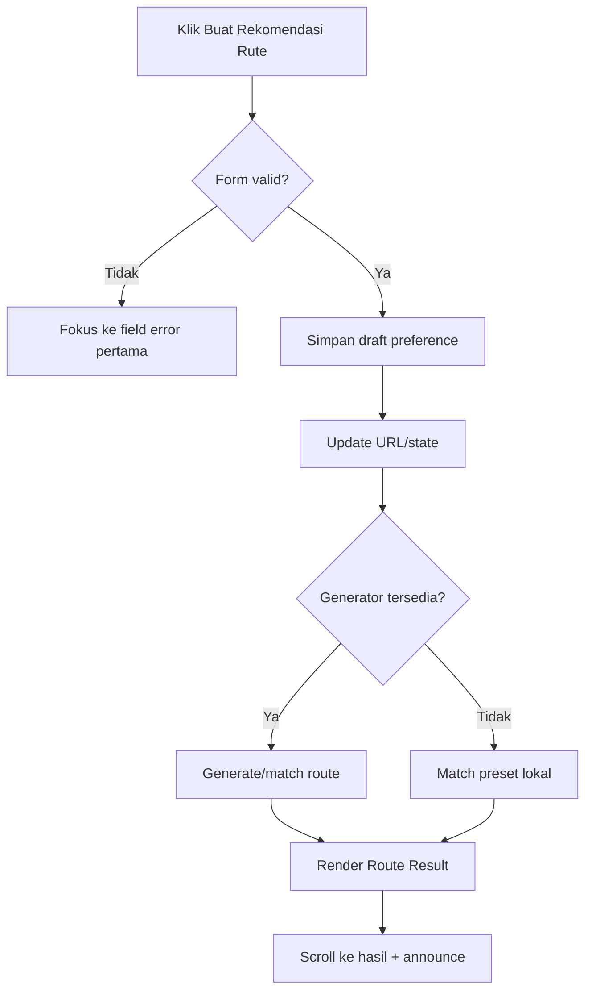

# Planning Lengkap — Section 2 Route Planner Form NUSANTARAYA

<aside>
🧭

**Tujuan dokumen:** menjadi acuan produk, UX, visual, data, engineering, accessibility, analytics, QA, dan demo untuk membangun **Section 2 — Route Planner Form** pada halaman **Nusa Route** (`/routes`). Section ini adalah pusat input preferensi sebelum NUSANTARAYA menyusun rekomendasi itinerary.

</aside>

---

## 1. Ringkasan Eksekutif

### 1.1 Nama Section

**Route Planner Form**

Nama tampilan yang direkomendasikan:

> **Rancang Perjalanan Nusantaramu**
> 

Alternatif:

- Temukan Rute yang Cocok Untukmu
- Susun Preferensi Perjalanan
- Mulai Perjalanan dari Caramu
- Nusa Journey Builder

### 1.2 Route dan Posisi

- **Halaman:** Nusa Route
- **Route:** `/routes`
- **Nomor section:** 2
- **Posisi:** setelah Hero / Page Header Nusa Route dan sebelum Preset Routes atau Route Recommendation Result.
- **Peran:** mengubah niat pengguna menjadi preferensi perjalanan yang terstruktur dan siap diproses generator itinerary.

Urutan halaman yang direkomendasikan:

```
1. Route Hero / Page Header
2. Route Planner Form ← SECTION INI
3. Popular / Preset Routes
4. Route Recommendation Result
5. Day-by-Day Itinerary
6. Route Map + Transport Summary
7. Budget, Culinary, Etiquette, and Checklist
8. Save to Passport + Ask RANI
9. Related Journeys / Final CTA
```

### 1.3 Scope Section

Section ini mencakup:

1. Durasi: **3, 5, atau 7 hari**.
2. Provinsi keberangkatan: opsional.
3. Wilayah tujuan.
4. Minat: budaya, alam, kuliner, sejarah, dan kategori relevan lain.
5. Anggaran.
6. Gaya perjalanan: santai, seimbang, atau eksploratif.
7. Ringkasan preferensi.
8. Tombol **Buat Rekomendasi Rute**.
9. Validasi, loading, error, empty state, dan fallback.
10. Integrasi dengan preset route, Map, Province Atlas, Passport, RANI, URL state, dan generator itinerary.

Section ini **tidak** bertanggung jawab menampilkan itinerary lengkap. Hasil lengkap adalah tanggung jawab section Route Recommendation Result setelah form.

### 1.4 North Star UX

> Pengguna harus dapat memahami, mengisi, dan mengirim form dalam **30–60 detik**, tanpa merasa sedang mengisi formulir administratif.
> 

Form harus terasa seperti **travel preference composer** yang hangat, visual, ringan, dan premium—bukan kumpulan dropdown generik.

---

## 2. Konteks Produk dan Dasar Keputusan

Planning ini mengikuti arah produk dalam [PRD NUSANTARAYA FIX](https://app.notion.com/p/PRD-NUSANTARAYA-FIX-165098210a3c83fea99181f526f0367e?pvs=21), [Roadmap & Workflow Pengembangan NUSANTARAYA](https://app.notion.com/p/Roadmap-Workflow-Pengembangan-NUSANTARAYA-02a098210a3c83dfb7688147846399f4?pvs=21), dan [Planning Section Preview Fitur Utama](https://app.notion.com/p/Planning-Section-Preview-Fitur-Utama-NUSANTARAYA-1eb098210a3c83d1a9f1811725a401c1?pvs=21).

Prinsip yang dipertahankan:

- Nusa Route adalah fitur **Must Have**.
- Generator harus berguna nyata, tetapi tetap aman untuk demo.
- Versi lomba wajib memiliki **fallback route lokal**.
- Data dan route canonical harus dipakai ulang, bukan membuat itinerary acak di komponen.
- Visual mengikuti identitas **Heritage Futuristic Light**.
- Pengalaman harus responsif, bilingual-ready, keyboard-friendly, dan tidak bergantung penuh pada AI/API.

### 2.1 Problem Statement

Pengguna sering memiliki gambaran umum—misalnya lima hari, ingin budaya dan kuliner, budget menengah—tetapi belum tahu:

- provinsi mana yang paling cocok,
- urutan perjalanan yang realistis,
- berapa banyak destinasi yang masuk akal,
- bagaimana menyeimbangkan budaya, kuliner, dan waktu istirahat,
- serta apakah perpindahan antarwilayah realistis.

Route Planner Form harus menerjemahkan preferensi yang masih abstrak menjadi input terstruktur untuk sistem rekomendasi.

### 2.2 Nilai Utama

- **Cepat:** selesai kurang dari satu menit.
- **Jelas:** setiap pilihan memakai bahasa manusia, bukan jargon sistem.
- **Personal:** rekomendasi berubah berdasarkan kombinasi input.
- **Explainable:** hasil nanti dapat menjelaskan alasan rute dipilih.
- **Realistis:** durasi membatasi cakupan destinasi.
- **Aman untuk demo:** tetap menghasilkan rute melalui preset/fallback lokal.

---

## 3. Tujuan, Non-Goals, dan KPI

### 3.1 Tujuan Utama

1. Membantu pengguna mengartikulasikan preferensi perjalanan dengan usaha minimal.
2. Menghasilkan payload yang konsisten dan dapat dipakai generator rute.
3. Meningkatkan rasio pengguna yang berhasil membuat minimal satu rute.
4. Menjadi momen utility utama NUSANTARAYA saat demo lomba.
5. Menghubungkan konteks dari Map, Province Atlas, Recommended Journey, Regional Explorer, RANI, dan preset route.

### 3.2 Non-Goals

Section ini tidak perlu:

- melakukan booking tiket/hotel,
- meminta data pribadi,
- menghitung harga real-time,
- meminta tanggal perjalanan pada MVP,
- menyusun jadwal per jam,
- menampilkan seluruh itinerary dalam form,
- mengharuskan login,
- menjanjikan ketersediaan transportasi aktual,
- membuat rute lintas pulau yang tidak realistis hanya demi variasi.

### 3.3 KPI Produk

| Metrik | Target MVP | Target Polish |
| --- | --- | --- |
| --- | ---: | ---: |
| Form start rate | ≥ 55% pengunjung `/routes` | ≥ 65% |
| Form completion rate | ≥ 70% dari yang mulai | ≥ 80% |
| Generate success rate | 100% dengan fallback | 100% |
| Waktu median sampai submit | ≤ 60 detik | ≤ 45 detik |
| Validation error rate | < 15% | < 8% |
| Route save rate | ≥ 20% hasil | ≥ 30% |
| Generate ulang | Terukur, bukan dibatasi | Terukur |
| Accessibility | Lighthouse ≥ 90 | ≥ 95 |

---

## 4. Persona dan Skenario Utama

### 4.1 Turis Lokal

**Kebutuhan:** rute singkat yang praktis, kuliner, destinasi populer, dan budget jelas.

Contoh:

> “Saya punya lima hari, berangkat dari Jawa Barat, ingin budaya dan kuliner di Jawa, budget menengah, ritme seimbang.”
> 

### 4.2 Turis Mancanegara

**Kebutuhan:** destinasi yang mudah dipahami, cultural etiquette, ritme realistis, dan bantuan bahasa.

Contoh:

> “Saya belum menentukan titik berangkat, ingin Bali–Nusa Tenggara, alam dan budaya, tujuh hari, gaya santai.”
> 

### 4.3 Explorer / Pengguna Berpengalaman

**Kebutuhan:** lebih banyak stop, hidden gems, aktivitas alam, dan perjalanan aktif.

Contoh:

> “Tujuh hari, Sulawesi, alam dan sejarah, budget fleksibel, eksploratif.”
> 

### 4.4 Juri Lomba

**Kebutuhan:** melihat bahwa form benar-benar mengubah output, bukan mockup statis.

Skenario demo utama:

```
5 hari → tujuan Jawa → Budaya + Kuliner → budget Menengah → gaya Seimbang
→ Buat Rekomendasi Rute
→ hasil harian muncul
→ peta mini menampilkan urutan
→ simpan ke Passport / tanya RANI
```

---

## 5. Prinsip UX Form

1. **Progressive disclosure:** tampilkan kebutuhan inti tanpa membanjiri pengguna.
2. **Visual choice over dropdown:** gunakan card/chip untuk pilihan kecil; combobox hanya untuk daftar provinsi.
3. **One obvious next action:** CTA utama selalu jelas.
4. **Optional means optional:** provinsi keberangkatan tidak boleh menghambat submit.
5. **Sensible defaults:** durasi 5 hari, budget menengah, gaya seimbang.
6. **Multi-interest but controlled:** minimal satu, rekomendasi maksimal tiga minat utama.
7. **Immediate feedback:** summary berubah ketika pilihan berubah.
8. **No fake AI:** jika generator dinamis tidak tersedia, gunakan preset yang cocok dan jelaskan sebagai rekomendasi terkurasi.
9. **URL-resumable:** konteks dari halaman lain dapat mengisi form tanpa membuat state tersembunyi.
10. **Mobile-first:** seluruh form nyaman untuk satu tangan dan tidak memiliki horizontal overflow.

---

## 6. Arsitektur Informasi Section

### 6.1 Struktur Besar

```
Section Wrapper
├── Editorial Intro
│   ├── Eyebrow
│   ├── Heading
│   ├── Supporting copy
│   └── Trust/microcopy row
├── Planner Workspace
│   ├── Form Area
│   │   ├── Step 1 Durasi
│   │   ├── Step 2 Keberangkatan
│   │   ├── Step 3 Wilayah Tujuan
│   │   ├── Step 4 Minat
│   │   ├── Step 5 Anggaran
│   │   └── Step 6 Gaya Perjalanan
│   └── Sticky Preference Summary
│       ├── Selected preferences
│       ├── Estimated route character
│       ├── Edit/reset actions
│       └── Primary CTA
├── Inline Validation / Status
└── Result Anchor Handoff
```

### 6.2 Model Interaksi yang Direkomendasikan

Gunakan **single-page guided form**, bukan wizard penuh.

Alasan:

- hanya enam kelompok input,
- pengguna perlu membandingkan pilihan,
- lebih cepat saat demo,
- mudah kembali mengubah satu preferensi,
- lebih aman untuk desktop dan mobile,
- state lebih sederhana.

Nomor `01–06` tetap dapat dipakai sebagai petunjuk urutan visual tanpa memaksa navigasi step-by-step.

### 6.3 Layout Desktop

```
┌──────────────────────────────────────────────────────────────┐
│ Eyebrow · Heading · Intro                                    │
├──────────────────────────────────────┬───────────────────────┤
│ 01 Durasi                            │ Ringkasan perjalanan  │
│ 02 Provinsi keberangkatan            │ 5 hari                │
│ 03 Wilayah tujuan                    │ Jawa                  │
│ 04 Minat                             │ Budaya + Kuliner      │
│ 05 Anggaran                          │ Menengah              │
│ 06 Gaya perjalanan                   │ Seimbang              │
│                                      │                       │
│                                      │ [Buat Rekomendasi]    │
└──────────────────────────────────────┴───────────────────────┘
```

- Form: 7–8 kolom.
- Summary: 4–5 kolom dan `position: sticky` selama masih berada di section.
- Jarak antar-field group cukup luas agar tidak terasa padat.

### 6.4 Layout Tablet

- Form tetap satu kolom besar.
- Summary menjadi panel horizontal setelah 3–4 kelompok input atau berada di bawah form.
- CTA dapat sticky di bawah viewport jika tidak menutupi konten.
- Pilihan wilayah dan budget memakai grid dua kolom.

### 6.5 Layout Mobile

```
Intro
↓
Durasi chips
↓
Keberangkatan combobox
↓
Wilayah cards
↓
Minat chips
↓
Anggaran cards
↓
Gaya cards
↓
Compact summary
↓
Sticky CTA
```

Aturan:

- semua grup vertikal,
- touch target minimal 44×44 px,
- CTA full width,
- summary dapat berupa accordion ringkas,
- sticky CTA harus menyisakan safe-area bottom,
- jangan menggunakan carousel horizontal untuk input penting.

---

## 7. Copywriting Final

### 7.1 Header Section

**Eyebrow**

```
Nusa Route Planner
```

**Heading**

```
Rancang perjalanan yang sesuai dengan caramu menjelajah.
```

**Subheading**

```
Pilih durasi, wilayah, minat, anggaran, dan ritme perjalanan. NUSANTARAYA akan menyusun rekomendasi rute yang realistis, bermakna, dan mudah disesuaikan.
```

**Trust microcopy**

```
Tanpa login · Dapat diubah kapan saja · Estimasi awal, bukan harga pemesanan
```

### 7.2 Label dan Helper Text

| Input | Label | Helper text |
| --- | --- | --- |
| Durasi | Berapa lama kamu ingin menjelajah? | Durasi membantu kami membatasi jumlah perpindahan dan destinasi. |
| Keberangkatan | Dari provinsi mana perjalanan dimulai? | Opsional. Kosongkan jika kamu masih fleksibel. |
| Wilayah | Wilayah mana yang ingin kamu jelajahi? | Pilih satu wilayah utama agar rute tetap realistis. |
| Minat | Pengalaman apa yang paling kamu cari? | Pilih 1–3 minat utama. |
| Anggaran | Kisaran perjalanan yang kamu inginkan? | Estimasi mencakup transportasi lokal, aktivitas, dan konsumsi dasar. |
| Gaya | Seberapa padat ritme perjalananmu? | Ini menentukan jumlah aktivitas dan waktu jeda setiap hari. |

### 7.3 CTA

Default:

```
Buat Rekomendasi Rute
```

Loading:

```
Menyusun Rute Terbaik…
```

Success handoff:

```
Lihat Rekomendasi Rute
```

Fallback:

```
Gunakan Rute Terkurasi
```

### 7.4 Supporting Microcopy CTA

```
Hasil dapat diubah, disimpan ke Passport, dan disesuaikan bersama RANI.
```

---

## 8. Spesifikasi Field: Durasi

### 8.1 Opsi

- **3 hari** — Jelajah singkat.
- **5 hari** — Ritme paling seimbang.
- **7 hari** — Eksplorasi lebih mendalam.

### 8.2 Komponen

Gunakan **segmented cards/chips**, bukan select.

Setiap opsi menampilkan:

- angka besar,
- label “hari”,
- deskripsi satu baris,
- status selected yang kuat.

### 8.3 Default

**5 hari**.

Alasan:

- paling cocok untuk demo,
- cukup untuk 2–3 kota/cluster,
- tidak terlalu pendek atau kompleks,
- sesuai flow demo PRD.

### 8.4 Dampak ke Generator

| Durasi | Maksimum area | Rekomendasi stop | Prinsip |
| --- | --- | --- | --- |
| --- | --- | ---: | --- |
| 3 hari | satu provinsi/cluster | 1–2 base | perpindahan minimal |
| 5 hari | satu region / 1–2 provinsi dekat | 2–3 base | seimbang |
| 7 hari | satu region / lintas provinsi terdekat | 3–4 base | eksplorasi mendalam |

### 8.5 Validasi

- wajib dipilih,
- hanya menerima `3 | 5 | 7`,
- jika payload eksternal memberi nilai lain, normalisasi ke opsi terdekat atau tampilkan pilihan tanpa submit otomatis.

---

## 9. Spesifikasi Field: Provinsi Keberangkatan

### 9.1 Status

**Opsional.**

### 9.2 Komponen

Gunakan searchable combobox dengan:

- placeholder: `Cari provinsi keberangkatan…`,
- daftar 38 provinsi canonical,
- dukungan keyboard,
- tombol clear,
- empty result yang jelas,
- grouping wilayah opsional.

### 9.3 Opsi Fleksibel

Sediakan pilihan pertama:

```
Belum menentukan / fleksibel
```

Nilai internal tetap `null`, bukan string palsu.

### 9.4 Perilaku

- Jika terisi, generator mempertimbangkan akses ke titik awal rute.
- Jika kosong, generator memilih entry point paling masuk akal pada wilayah tujuan.
- Jika provinsi keberangkatan berada di wilayah tujuan, prioritaskan rute dari provinsi tersebut.
- Jika berada di luar wilayah tujuan, output harus memberi catatan bahwa biaya menuju titik awal belum tentu termasuk estimasi lokal.

### 9.5 Edge Cases

- Provinsi asal sama dengan tujuan: valid.
- Provinsi asal tidak memiliki data transport detail: gunakan microcopy umum, jangan membuat jadwal atau harga palsu.
- Input dari Map berupa province ID: map ke label canonical.

---

## 10. Spesifikasi Field: Wilayah Tujuan

### 10.1 Opsi Canonical

1. Sumatra
2. Jawa
3. Kalimantan
4. Sulawesi
5. Bali–Nusa Tenggara
6. Maluku
7. Papua
8. Seluruh Indonesia — hanya opsional untuk mode inspirasi; jangan default.

### 10.2 Rekomendasi MVP

Untuk menjaga hasil realistis, jadikan **satu wilayah utama** sebagai pilihan tunggal.

“Seluruh Indonesia” sebaiknya:

- memberi rekomendasi inspirasi/preset,
- tidak menjanjikan rute padat 3 hari lintas pulau,
- menampilkan peringatan bahwa cakupan akan dipersempit otomatis.

### 10.3 Komponen

Gunakan `RegionOptionCard` dengan:

- nama region,
- 2–4 provinsi contoh,
- kata kunci karakter,
- aksen warna wilayah,
- ilustrasi/pattern sangat halus,
- radio semantics.

Contoh:

```
Jawa
Warisan, kota kreatif, kuliner, dan jalur sejarah
Yogyakarta · Jawa Tengah · Jawa Timur
```

### 10.4 Default

Tidak ada default jika pengguna masuk langsung ke `/routes`.

Jika datang dari konteks:

- Map/Regional Explorer → prefill region terkait.
- Province Atlas → prefill region provinsi.
- Journey/Preset → prefill region route.
- RANI → prefill sesuai payload yang tervalidasi.

### 10.5 Validasi

Wilayah tujuan **wajib** dipilih sebelum submit.

Pesan error:

```
Pilih satu wilayah tujuan agar kami dapat menyusun rute yang realistis.
```

---

## 11. Spesifikasi Field: Minat

### 11.1 Opsi Utama

- Budaya
- Alam
- Kuliner
- Sejarah
- Petualangan
- Relaksasi
- Hidden Gems
- Kota & Kreativitas

Kategori opsional lanjutan:

- Keluarga
- Fotografi
- Jalur Rempah
- Wisata Berkelanjutan

### 11.2 Batas Pilihan

- minimum: **1**,
- rekomendasi: **2**,
- maksimum MVP: **3**.

Jika pengguna memilih opsi keempat:

```
Pilih maksimal 3 minat utama agar rekomendasi tetap fokus.
```

### 11.3 Komponen

Gunakan toggle chips/cards dengan:

- icon sederhana,
- label,
- `aria-pressed`,
- selected state yang tidak hanya mengandalkan warna,
- counter `2/3 dipilih`.

### 11.4 Default

Tidak ada default, tetapi dapat diberikan rekomendasi visual:

```
Pilihan populer: Budaya + Kuliner
```

Jangan memilih otomatis tanpa sepengetahuan pengguna.

### 11.5 Weighting

Urutan klik dapat dianggap setara pada MVP. Jika ingin weighting:

- minat pertama = primary,
- kedua dan ketiga = supporting.

Namun UI harus menjelaskan jika urutan punya dampak. Rekomendasi awal: semua pilihan berbobot sama agar mental model sederhana.

---

## 12. Spesifikasi Field: Anggaran

### 12.1 Opsi yang Direkomendasikan

1. **Hemat**
    - transport lokal ekonomis,
    - akomodasi sederhana,
    - aktivitas gratis/terjangkau.
2. **Menengah**
    - kombinasi kenyamanan dan pengalaman,
    - akomodasi menengah,
    - beberapa aktivitas berbayar.
3. **Premium**
    - kenyamanan lebih tinggi,
    - pengalaman terkurasi,
    - transport/akomodasi premium bila tersedia.
4. **Fleksibel**
    - sistem mengutamakan kecocokan pengalaman.

### 12.2 Penamaan

Gunakan **Hemat**, bukan “Murah”; **Menengah**, bukan “Normal”. Bahasa harus tidak menghakimi.

### 12.3 Default

**Menengah**.

### 12.4 Komponen

Gunakan option cards dengan simbol sederhana:

- `Rp` Hemat
- `RpRp` Menengah
- `RpRpRp` Premium
- `±` Fleksibel

Pastikan simbol bukan satu-satunya label aksesibel.

### 12.5 Disclaimer

```
Estimasi bersifat indikatif dan dapat berubah menurut musim, titik keberangkatan, serta pilihan akomodasi.
```

### 12.6 Prinsip Data

Jangan menyimpan angka biaya palsu di form. Form hanya mengirim kategori. Range biaya ditentukan oleh route data/result engine dan diberi label estimasi.

---

## 13. Spesifikasi Field: Gaya Perjalanan

### 13.1 Opsi

#### Santai

- 1–2 aktivitas utama per hari,
- waktu jeda lebih panjang,
- perpindahan antarkota minimal,
- cocok untuk keluarga, pasangan, atau slow travel.

#### Seimbang

- 2–3 aktivitas utama per hari,
- perpaduan eksplorasi dan istirahat,
- default untuk mayoritas pengguna.

#### Eksploratif

- 3–4 aktivitas terkurasi per hari,
- lebih banyak stop dan aktivitas aktif,
- tetap harus realistis dan tidak memadatkan perjalanan berlebihan.

### 13.2 Default

**Seimbang**.

### 13.3 Komponen

Gunakan tiga cards horizontal pada desktop dan vertikal pada mobile.

Setiap card berisi:

- nama gaya,
- ritme visual (mis. titik/garis),
- jumlah aktivitas harian,
- satu kalimat penjelas.

### 13.4 Hubungan dengan Durasi

- 3 hari + Santai → satu base, stop minimal.
- 3 hari + Eksploratif → lebih banyak aktivitas lokal, bukan lebih banyak penerbangan.
- 7 hari + Santai → 2–3 base dengan rest window.
- 7 hari + Eksploratif → hingga 4 base hanya jika konektivitas masuk akal.

---

## 14. Preference Summary Panel

### 14.1 Tujuan

- membuat pilihan terasa nyata,
- mengurangi kesalahan sebelum submit,
- memperlihatkan bahwa output akan dipersonalisasi,
- menjadi anchor CTA utama.

### 14.2 Isi

```
Perjalananmu
5 hari
Dari: Fleksibel
Tujuan: Jawa
Minat: Budaya · Kuliner
Anggaran: Menengah
Gaya: Seimbang
```

Tambahkan insight pendek berbasis rules:

```
Rute akan memprioritaskan 2–3 kota dengan perpaduan warisan budaya, kuliner lokal, dan waktu jeda yang cukup.
```

### 14.3 Status Incomplete

Jika belum lengkap:

```
Lengkapi wilayah tujuan dan minimal satu minat untuk membuat rekomendasi.
```

### 14.4 Edit dan Reset

- `Ubah` cukup scroll/focus ke field terkait.
- `Reset pilihan` adalah secondary/ghost action.
- Reset harus meminta konfirmasi hanya jika form telah banyak diubah; untuk MVP, reset langsung dengan toast + Undo lebih ringan.

### 14.5 Sticky Behavior

Desktop:

- sticky di dalam batas section,
- tidak menutupi navbar,
- stop sebelum section berikutnya.

Mobile:

- summary compact biasa,
- CTA boleh sticky bottom,
- hindari panel sticky tinggi.

---

## 15. CTA dan Submission Flow

### 15.1 Enable/Disable

CTA aktif jika:

- durasi valid,
- wilayah tujuan terpilih,
- minimal satu minat,
- anggaran valid,
- gaya valid.

Keberangkatan tidak wajib.

### 15.2 Disabled State

CTA disabled harus tetap memiliki penjelasan. Jangan hanya menurunkan opacity.

```
Pilih wilayah tujuan dan minimal satu minat untuk melanjutkan.
```

### 15.3 Submit Sequence



### 15.4 Loading

Durasi ideal: 600–1500 ms untuk transisi yang terasa nyata tetapi tidak dibuat-buat.

Loading UI:

- CTA menunjukkan spinner kecil,
- teks “Menyusun Rute Terbaik…”,
- form tetap terlihat tetapi input dinonaktifkan sementara,
- skeleton result dapat muncul di section hasil,
- `aria-live="polite"` mengumumkan status.

### 15.5 Success

- hasil dirender pada section setelah form,
- scroll halus ke heading hasil,
- focus dipindahkan ke heading hasil hanya jika tidak mengganggu pengguna keyboard,
- URL dapat menyimpan query/draft ID,
- toast tidak menjadi satu-satunya feedback.

### 15.6 Retry

Jika generator gagal:

```
Kami belum dapat membuat rute dinamis. Rute terkurasi dengan preferensi paling dekat sudah disiapkan untukmu.
```

Selalu berikan hasil fallback, bukan dead end.

---

## 16. State Matrix

| State | Kondisi | Tampilan | Aksi |
| --- | --- | --- | --- |
| Pristine | baru masuk | default duration/budget/style; region/minat kosong | mulai memilih |
| Prefilled | datang dari Map/Journey/RANI | field terkait terisi + label sumber konteks | review/edit |
| In progress | ada perubahan | summary live | lanjut isi |
| Invalid | submit belum lengkap | inline error + focus field pertama | perbaiki |
| Ready | semua wajib valid | CTA aktif | submit |
| Loading | request/matching berlangsung | spinner + result skeleton | tunggu/cancel opsional |
| Success | route tersedia | result tampil | simpan/edit/tanya RANI |
| Fallback | engine gagal/tidak tersedia | preset terdekat + disclosure | gunakan/edit |
| No exact match | kombinasi terlalu sempit | rekomendasi terdekat + alasan penyesuaian | terima/edit |
| Restored | kembali/refresh | draft dipulihkan | lanjut/reset |

---

## 17. Prefill dan Entry Context

### 17.1 Sumber yang Didukung

```tsx
type RoutePlannerSource =
  | "routes-page"
  | "home-feature"
  | "map"
  | "province-atlas"
  | "recommended-journey"
  | "regional-explorer"
  | "passport"
  | "rani"
  | "preset-route";
```

### 17.2 Prinsip Prefill

- Prefill harus terlihat dan dapat diedit.
- Jangan auto-submit.
- Parameter yang tidak valid diabaikan dengan aman.
- Sumber context dapat ditampilkan sebagai chip kecil: `Berawal dari Regional Explorer`.
- Jangan membuat key baru jika canonical contract sudah tersedia di repository.

### 17.3 Contoh URL

```
/routes?source=regional-explorer&region=jawa&interests=budaya,kuliner&duration=5
```

Gunakan `replace` saat mengubah preview/filter state agar history tidak penuh. Gunakan `push` saat berpindah ke route/preset detail yang bermakna.

---

## 18. Data Contract

### 18.1 Form Values

```tsx
export type RouteDuration = 3 | 5 | 7;

export type RegionId =
  | "sumatra"
  | "jawa"
  | "kalimantan"
  | "sulawesi"
  | "bali-nusa-tenggara"
  | "maluku"
  | "papua"
  | "indonesia";

export type RouteInterest =
  | "budaya"
  | "alam"
  | "kuliner"
  | "sejarah"
  | "petualangan"
  | "relaksasi"
  | "hidden-gems"
  | "kota-kreatif";

export type BudgetLevel = "hemat" | "menengah" | "premium" | "fleksibel";
export type TravelPace = "santai" | "seimbang" | "eksploratif";

export interface RoutePlannerFormValues {
  durationDays: RouteDuration;
  originProvinceId: string | null;
  destinationRegionId: RegionId | null;
  interests: RouteInterest[];
  budgetLevel: BudgetLevel;
  travelPace: TravelPace;
}
```

### 18.2 Submit Payload

```tsx
export interface RoutePlannerRequest extends RoutePlannerFormValues {
  source: RoutePlannerSource;
  locale: "id" | "en";
  travelerMode: "explore" | "tourist" | "learn";
  contextProvinceIds?: string[];
  contextJourneyId?: string;
  contextPresetRouteId?: string;
}
```

### 18.3 Response Minimum

```tsx
export interface RouteRecommendation {
  id: string;
  matchType: "dynamic" | "preset" | "fallback";
  title: string;
  summary: string;
  reason: string[];
  durationDays: RouteDuration;
  provinceIds: string[];
  stops: Array<{
    dayStart: number;
    dayEnd: number;
    provinceId: string;
    cityOrCluster: string;
    highlights: string[];
  }>;
  estimatedBudgetLabel: string;
  transportSummary: string[];
  etiquetteTips: string[];
  sourceRefs?: string[];
}
```

### 18.4 Validation Schema Rules

- `durationDays`: enum 3/5/7.
- `originProvinceId`: null atau ID provinsi canonical.
- `destinationRegionId`: required.
- `interests`: min 1, max 3, unique.
- `budgetLevel`: required enum.
- `travelPace`: required enum.
- query param harus di-parse dan disanitasi.
- jangan percaya payload dari URL/localStorage tanpa validasi.

---

## 19. Matching dan Recommendation Logic

### 19.1 Strategi MVP

Gunakan **deterministic preset matcher** terlebih dahulu.

Urutan matching:

1. region exact,
2. duration exact,
3. overlap minat,
4. budget compatibility,
5. pace compatibility,
6. origin proximity,
7. fallback regional.

Contoh scoring:

```tsx
score =
  regionMatch * 40 +
  durationMatch * 25 +
  interestOverlap * 15 +
  paceMatch * 10 +
  budgetMatch * 5 +
  originFit * 5;
```

Nilai di atas adalah baseline dan harus diuji, bukan angka final yang kaku.

### 19.2 Guardrail Realisme

- Jangan mengirim pengguna melintasi banyak pulau dalam tiga hari.
- Utamakan cluster destinasi yang berdekatan.
- Maksimalkan pengalaman lokal, bukan jumlah provinsi.
- Gunakan travel day jika perpindahan signifikan.
- Jangan membuat jam, harga, jadwal kapal/pesawat, atau durasi tempuh yang tidak bersumber.
- Jika exact match tidak ada, jelaskan penyesuaian.

### 19.3 Dynamic/AI Enhancement

AI dapat dipakai untuk:

- menyusun narasi alasan,
- mempersonalisasi deskripsi,
- menyarankan variasi aktivitas dari dataset yang sudah disetujui.

AI tidak boleh:

- mengarang destinasi,
- mengarang harga/jadwal,
- mengganti ID canonical,
- menjadi satu-satunya jalur agar form berhasil,
- mengabaikan fallback preset.

---

## 20. Preset Fallback

Minimal siapkan preset yang mewakili kombinasi demo:

1. 5 Hari Budaya & Kuliner Jawa
2. 7 Hari Jawa–Bali Heritage
3. 5 Hari Jalur Rempah Maluku
4. 7 Hari Sumatra Heritage
5. 5 Hari Kalimantan Nature Explorer
6. 7 Hari Sulawesi Culture & Nature
7. 7 Hari Papua Wonder
8. 5 Hari Bali–Nusa Tenggara
9. 3 Hari Yogyakarta Cultural Escape
10. 3 Hari Bali Slow Journey

Setiap preset wajib memiliki:

- ID stabil,
- region,
- durasi,
- minat,
- pace support,
- budget support,
- daftar provinsi/stop,
- itinerary ringkas,
- alasan rekomendasi,
- estimasi kategori biaya,
- tips dan etiquette,
- sumber data jika menampilkan fakta spesifik.

---

## 21. Visual Direction

### 21.1 Konsep

```
Editorial Travel Composer
× Heritage Futuristic Light
× Premium Journey Dashboard
```

Form harus terasa seperti menyusun perjalanan melalui kartu pilihan, bukan mengisi database.

### 21.2 Palet

| Role | Warna |
| --- | --- |
| Background | `#F8F4EA` / `#FFFDF8` |
| Surface | `#FFFFFF` |
| Text utama | `#0D1B2A` |
| Text sekunder | `#5C6470` |
| Border | `#E8E0CE` |
| Primary CTA | `#C9A84C` |
| Success | `#2D5A27` |
| Error | `#8B2020` |
| Focus | `#2D6BE4` |

Warna region dipakai sebagai aksen kecil, bukan background penuh.

### 21.3 Typography

- Heading editorial: Playfair Display/Cormorant Garamond.
- Body dan UI: Inter.
- Nomor step: Inter Medium, uppercase/letter spacing ringan.
- Label field harus tetap mudah dipindai.

### 21.4 Surface dan Shape

- Radius container: 24–32 px.
- Radius option card: 16–20 px.
- Border tipis, shadow sangat lembut.
- Pattern batik/tenun opacity 3–6% di area kosong.
- Hindari glassmorphism berat dan blur berlapis.

### 21.5 Selected State

Selected state harus memiliki minimal tiga sinyal:

1. border/outline lebih kuat,
2. background tint,
3. check icon atau indicator.

Jangan mengandalkan warna saja.

---

## 22. Motion dan Micro-interaction

### 22.1 Motion yang Direkomendasikan

- Option selected: scale 0.98 → 1 dan check fade.
- Summary chips: crossfade ringan.
- Section reveal: opacity + translateY kecil.
- CTA arrow: slide 2–4 px saat hover.
- Result handoff: route line/skeleton singkat.

### 22.2 Batasan

- durasi 150–300 ms untuk UI,
- hanya `transform` dan `opacity` jika memungkinkan,
- tidak ada parallax berat,
- tidak ada chip auto-rotating pada form aktif,
- `prefers-reduced-motion` menonaktifkan animasi non-esensial.

### 22.3 Feedback

- hover hanya enhancement desktop,
- tap state jelas di mobile,
- focus state tidak kalah dari hover,
- error tidak memakai shake agresif.

---

## 23. Component Architecture

### 23.1 Struktur Folder Rekomendasi

```
src/components/routes/route-planner-form/
├── RoutePlannerFormSection.tsx
├── RoutePlannerForm.tsx
├── PlannerSectionHeader.tsx
├── DurationSelector.tsx
├── OriginProvinceCombobox.tsx
├── DestinationRegionSelector.tsx
├── InterestSelector.tsx
├── BudgetSelector.tsx
├── TravelPaceSelector.tsx
├── PreferenceSummary.tsx
├── GenerateRouteButton.tsx
├── PlannerStatusMessage.tsx
├── RouteFormSkeleton.tsx
├── routePlannerSchema.ts
├── routePlannerTypes.ts
└── index.ts
```

### 23.2 Tanggung Jawab

#### `RoutePlannerFormSection.tsx`

- section wrapper,
- header,
- layout form + summary,
- result anchor relationship.

#### `RoutePlannerForm.tsx`

- form state,
- validation,
- submit handler,
- reset/restore,
- prefill adapter.

#### Selectors

- menerima value dan callback,
- tidak melakukan fetch sendiri,
- memakai canonical data,
- semantic input tetap tersedia.

#### `PreferenceSummary.tsx`

- pure derived summary,
- tidak menduplikasi source of truth,
- menampilkan readiness dan insight.

#### `GenerateRouteButton.tsx`

- disabled/loading/error status,
- tidak memuat matching logic.

### 23.3 State Management

Rekomendasi:

- local form state untuk input,
- URL/query untuk shareable context,
- route planner store/context hanya jika hasil dan form harus dipakai lintas section/page,
- localStorage untuk draft dan saved route, bukan sebagai sumber data canonical.

Jangan membuat global state baru jika repository sudah memiliki route planner store/adapter.

---

## 24. Persistence dan Recovery

### 24.1 Draft Persistence

Simpan draft lokal setelah perubahan dengan debounce 300–500 ms.

Contoh key:

```
nusantaraya.routePlanner.draft.v1
```

### 24.2 Priority saat Hydration

1. explicit URL/context payload,
2. preset/journey handoff,
3. valid local draft,
4. defaults.

### 24.3 Reset

Reset mengembalikan:

- durasi 5,
- origin null,
- region null,
- interests kosong,
- budget menengah,
- pace seimbang.

### 24.4 SSR/Hydration

- hindari membaca localStorage saat server render,
- gunakan hydration-safe pattern,
- jangan sampai controlled/uncontrolled mismatch,
- tampilkan default stabil sebelum draft siap.

---

## 25. Accessibility Plan

### 25.1 Semantik

- `<section aria-labelledby="route-planner-title">`.
- Form memakai `<form>`.
- Setiap kelompok menggunakan `<fieldset>` dan `<legend>`.
- Single choice menggunakan radio semantics.
- Multi-interest menggunakan checkbox atau toggle button dengan semantics yang benar.
- Combobox mengikuti ARIA combobox pattern.

### 25.2 Keyboard

- Tab bergerak secara logis.
- Arrow key berpindah di radio group.
- Space/Enter memilih card.
- Escape menutup combobox.
- CTA dapat diaktifkan dengan keyboard.
- Submit invalid memindahkan focus ke field error pertama.

### 25.3 Screen Reader

- Helper dan error terhubung melalui `aria-describedby`.
- Status loading/result menggunakan `aria-live`.
- Counter minat dibacakan.
- Icon dekoratif `aria-hidden="true"`.
- Label option tidak hanya berupa simbol.

### 25.4 Visual

- WCAG AA minimal.
- Focus ring 2–3 px terlihat di background terang.
- Selected state tidak bergantung warna.
- Error memiliki ikon + teks.
- Minimum body text 14–16 px.
- Zoom 200% tidak merusak layout.

---

## 26. Responsive Specifications

| Breakpoint | Layout | Summary | CTA |
| --- | --- | --- | --- |
| ≥1280 px | form 8 kolom + summary 4 kolom | sticky | dalam summary |
| 1024–1279 px | form 7 + summary 5 / proporsional | sticky terbatas | dalam summary |
| 768–1023 px | satu kolom; option grid 2–3 | panel bawah form | full width |
| <768 px | full vertical | compact/accordion | sticky bottom opsional |

### 26.1 Mobile Detail

- padding horizontal 16–20 px,
- gap group 28–36 px,
- chip wrap natural,
- region card satu kolom pada layar sempit,
- durasi tetap tiga kolom hanya jika label tidak sempit; jika tidak, vertikal,
- CTA tinggi 48–56 px,
- safe area `env(safe-area-inset-bottom)`.

### 26.2 Tablet Detail

- jangan memaksa desktop mini,
- region dan budget grid dua kolom,
- pace tiga kolom jika cukup,
- summary full width dengan grid chips.

---

## 27. Performance Plan

### 27.1 Target

- form interactive cepat setelah page load,
- JavaScript tambahan terkontrol,
- tidak ada map interaktif berat di section form,
- combobox 38 provinsi tidak memerlukan virtualisasi.

### 27.2 Optimasi

- data option statis di-bundle ringan,
- dynamic import hanya untuk modul result/map berat,
- debounce persistence,
- memoize derived summary bila perlu,
- animasi menggunakan CSS/Framer Motion ringan,
- tidak memakai video/autoplay,
- pattern SVG teroptimasi.

### 27.3 Budget

- icon SVG < 10 KB per icon,
- pattern < 30 KB,
- section tidak menambah image besar above-the-fold,
- hindari library form berat jika native/react-hook-form existing sudah cukup.

---

## 28. Analytics dan Event Tracking

### 28.1 Events

```
route_planner_form_viewed
route_planner_started
route_duration_selected
route_origin_selected
route_origin_cleared
route_region_selected
route_interest_selected
route_interest_removed
route_budget_selected
route_pace_selected
route_planner_prefilled
route_planner_reset
route_generate_clicked
route_generate_validation_failed
route_generate_started
route_generate_succeeded
route_generate_fallback_used
route_generate_failed
route_result_viewed
```

### 28.2 Payload Aman

Contoh:

```tsx
{
  source,
  durationDays,
  hasOrigin: Boolean(originProvinceId),
  destinationRegionId,
  interestCount: interests.length,
  interests,
  budgetLevel,
  travelPace,
  matchType,
  locale
}
```

Jangan mengirim data pribadi. Provinsi asal dalam konteks ini adalah titik perjalanan, bukan domisili pengguna.

### 28.3 Funnel

```
Form viewed
→ Started
→ Required fields completed
→ Generate clicked
→ Success/fallback
→ Result viewed
→ Saved to Passport / Ask RANI
```

---

## 29. Error Handling dan Recovery

### 29.1 Validation Error

- tampil dekat field,
- summary juga menunjukkan jumlah bagian yang perlu dilengkapi,
- focus ke error pertama,
- pilihan valid lain tidak hilang.

### 29.2 Data Load Error

Jika daftar provinsi gagal:

- origin tetap dapat dikosongkan,
- jangan blokir generate,
- tampilkan pesan kecil bahwa titik keberangkatan dapat ditambahkan nanti.

### 29.3 Generator Error

- otomatis gunakan preset matcher lokal,
- beri disclosure jujur,
- simpan input,
- jangan meminta pengguna mengisi ulang.

### 29.4 No Exact Match

Tampilkan:

```
Kami menyesuaikan cakupan agar perjalanan tetap realistis. Rute ini paling mendekati wilayah, durasi, dan minat pilihanmu.
```

### 29.5 Offline

Jika app mendukung offline/demo mode:

- form tetap berfungsi,
- preset lokal tetap tersedia,
- map eksternal dapat diganti static route visual,
- save Passport tetap melalui localStorage.

---

## 30. Integrasi Ekosistem

### 30.1 Nusa Map

- menerima `source=map`, province/region context,
- result dapat membuka jalur di Map,
- jangan menduplikasi map state tanpa adapter.

### 30.2 Province Atlas

- CTA “Buat Rute dari Provinsi Ini” mengisi origin atau destination context sesuai intent.
- Province ID harus canonical.

### 30.3 Recommended Journey

- journey mengirim `journeyId`, province IDs, minat, dan durasi.
- form tetap dapat diedit.
- form tidak mengarang route jika preset journey tidak tersedia.

### 30.4 Regional Explorer

- prefill region,
- optional province IDs sebagai context,
- pertahankan source untuk analytics.

### 30.5 Nusa Passport

Setelah hasil:

- route dapat disimpan,
- province IDs masuk saved route context,
- jangan memberi stempel hanya karena form dibuka.

### 30.6 RANI

- RANI dapat membuka form dengan draft preference.
- Setelah hasil, CTA “Tanya RANI untuk menyesuaikan” mengirim recommendation ID + preference, bukan seluruh konten visual.
- RANI harus tetap memakai sumber data yang sama.

### 30.7 Preset Routes

- memilih preset dapat mengisi form atau langsung membuka result detail,
- keputusan tergantung intent CTA:
    - `Gunakan Preferensi Ini` → prefill form,
    - `Lihat Rute` → buka result.

---

## 31. Bilingual dan Content Localization

### 31.1 Indonesian

Tone:

- hangat,
- praktis,
- tidak terlalu formal,
- menghindari klaim absolut.

### 31.2 English

Contoh label:

- Duration
- Starting Province (optional)
- Destination Region
- Interests
- Budget
- Travel Pace
- Create My Route

Gaya:

- `Relaxed`, `Balanced`, `Explorative` atau `Active Explorer` setelah uji copy.
- `Budget`, `Comfort`, `Premium`, `Flexible` dapat dipakai dengan penjelasan.

### 31.3 Layout

- jangan hard-code lebar label,
- sediakan ruang untuk teks Inggris yang lebih panjang,
- semua data label berasal dari translation dictionary,
- ID internal tidak diterjemahkan.

---

## 32. Content dan Cultural Safety

- Jangan mereduksi wilayah menjadi stereotip.
- Kata kunci region harus beragam dan faktual.
- Jangan menjanjikan ritual atau event selalu tersedia.
- Cultural etiquette harus bersumber dan kontekstual.
- Hidden gems jangan mendorong overtourism atau akses ke tempat sensitif.
- Gunakan istilah lokal dengan ejaan benar.
- Sediakan jalur koreksi konten pada halaman hasil/detail, bukan membebani form.

---

## 33. Security dan Privacy

- sanitasi semua query params,
- allowlist enum,
- jangan mengeksekusi string dari URL,
- tidak menyimpan data sensitif,
- jangan menyimpulkan domisili dari origin,
- batasi payload ke AI,
- API key hanya di server,
- log error tidak memuat informasi sensitif,
- localStorage versioned dan mudah dihapus.

---

## 34. Test Plan

### 34.1 Unit Tests

- schema menerima kombinasi valid,
- menolak durasi selain 3/5/7,
- menolak minat kosong atau >3,
- origin null valid,
- parser query aman,
- summary derivation benar,
- matcher memilih preset expected.

### 34.2 Component Tests

- semua option dapat dipilih keyboard,
- selected state benar,
- clear origin bekerja,
- counter minat benar,
- CTA enable/disable benar,
- error terhubung ke field,
- reset mengembalikan default.

### 34.3 Integration Tests

1. Direct entry → isi form → submit → result.
2. Prefill dari Map → edit minat → submit.
3. Prefill dari Journey → ubah durasi → submit.
4. Generator gagal → fallback preset muncul.
5. Refresh → draft kembali.
6. Save result → Passport menerima route.
7. Ask RANI → context benar.

### 34.4 E2E Demo Path

```
Buka /routes
→ pilih 5 hari
→ origin fleksibel
→ tujuan Jawa
→ Budaya + Kuliner
→ Menengah
→ Seimbang
→ generate
→ hasil sukses/fallback
→ scroll/focus benar
→ simpan ke Passport
```

### 34.5 Device QA

- 360×800 mobile,
- 390×844 mobile,
- 768×1024 tablet,
- 1024×768 landscape tablet,
- 1366×768 laptop,
- 1440×900 desktop,
- zoom 200%,
- keyboard only,
- reduced motion,
- slow 4G/offline fallback.

### 34.6 Visual QA

- tidak ada chip terpotong,
- sticky summary tidak overlap,
- CTA tidak tertutup bottom navigation,
- error tidak menggeser layout secara ekstrem,
- selected state konsisten,
- bilingual tidak overflow,
- dark browser forced colors tetap dapat dipahami jika memungkinkan.

---

## 35. Implementation Phases

### Fase A — Audit dan Contract

- [ ]  Audit `/routes` existing.
- [ ]  Audit route data/presets.
- [ ]  Audit province/region IDs.
- [ ]  Audit shared store/context.
- [ ]  Audit handoff dari Map/Journey/RANI.
- [ ]  Kunci form contract dan validation schema.

### Fase B — Static UI

- [ ]  Buat section header.
- [ ]  Buat layout form + summary.
- [ ]  Buat seluruh selector.
- [ ]  Terapkan design tokens existing.
- [ ]  Pastikan desktop/tablet/mobile.

### Fase C — Form Behavior

- [ ]  Implement controlled state/form library.
- [ ]  Tambahkan defaults.
- [ ]  Tambahkan validation.
- [ ]  Tambahkan reset.
- [ ]  Tambahkan summary live.

### Fase D — Prefill dan Persistence

- [ ]  Parse URL/context.
- [ ]  Validasi prefill.
- [ ]  Simpan draft lokal.
- [ ]  Restore draft tanpa hydration error.
- [ ]  Sinkronkan history secara aman.

### Fase E — Recommendation

- [ ]  Hubungkan preset matcher.
- [ ]  Hubungkan dynamic generator jika tersedia.
- [ ]  Implement fallback.
- [ ]  Render success/error status.
- [ ]  Handoff ke result section.

### Fase F — Ecosystem Integration

- [ ]  Map.
- [ ]  Province Atlas.
- [ ]  Journey.
- [ ]  Regional Explorer.
- [ ]  Passport.
- [ ]  RANI.

### Fase G — Polish

- [ ]  Motion ringan.
- [ ]  Accessibility audit.
- [ ]  Analytics.
- [ ]  Performance.
- [ ]  i18n.
- [ ]  Content safety review.

### Fase H — QA dan Demo

- [ ]  Unit/component/integration tests.
- [ ]  Cross-device QA.
- [ ]  Offline/API failure demo.
- [ ]  Lighthouse.
- [ ]  Demo rehearsal.

---

## 36. Estimasi Pengerjaan

| Tahap | Estimasi |
| --- | --- |
| --- | ---: |
| Audit repository dan contract | 1–2 jam |
| Static responsive UI | 3–4 jam |
| Form state + validation | 2–3 jam |
| Summary + persistence + URL prefill | 2–3 jam |
| Preset matching + fallback | 3–4 jam |
| Integrasi result/ecosystem | 3–5 jam |
| Accessibility + analytics + i18n | 2–3 jam |
| QA + polish | 3–4 jam |

**Total MVP kuat:** 10–14 jam.  

**Total premium terintegrasi:** 18–28 jam, tergantung kondisi codebase dan generator existing.

---

## 37. Risiko dan Mitigasi

| Risiko | Dampak | Mitigasi |
| --- | --- | --- |
| Form terasa administratif | engagement rendah | option cards, editorial copy, summary live |
| Terlalu banyak pilihan | pengguna bingung | 6 grup inti, progressive disclosure |
| Rute tidak realistis | kredibilitas turun | region-first matching + guardrail durasi |
| AI/API gagal | demo berhenti | preset matcher lokal wajib |
| State dari halaman lain tidak konsisten | prefill rusak | canonical typed adapter |
| URL/localStorage invalid | error/hydration mismatch | parse + schema validation + versioning |
| Mobile terlalu panjang | fatigue | compact cards, sticky CTA, spacing terkontrol |
| Sticky panel overlap | UX rusak | sticky dalam section + safe offsets |
| Aksesibilitas option card buruk | keyboard/screen reader gagal | native semantics + visible focus |
| Estimasi budget dianggap harga pasti | trust issue | label estimasi + disclaimer |
| Terlalu banyak lintas pulau | rute tidak masuk akal | cluster routing dan automatic scope reduction |
| Analytics berlebihan | privasi | event minimal tanpa data pribadi |

---

## 38. Acceptance Criteria

### 38.1 Functional

- [ ]  Section tampil sebagai section kedua `/routes`.
- [ ]  Durasi hanya 3, 5, atau 7 hari.
- [ ]  Provinsi keberangkatan opsional dan searchable.
- [ ]  Wilayah tujuan wajib dan memakai region ID canonical.
- [ ]  Minat dapat dipilih 1–3.
- [ ]  Anggaran memiliki empat kategori yang jelas.
- [ ]  Gaya memiliki Santai, Seimbang, Eksploratif.
- [ ]  Summary berubah secara real time.
- [ ]  CTA hanya aktif saat form valid.
- [ ]  Submit menghasilkan dynamic match atau preset fallback.
- [ ]  Input tidak hilang saat terjadi error.
- [ ]  Prefill dari context dapat diedit.
- [ ]  Draft dapat dipulihkan.

### 38.2 Visual

- [ ]  Terasa premium dan editorial, bukan form generik.
- [ ]  Identitas Heritage Futuristic Light konsisten.
- [ ]  Hierarchy field mudah dipindai.
- [ ]  Selected, hover, focus, disabled, dan error state jelas.
- [ ]  Pattern budaya halus dan tidak mengganggu teks.
- [ ]  Summary terlihat sebagai journey card, bukan kotak debug.

### 38.3 Responsive

- [ ]  Desktop memakai form + sticky summary.
- [ ]  Tablet tidak terasa sebagai desktop yang diperkecil.
- [ ]  Mobile satu kolom tanpa overflow.
- [ ]  CTA aman dari bottom navigation/safe area.
- [ ]  Touch target minimal 44 px.
- [ ]  Bilingual copy tidak terpotong.

### 38.4 Accessibility

- [ ]  Form/fieldset/legend semantic.
- [ ]  Seluruh form dapat digunakan keyboard.
- [ ]  Combobox mengikuti ARIA pattern.
- [ ]  Error dibaca screen reader.
- [ ]  Focus ring jelas.
- [ ]  Kontras WCAG AA.
- [ ]  Reduced motion didukung.

### 38.5 Reliability

- [ ]  Generator failure selalu jatuh ke preset fallback.
- [ ]  Tidak ada broken state saat refresh.
- [ ]  Invalid query/localStorage tidak membuat crash.
- [ ]  Tidak ada itinerary atau harga palsu.
- [ ]  Demo utama dapat dilakukan tanpa jaringan eksternal.

### 38.6 Performance

- [ ]  Section tidak mengganggu LCP.
- [ ]  Tidak ada video atau map berat di form.
- [ ]  Interaksi terasa responsif.
- [ ]  Aset ringan dan teroptimasi.
- [ ]  Lighthouse Accessibility ≥ 90.

---

## 39. Definition of Done

Section dianggap selesai jika:

1. Pengguna dapat mengisi form dalam kurang dari satu menit.
2. Semua field dan aturan validasi berjalan.
3. Form menerima prefill dari ekosistem NUSANTARAYA.
4. Summary live menjelaskan karakter rute.
5. CTA menghasilkan rekomendasi atau fallback yang valid.
6. Tidak ada dead end ketika API gagal.
7. State dapat dipulihkan tanpa hydration error.
8. Integrasi ke result, Passport, dan RANI tersedia atau memakai adapter yang jelas.
9. Responsif di desktop, tablet, dan mobile.
10. Dapat digunakan dengan keyboard dan screen reader.
11. Copy ID/EN siap dan tidak overflow.
12. Analytics funnel utama tercatat.
13. Guardrail realisme perjalanan diterapkan.
14. Demo 5 hari Jawa, Budaya + Kuliner, Menengah, Seimbang berjalan mulus.
15. Visual terasa seperti fitur produk premium yang siap dipresentasikan kepada juri.

---

## 40. Rekomendasi Final

<aside>
🏆

Bangun Route Planner Form sebagai **Editorial Travel Composer**: satu form terpandu dengan pilihan visual, summary sticky, typed payload, preset matcher lokal, dan fallback yang tidak pernah gagal. Prioritaskan **kejelasan, realisme rute, aksesibilitas, dan integrasi state** di atas animasi kompleks. Kombinasi default terbaik untuk demo adalah **5 hari · Jawa · Budaya + Kuliner · Menengah · Seimbang**.

</aside>

### Urutan implementasi paling aman

1. Audit route, data, dan store existing.
2. Kunci ID canonical serta schema form.
3. Bangun UI statis responsif.
4. Implement state, default, dan validation.
5. Implement summary live.
6. Implement URL prefill dan draft restore.
7. Implement preset matching lokal.
8. Hubungkan generator dinamis bila tersedia.
9. Integrasikan result, Passport, dan RANI.
10. Tambahkan analytics, i18n, accessibility, dan QA.

### Satu prinsip terakhir

> **Jangan membuat form terlihat pintar dengan mengarang hasil. Buat form benar-benar berguna melalui data canonical, aturan realistis, alasan rekomendasi yang jelas, dan fallback yang dapat dipercaya.**
>