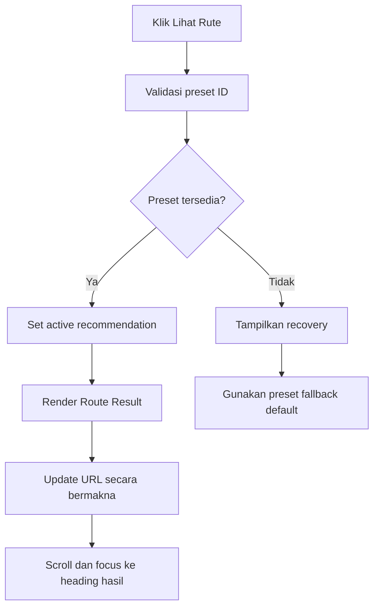
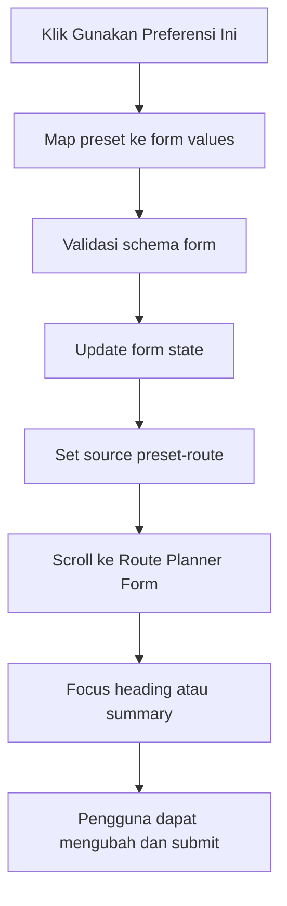

# Planning Lengkap — Section 3 Popular / Preset Routes NUSANTARAYA

<aside>
🛣️

**Tujuan dokumen:** menjadi source of truth produk, UX, visual, data, engineering, accessibility, analytics, QA, dan demo untuk membangun **Section 3 — Popular / Preset Routes** pada halaman **Nusa Route** (`/routes`). Section ini mengubah kumpulan rute terkurasi menjadi jalur inspirasi yang cepat dipahami, dapat langsung dibuka, dapat mengisi ulang Route Planner Form, dan selalu siap menjadi fallback ketika generator dinamis tidak tersedia.

</aside>

---

## 1. Ringkasan Eksekutif

### 1.1 Nama Section

**Popular / Preset Routes**

Nama tampilan yang direkomendasikan:

> **Rute Pilihan untuk Memulai Perjalanan**
> 

Alternatif copy:

- Jelajahi Rute Terpopuler Nusantara
- Perjalanan Terkurasi, Siap Dijelajahi
- Mulai dari Rute yang Sudah Teruji
- Curated Nusa Journeys

### 1.2 Route, Nomor, dan Posisi

- **Halaman:** Nusa Route.
- **Route:** `/routes`.
- **Nomor section:** 3.
- **Posisi:** setelah Route Planner Form dan sebelum Route Recommendation Result.
- **Anchor:** `#preset-routes`.
- **Peran:** jalur cepat bagi pengguna yang belum ingin mengisi form, sumber prefill bagi form, katalog inspirasi, dan fallback lokal untuk recommendation engine.

Urutan halaman:

```
1. Route Hero / Page Header
2. Route Planner Form
3. Popular / Preset Routes ← SECTION INI
4. Route Recommendation Result
5. Day-by-Day Itinerary
6. Route Map + Transport Summary
7. Budget, Culinary, Etiquette, and Checklist
8. Save to Passport + Ask RANI
9. Related Journeys / Final CTA
```

### 1.3 Konsep Produk

```
Curated Route Library
× Editorial Journey Shelf
× Heritage Futuristic Light
```

Section bukan sekadar grid kartu destinasi. Setiap preset adalah **produk perjalanan terkurasi** dengan ID stabil, metadata terstruktur, alasan pemilihan, cakupan realistis, dan hubungan langsung ke form serta result engine.

### 1.4 North Star UX

> Dalam 10–20 detik, pengguna harus dapat menemukan satu rute yang menarik, memahami karakter utamanya, lalu memilih antara melihat detail atau memakai preferensinya sebagai titik awal.
> 

### 1.5 Hubungan dengan Dokumen Existing

Planning ini melanjutkan keputusan dari [Planning Lengkap — Section 2 Route Planner Form NUSANTARAYA](https://app.notion.com/p/Planning-Lengkap-Section-2-Route-Planner-Form-NUSANTARAYA-eb2b2fe430854788b534a4c8aebc1344?pvs=21), serta menyelaraskan implementasi dengan [PRD — NUSANTARAYA: Digital Twin Nusantara](https://app.notion.com/p/PRD-NUSANTARAYA-Digital-Twin-Nusantara-3ba098210a3c82d3ba94815e97897510?pvs=21), [FLOWCHART NUSANTARAYA WEB](https://app.notion.com/p/FLOWCHART-NUSANTARAYA-WEB-d9e098210a3c82ef846c01b2b673e84f?pvs=21), dan [Roadmap & Workflow Pengembangan NUSANTARAYA](https://app.notion.com/p/Roadmap-Workflow-Pengembangan-NUSANTARAYA-02a098210a3c83dfb7688147846399f4?pvs=21).

Keputusan yang wajib dipertahankan:

- Route Planner adalah fitur **Must Have**.
- MVP memakai **10 preset route** terkurasi sebelum enhancement dinamis.
- Preset lokal wajib menjamin demo tetap berjalan tanpa API.
- Form MVP menggunakan durasi **3, 5, atau 7 hari**.
- Data route harus canonical dan reusable, bukan hard-coded tersebar di card.
- Visual mengikuti **Heritage Futuristic Light**.
- Seluruh section harus responsif, bilingual-ready, accessible, dan aman untuk demo.

---

## 2. Problem Statement dan Nilai Utama

### 2.1 Masalah Pengguna

Tidak semua pengguna siap menyusun preferensi dari nol. Sebagian pengguna:

- belum tahu wilayah yang ingin dikunjungi,
- ingin inspirasi cepat,
- ingin melihat contoh kualitas output sebelum mengisi form,
- ingin rute yang aman dan mudah didemokan,
- atau datang dari Map/Atlas tanpa konteks yang lengkap.

Tanpa preset, halaman terlalu bergantung pada form dan generator. Jika API gagal atau pilihan pengguna tidak memiliki exact match, pengalaman dapat menjadi dead end.

### 2.2 Nilai yang Diberikan

1. **Inspirasi instan:** rute dapat dipindai tanpa mengisi form.
2. **Kepercayaan:** pengguna melihat rute yang dikurasi, bukan hasil acak.
3. **Kontrol:** pengguna dapat membuka detail atau mengubah preset lewat form.
4. **Reliability:** preset menjadi fallback lokal untuk generator.
5. **Demo readiness:** satu klik menghasilkan output yang stabil.
6. **Discovery:** memperkenalkan region dan tema yang mungkin belum terpikirkan.
7. **Consistency:** card, form, matcher, result, Passport, dan RANI membaca data route yang sama.

---

## 3. Tujuan, Non-Goals, dan KPI

### 3.1 Tujuan Utama

- Menampilkan 10 preset canonical dengan hierarchy yang mudah dipindai.
- Mempercepat time-to-first-route.
- Menjadi jalur alternatif selain Route Planner Form.
- Mengisi form secara transparan melalui CTA **Gunakan Preferensi Ini**.
- Membuka result/detail melalui CTA **Lihat Rute**.
- Menjamin fallback recommendation selalu tersedia.
- Mendorong eksplorasi region, tema, dan flagship province secara seimbang.

### 3.2 Non-Goals

Section tidak bertanggung jawab untuk:

- menampilkan itinerary harian lengkap,
- membuat booking atau harga real-time,
- mengklaim popularitas tanpa data,
- memuat peta interaktif berat,
- mengarang jadwal transportasi,
- menyimpan rute langsung tanpa review,
- menggantikan form,
- menjadi katalog puluhan rute pada MVP,
- menampilkan rating/testimoni palsu.

### 3.3 KPI

| Metrik | Target MVP | Target Polish |
| --- | --- | --- |
| Preset section view rate | ≥ 70% pengunjung `/routes` | ≥ 80% |
| Preset interaction rate | ≥ 25% | ≥ 35% |
| Route detail open rate | ≥ 15% | ≥ 25% |
| Prefill form rate | ≥ 8% | ≥ 15% |
| Fallback success | 100% | 100% |
| Time to first preset action | ≤ 20 detik | ≤ 12 detik |
| Keyboard completion | 100% flow utama | 100% |
| Layout shift | tidak terasa | CLS section ≈ 0 |

**Catatan:** label “Populer” hanya boleh digunakan sebagai editorial collection atau berdasarkan sinyal interaksi nyata. Jangan menampilkan angka “paling banyak dipilih” jika analytics belum tersedia.

---

## 4. Persona dan Skenario Utama

### 4.1 Pengguna yang Butuh Inspirasi

> “Saya ingin liburan, tetapi belum tahu harus mulai dari wilayah mana.”
> 

Aksi ideal: melihat featured route → membaca tema dan stop → **Lihat Rute**.

### 4.2 Pengguna yang Sudah Punya Preferensi Kasar

> “Saya tertarik budaya dan kuliner di Jawa, tetapi ingin contoh rute siap pakai.”
> 

Aksi ideal: filter Jawa/Budaya → pilih preset → **Gunakan Preferensi Ini** → form terisi → sesuaikan.

### 4.3 Turis Mancanegara

> “Saya butuh rute yang mudah dipahami dan tidak terlalu padat.”
> 

Aksi ideal: memilih collection “First Journey” atau pace santai → membuka detail dengan etiquette dan transport disclaimer.

### 4.4 Juri Lomba

> “Apakah Route Planner tetap bekerja tanpa API?”
> 

Aksi ideal: klik preset 5 Hari Budaya & Kuliner Jawa → result langsung tampil → map mini, itinerary, budget label, etiquette, dan Save to Passport tersedia.

---

## 5. Scope Konten Section

### 5.1 Elemen Wajib

1. Editorial header.
2. Featured preset utama.
3. Filter/chip ringan.
4. Grid preset route.
5. Card dengan metadata minimum.
6. CTA **Lihat Rute**.
7. CTA **Gunakan Preferensi Ini**.
8. Empty/no-match recovery.
9. Loading/skeleton jika data async.
10. Analytics hooks.
11. Integrasi form/result/Passport/RANI.
12. Bilingual copy.

### 5.2 Metadata yang Ditampilkan di Card

- nama rute,
- region/collection,
- durasi,
- 2–3 minat utama,
- 2–4 stop ringkas,
- pace,
- budget label,
- satu kalimat value proposition,
- badge editorial yang valid,
- gambar utama,
- CTA.

### 5.3 Informasi yang Tidak Ditampilkan di Card

- itinerary harian penuh,
- jadwal transportasi rinci,
- harga angka pasti,
- seluruh tips,
- seluruh sumber,
- lebih dari empat stop,
- deskripsi panjang.

---

## 6. Arsitektur Informasi

### 6.1 Struktur Section

```
PresetRoutesSection
├── Section Header
│   ├── Eyebrow
│   ├── Heading
│   ├── Supporting copy
│   └── Optional result count
├── Filter Bar
│   ├── Collection
│   ├── Region
│   ├── Duration
│   └── Interest
├── Featured Route
│   ├── Editorial image
│   ├── Route metadata
│   ├── Mini route ribbon
│   └── Primary + secondary CTA
├── Preset Grid
│   └── PresetRouteCard × 9
├── Empty / No-match State
└── Browse/Reset Footer
```

### 6.2 Hierarchy Rekomendasi

- Satu featured route sebagai entry point utama.
- Maksimal sembilan card pendukung.
- Maksimal satu badge editorial per card.
- Filter bukan pusat visual; konten route tetap dominan.
- Jangan membuat seluruh section menjadi carousel yang menyembunyikan pilihan.

### 6.3 Featured Route Default

Rekomendasi default:

**5 Hari Budaya & Kuliner Jawa**

Alasan:

- selaras dengan skenario demo form,
- memanfaatkan flagship DI Yogyakarta,
- mudah dipahami pengguna lokal dan internasional,
- cocok untuk tema budaya + kuliner,
- dapat memakai durasi, budget, dan pace default form.

Featured route dapat berubah berdasarkan context tervalidasi, tetapi jangan berubah acak setiap render.

---

## 7. Copywriting Final

### 7.1 Header

**Eyebrow**

```
Rute Terkurasi Nusantara
```

**Heading**

```
Mulai dari perjalanan yang sudah kami pilihkan.
```

**Supporting copy**

```
Jelajahi rute siap pakai berdasarkan wilayah, durasi, dan pengalaman. Buka detailnya sekarang atau gunakan preferensinya sebagai titik awal untuk rute versimu sendiri.
```

**Trust microcopy**

```
Dikurasi dari data lokal · Dapat disesuaikan · Tetap tersedia tanpa generator AI
```

### 7.2 CTA

- Primary: **Lihat Rute**.
- Secondary: **Gunakan Preferensi Ini**.
- Filter reset: **Tampilkan Semua Rute**.
- No match: **Hapus Filter**.
- Contextual fallback: **Lihat Rute Terdekat**.

### 7.3 Card Microcopy

- Durasi: `5 hari`.
- Pace: `Ritme seimbang`.
- Budget: `Kisaran menengah`.
- Stops: `Yogyakarta → Solo → Semarang`.
- Disclaimer: `Urutan dan cakupan dapat disesuaikan.`

### 7.4 Empty State

```
Belum ada preset yang cocok dengan semua filter ini.
Coba hapus satu filter atau gunakan Route Planner untuk rekomendasi yang lebih personal.
```

---

## 8. Daftar 10 Preset Canonical MVP

<aside>
📌

Nama, stop, dan metadata di bawah adalah baseline produk. Sebelum implementasi final, audit `routes.json`, ID provinsi, aset, fakta budaya, serta realisme perpindahan. Card hanya menampilkan ringkasan; itinerary lengkap harus berasal dari dataset route canonical.

</aside>

| # | ID | Nama | Durasi | Region | Minat utama |
| --- | --- | --- | --- | --- | --- |
| 1 | `jawa-budaya-kuliner-5` | Budaya & Kuliner Jawa | 5 | Jawa | Budaya, Kuliner |
| 2 | `yogyakarta-cultural-escape-3` | Yogyakarta Cultural Escape | 3 | Jawa | Budaya, Sejarah |
| 3 | `bali-slow-journey-3` | Bali Slow Journey | 3 | Bali–Nusa Tenggara | Relaksasi, Budaya |
| 4 | `bali-nusa-tenggara-5` | Bali–Nusa Tenggara Highlights | 5 | Bali–Nusa Tenggara | Alam, Budaya |
| 5 | `maluku-spice-route-5` | Jalur Rempah Maluku | 5 | Maluku | Sejarah, Kuliner |
| 6 | `sumatra-heritage-7` | Sumatra Heritage Trail | 7 | Sumatra | Budaya, Sejarah |
| 7 | `kalimantan-nature-future-5` | Kalimantan Nature & Future | 5 | Kalimantan | Alam, Kota & Kreativitas |
| 8 | `sulawesi-culture-nature-7` | Sulawesi Culture & Nature | 7 | Sulawesi | Budaya, Alam |
| 9 | `papua-wonder-7` | Papua Wonder Journey | 7 | Papua | Alam, Budaya |
| 10 | `jawa-bali-heritage-7` | Jawa–Bali Heritage Passage | 7 | Lintas region terkontrol | Budaya, Sejarah |

### 8.1 Guardrail Daftar Preset

- Durasi MVP harus cocok dengan form: **3, 5, atau 7 hari**.
- Rute lintas pulau hanya digunakan jika perpindahan masuk akal dan diberi travel window.
- Jangan memaksa banyak provinsi demi terlihat luas.
- Satu preset idealnya mempunyai 1–3 province ID dan 2–4 base/cluster.
- Stop pada card adalah ringkasan, bukan jadwal.
- Jika detail konektivitas belum tervalidasi, gunakan cluster/province naming dan disclaimer.
- Rute harus mewakili tujuh region serta flagship province secara seimbang.

### 8.2 Collection Tags

Setiap route dapat memiliki maksimal dua collection:

- `popular-starter`
- `first-journey`
- `heritage`
- `nature`
- `culinary`
- `slow-travel`
- `flagship`
- `spice-route`
- `east-indonesia`
- `demo-ready`

Collection adalah metadata editorial, bukan klaim statistik.

---

## 9. Filter dan Discovery

### 9.1 Filter MVP

1. **Collection:** Semua, Untuk Pertama Kali, Heritage, Alam, Kuliner, Slow Travel.
2. **Region:** tujuh region canonical.
3. **Durasi:** 3, 5, 7 hari.
4. **Minat:** Budaya, Alam, Kuliner, Sejarah, Petualangan, Relaksasi.

### 9.2 Prinsip Filter

- Default: semua route.
- Gunakan chip/segmented control; dropdown hanya jika ruang terbatas.
- Filter bekerja client-side pada 10 item.
- Kombinasi antar-kategori memakai logika AND; pilihan dalam kategori memakai OR jika multi-select diizinkan.
- Untuk MVP, region dan durasi sebaiknya single-select agar mental model sederhana.
- Result count diumumkan secara accessible.
- Update URL opsional: `?presetRegion=jawa&presetDuration=5`.
- Gunakan `replace`, bukan `push`, untuk filter preview.

### 9.3 Context-Aware Ordering

Jika pengguna datang dari:

- **Map/Atlas:** urutkan preset yang memuat region/province tersebut lebih dulu.
- **Route Planner Form:** tampilkan exact/near match lebih dulu setelah preferensi berubah.
- **Regional Explorer:** utamakan route region terkait.
- **RANI/Journey:** gunakan `contextPresetRouteId` jika valid.

Context hanya mengubah urutan atau active filter; jangan menyembunyikan semua alternatif tanpa kontrol reset.

### 9.4 Search

Search teks tidak dibutuhkan pada MVP karena hanya 10 route. Tambahkan hanya jika koleksi berkembang menjadi lebih dari 20–24 route.

---

## 10. Spesifikasi Preset Route Card

### 10.1 Anatomi Card

```
Image / Visual
├── Editorial badge
├── Duration badge
└── Optional region accent
Content
├── Region eyebrow
├── Route title
├── One-line promise
├── Interest chips
├── Mini route ribbon / stops
├── Pace + budget metadata
└── CTA row
```

### 10.2 Information Hierarchy

1. Gambar dan nama rute.
2. Promise/value proposition.
3. Durasi dan region.
4. Route ribbon.
5. Minat, pace, budget.
6. CTA.

### 10.3 Mini Route Ribbon

- 2–4 node.
- Gunakan label pendek.
- Hubungkan node dengan garis sederhana.
- Jika lebih banyak stop, tampilkan `+2 pengalaman` alih-alih memadatkan.
- Ribbon bukan peta geografis; jangan menyiratkan jarak presisi.
- Dekorasi harus `aria-hidden`; daftar stop tetap tersedia sebagai teks accessible.

### 10.4 Badge yang Diizinkan

- Pilihan Utama
- Cocok untuk Pertama Kali
- Heritage Trail
- Slow Journey
- Jalur Rempah
- Indonesia Timur
- Demo Pilihan

Jangan memakai “Terlaris”, “#1”, atau “Paling Populer” tanpa data.

### 10.5 Hover, Focus, dan Selected

- Hover: image zoom 1.02–1.04, border/shadow naik ringan.
- Focus: ring 2–3 px yang kontras.
- Active/tap: scale ringan tanpa layout shift.
- Selected/current route: border kuat + label `Sedang dilihat`.
- Card tidak boleh seluruhnya menjadi link jika berisi dua aksi berbeda.

---

## 11. Featured Route

### 11.1 Layout Desktop

```
┌───────────────────────────────┬──────────────────────────────┐
│ Editorial image / route art   │ Eyebrow + title              │
│                               │ Promise                      │
│                               │ Metadata                     │
│                               │ Route ribbon                 │
│                               │ [Lihat Rute] [Gunakan…]      │
└───────────────────────────────┴──────────────────────────────┘
```

### 11.2 Layout Mobile

- Image di atas dengan aspect ratio stabil.
- Metadata wrap natural.
- CTA primary full width.
- CTA secondary menjadi text/outline button.
- Route ribbon boleh scroll secara internal hanya jika tetap accessible; lebih baik wrap/stack.

### 11.3 Pemilihan Featured

Priority:

1. exact `presetId` dari context,
2. exact region/duration match dari form,
3. editorial default,
4. first valid preset.

Jangan randomize agar SSR/hydration dan demo stabil.

---

## 12. Interaction Flow

### 12.1 Lihat Rute



Perilaku:

- result memakai data canonical yang sama,
- form dapat ikut terisi agar state konsisten,
- URL direkomendasikan: `/routes?preset=jawa-budaya-kuliner-5`,
- browser Back harus memulihkan filter dan posisi secara masuk akal,
- analytics mencatat source `preset-routes`.

### 12.2 Gunakan Preferensi Ini



Aturan:

- jangan auto-submit,
- jangan menimpa origin province pengguna kecuali preset memang mendefinisikannya dan pengguna menyetujui,
- tampilkan status `Preferensi diisi dari [nama route]`,
- durasi, region, interests, budget, dan pace harus valid,
- jika preset punya lebih dari tiga minat, mapper memilih tiga primary interests yang sudah ditandai di data.

### 12.3 Klik Filter

- update hasil tanpa reload,
- pertahankan focus,
- announce jumlah hasil,
- jangan memindahkan scroll secara agresif.

---

## 13. State Matrix

| State | Kondisi | Tampilan | Aksi |
| --- | --- | --- | --- |
| Default | masuk langsung | featured default + 9 card | filter/buka/prefill |
| Contextual | datang dari Map/RANI | route relevan diurutkan awal | review |
| Filtered | filter aktif | hasil + active chips | pilih/reset |
| No match | kombinasi kosong | recovery + nearest routes | hapus filter/form |
| Loading | data async | skeleton dengan ukuran stabil | menunggu |
| Error | data gagal | fallback embedded/local | retry/buka default |
| Opening | result sedang disiapkan | CTA loading + result skeleton | menunggu |
| Prefilled | preferensi dipindah ke form | confirmation message | edit/generate |
| Active | route sedang tampil | card ditandai | lihat result |
| Empty dataset | data invalid/kosong | CTA Route Planner Form | gunakan form |

---

## 14. Data Contract

### 14.1 Type Preset Route

```tsx
export type PresetRouteBadge =
  | "editorial-pick"
  | "first-journey"
  | "heritage-trail"
  | "slow-journey"
  | "spice-route"
  | "east-indonesia"
  | "demo-ready";

export interface PresetRouteStopSummary {
  id: string;
  provinceId: string;
  cityOrCluster: string;
  shortLabel: string;
  order: number;
}

export interface PresetRoute {
  id: string;
  slug: string;
  status: "draft" | "published" | "archived";
  localeContent: {
    id: { title: string; summary: string; promise: string };
    en: { title: string; summary: string; promise: string };
  };
  regionIds: RegionId[];
  primaryRegionId: RegionId;
  durationDays: 3 | 5 | 7;
  primaryInterests: RouteInterest[];
  supportedBudgetLevels: BudgetLevel[];
  recommendedPace: TravelPace;
  provinceIds: string[];
  cardStops: PresetRouteStopSummary[];
  collections: string[];
  badge?: PresetRouteBadge;
  heroImage: {
    src: string;
    altId: string;
    altEn: string;
    focalPoint?: string;
  };
  resultRef: string;
  sourceRefs?: string[];
  updatedAt: string;
}
```

### 14.2 Card View Model

```tsx
export interface PresetRouteCardViewModel {
  id: string;
  title: string;
  promise: string;
  durationLabel: string;
  regionLabel: string;
  interestLabels: string[];
  paceLabel: string;
  budgetLabel: string;
  stopLabels: string[];
  badgeLabel?: string;
  imageSrc: string;
  imageAlt: string;
  isFeatured: boolean;
  isActive: boolean;
}
```

### 14.3 Handoff ke Form

```tsx
export interface PresetToPlannerPayload {
  source: "preset-route";
  contextPresetRouteId: string;
  durationDays: 3 | 5 | 7;
  destinationRegionId: RegionId;
  interests: RouteInterest[];
  budgetLevel: BudgetLevel;
  travelPace: TravelPace;
  originProvinceId: string | null;
}
```

### 14.4 Aturan Validasi

- ID dan slug unik.
- `status` harus `published` agar tampil.
- Durasi hanya 3/5/7 pada MVP.
- `primaryRegionId` harus termasuk `regionIds`.
- 1–3 `primaryInterests`.
- Minimal satu supported budget.
- Semua province ID harus canonical.
- 2–4 `cardStops` dengan order unik.
- `resultRef` wajib menunjuk route detail/result yang valid.
- Image source dan alt wajib.
- Locale ID wajib; EN dapat fallback terkontrol hanya saat development, bukan production.
- Route invalid tidak dirender dan dicatat dalam development warning.

---

## 15. Data Architecture dan Source of Truth

### 15.1 Rekomendasi Struktur

```
src/data/routes/
├── presets.ts atau presets.json
├── route-details/
│   ├── jawa-budaya-kuliner-5.ts
│   └── ...
├── collections.ts
└── sources.ts

src/lib/routes/
├── presetRouteSchema.ts
├── getPublishedPresetRoutes.ts
├── filterPresetRoutes.ts
├── rankPresetRoutes.ts
├── mapPresetToPlannerValues.ts
└── resolvePresetRouteResult.ts
```

### 15.2 Prinsip Source of Truth

- Section, matcher, result, RANI, dan Passport tidak boleh memiliki salinan data route berbeda.
- Card membaca summary dari route canonical.
- Result membaca detail dari `resultRef` atau record yang sama.
- Form prefill memakai mapper, bukan manual object di komponen.
- Badge/collection berasal dari data editorial.
- Analytics memakai ID, bukan title terjemahan.

### 15.3 Strategi Loading

Untuk 10 preset, data lokal statis adalah pilihan utama:

- stabil,
- cepat,
- offline-friendly,
- mudah divalidasi saat build,
- tidak memerlukan request client tambahan.

Jika nanti data berasal dari CMS, tetap generate fallback snapshot lokal untuk demo.

---

## 16. Ranking dan Matching

### 16.1 Urutan Default

1. featured editorial,
2. demo-ready,
3. first-journey,
4. keseimbangan region,
5. order editorial stabil.

### 16.2 Context Score Baseline

```tsx
score =
  exactPreset * 100 +
  regionMatch * 40 +
  durationMatch * 25 +
  interestOverlap * 15 +
  paceMatch * 10 +
  budgetCompatibility * 5;
```

Aturan:

- score dipakai untuk ordering internal, bukan ditampilkan sebagai “97% cocok”.
- tie-breaker memakai `editorialOrder` stabil.
- context invalid diabaikan.
- jika exact match tidak ada, tampilkan alasan kualitatif seperti `Wilayah dan durasi paling dekat`.

### 16.3 Hubungan dengan Form Matcher

Gunakan satu fungsi ranking canonical. Jangan membuat matcher berbeda untuk:

- section preset,
- fallback form,
- recommendation result,
- RANI.

Perbedaannya hanya filter dan threshold, bukan logika inti.

---

## 17. Visual Direction

### 17.1 Creative Direction

```
Premium editorial travel catalog
× atlas route ribbon
× material Nusantara yang halus
```

Section harus terasa hangat, kaya visual, dan lebih inspiratif daripada form, tetapi tetap satu keluarga desain.

### 17.2 Palet

- Background: `#F8F4EA` atau `#FFFDF8`.
- Surface: putih hangat.
- Text: `#0D1B2A`.
- Gold CTA/accent: `#C9A84C`.
- Forest success: `#2D5A27`.
- Border: `#E8E0CE`.
- Region colors hanya aksen kecil.

### 17.3 Typography

- Heading route: Playfair Display/Cormorant Garamond.
- Metadata/UI: Inter.
- Eyebrow: uppercase ringan dengan letter spacing.
- Title card maksimal 2–3 baris.

### 17.4 Surface

- Featured radius 24–32 px.
- Card radius 18–24 px.
- Border tipis dan shadow lembut.
- Hindari nested border berlebihan.
- Motif batik/tenun 3–5% opacity di area kosong.
- Jangan memakai glassmorphism berat.

### 17.5 Image Direction

- Gunakan foto yang mewakili karakter route, bukan kolase acak.
- Satu focal point jelas.
- Hindari teks baked-in pada gambar.
- Gunakan crop konsisten.
- Alt menjelaskan scene, bukan mengulang nama route.
- Jangan menampilkan tempat sensitif tanpa konteks.

---

## 18. Layout Responsif

| Breakpoint | Featured | Grid | Filter |
| --- | --- | --- | --- |
| ≥1280 px | split 7/5 atau 6/6 | 3 kolom | inline/wrap |
| 1024–1279 px | split proporsional | 2–3 kolom | wrap |
| 768–1023 px | split atau stacked | 2 kolom | horizontal wrap |
| <768 px | stacked | 1 kolom | compact chips/disclosure |

### 18.1 Desktop

- Max-width selaras dengan Route Planner Form.
- Featured memiliki visual dominan tetapi tidak melebihi satu viewport penuh.
- Grid tiga kolom hanya jika copy dan CTA tetap lapang.

### 18.2 Tablet

- Jangan memaksakan tiga kolom sempit.
- Gunakan dua kolom.
- Filter boleh dua baris.
- Featured dapat tetap split jika image tidak terpotong buruk.

### 18.3 Mobile

- Padding 16–20 px.
- Grid satu kolom.
- Touch target minimal 44 px.
- CTA tidak berdempetan.
- Chips wrap; jangan wajib horizontal scroll.
- Card image memakai aspect ratio stabil.
- Tidak ada overflow dari route ribbon.

---

## 19. Motion dan Micro-interaction

- Card reveal: opacity + translateY kecil.
- Image hover: scale maksimal 1.04.
- Filter result: crossfade/height transition ringan tanpa layout jump besar.
- Route ribbon: node highlight berurutan hanya saat pertama terlihat, maksimal 600–900 ms.
- CTA arrow: translate 2–4 px.
- Active card: border transition.
- `prefers-reduced-motion`: seluruh motion non-esensial dinonaktifkan.
- Jangan memakai auto-rotating carousel atau parallax berat.

---

## 20. Component Architecture

### 20.1 Struktur Folder

```
src/components/routes/preset-routes/
├── PresetRoutesSection.tsx
├── PresetRoutesHeader.tsx
├── PresetRouteFilters.tsx
├── FeaturedPresetRoute.tsx
├── PresetRoutesGrid.tsx
├── PresetRouteCard.tsx
├── PresetRouteRibbon.tsx
├── PresetRouteMetadata.tsx
├── PresetRoutesEmptyState.tsx
├── PresetRoutesSkeleton.tsx
├── usePresetRouteFilters.ts
└── index.ts
```

### 20.2 Tanggung Jawab

**`PresetRoutesSection`**

- composition,
- source data,
- context ordering,
- analytics section view,
- relationship ke form/result.

**`PresetRouteFilters`**

- controlled filters,
- URL sync opsional,
- result count,
- reset.

**`FeaturedPresetRoute`**

- featured presentation,
- dua CTA,
- no business logic.

**`PresetRouteCard`**

- presentational,
- menerima view model,
- tidak membaca store langsung.

**`PresetRouteRibbon`**

- visual urutan stop,
- accessible text equivalent.

**Mapper/ranker**

- berada di `src/lib/routes`,
- pure, typed, dan dapat diuji.

### 20.3 State Management

- Filter lokal di section.
- Query params jika state perlu shareable.
- Active result di route planner store/context existing.
- Form state tetap milik form.
- Jangan membuat global store baru jika adapter existing cukup.
- Tidak ada duplicate source of truth antara card dan result.

---

## 21. Integrasi Ekosistem

### 21.1 Route Planner Form

- Preset dapat mengisi form tanpa auto-submit.
- Form dapat mengirim preferensi untuk ranking preset.
- Reset form tidak harus mereset filter preset kecuali ada keputusan eksplisit.

### 21.2 Route Recommendation Result

- CTA Lihat Rute mengaktifkan hasil yang sama dengan fallback matcher.
- Result menerima `matchType: "preset"`.
- Result menjelaskan bahwa rute terkurasi dan dapat diedit.

### 21.3 Map dan Province Atlas

- Route dapat dibuka dari province/region context.
- Preset terkait province dapat diurutkan lebih awal.
- Jangan memuat interactive map di card.

### 21.4 Passport

- Card tidak langsung menambah stamp.
- Stamp/progress diperoleh setelah route disimpan atau action canonical lain.
- Saved route menyimpan preset ID + version.

### 21.5 RANI

- CTA `Tanya RANI tentang rute ini` berada di result, bukan wajib di card.
- RANI menerima preset ID, region, stops, duration, dan locale.
- RANI tidak boleh mengubah fakta route tanpa dataset.

### 21.6 Bilingual dan Mode

- ID/EN copy berasal dari locale data.
- Tourist Mode dapat mengubah emphasis ke etiquette, pace, dan practical summary.
- Learn Mode dapat menekankan konteks sejarah/sumber pada result.

---

## 22. Accessibility Plan

### 22.1 Semantik

- `<section aria-labelledby="preset-routes-title">`.
- Filter menggunakan group/fieldset yang sesuai.
- Card title memakai heading level konsisten.
- CTA berupa button untuk state action, link untuk navigasi canonical.
- Gambar memiliki alt bermakna.
- Badge dekoratif tidak mengganggu nama accessible.

### 22.2 Keyboard

- Urutan Tab: filter → featured CTA → grid CTA.
- Semua chip dapat dioperasikan dengan keyboard.
- Focus tidak hilang saat filtering.
- Setelah Lihat Rute, focus menuju heading hasil dengan hati-hati.
- Setelah Prefill, focus menuju form summary/heading.

### 22.3 Screen Reader

- Jumlah hasil memakai `aria-live="polite"`.
- Loading dan error diumumkan.
- Route ribbon tersedia sebagai daftar teks.
- State active dijelaskan, bukan hanya border.
- Tombol memiliki nama route: `Lihat rute Budaya & Kuliner Jawa`.

### 22.4 Visual

- WCAG AA.
- Badge, text overlay, dan metadata memiliki kontras aman.
- Focus ring terlihat.
- Informasi tidak bergantung warna.
- Zoom 200% tidak memotong CTA.
- Forced-colors tetap dapat membedakan button/link jika memungkinkan.

---

## 23. Performance Plan

### 23.1 Target

- Tidak menambah request data client pada MVP.
- Tidak memuat map library.
- Gambar di bawah fold lazy-loaded.
- Featured image memakai ukuran responsif dan priority hanya jika benar-benar dekat viewport.
- Filter response <50 ms untuk 10 item.
- Interaction feedback <100 ms.
- Tidak ada long task >200 ms dari section.

### 23.2 Image Budget

- Featured ideal ≤ 180–250 KB.
- Card image ideal ≤ 80–140 KB.
- Gunakan AVIF/WebP dengan fallback sesuai pipeline.
- Definisikan width/height atau aspect ratio untuk mencegah CLS.

### 23.3 Bundle

- Gunakan CSS transition sebelum menambah motion library khusus.
- Icon tree-shaken.
- Jangan import result map atau itinerary engine ke card bundle jika dapat dipisah.
- Data detail dapat di-load ketika route dibuka; summary tetap statis.

---

## 24. Analytics

### 24.1 Events

```
preset_routes_viewed
preset_routes_filter_selected
preset_routes_filter_cleared
preset_routes_no_match_viewed
preset_route_impression
preset_route_opened
preset_route_prefill_clicked
preset_route_prefill_succeeded
preset_route_result_loaded
preset_route_fallback_used
preset_route_error
```

### 24.2 Payload Aman

```tsx
{
  presetId,
  source,
  placement: "featured" | "grid" | "fallback",
  regionIds,
  durationDays,
  interestCount,
  activeFilters,
  locale,
  travelerMode
}
```

Jangan mengirim origin detail, query bebas, atau data pribadi.

### 24.3 Impression Rule

Card impression hanya dicatat jika:

- minimal 50% card terlihat,
- minimal 1 detik,
- deduplicated per session/view.

Untuk MVP, event section view + click sudah cukup; impression detail adalah polish.

---

## 25. SEO dan Shareability

- Section content harus server-renderable jika data lokal.
- Judul route dan ringkasan tersedia dalam HTML, bukan hanya client animation.
- Canonical route detail lebih baik: `/routes/[slug]` atau URL query yang stabil sesuai arsitektur existing.
- Metadata/OpenGraph route dibuat di level detail/result, bukan card section.
- Filter URL tidak perlu diindeks sebagai halaman terpisah.
- Jangan membuat duplicate canonical content untuk setiap kombinasi filter.

---

## 26. Content Safety dan Cultural Integrity

- Fakta budaya harus berasal dari source refs terkurasi.
- Jangan mereduksi masyarakat menjadi dekorasi “eksotis”.
- Gunakan nama wilayah, komunitas, tradisi, dan tempat secara akurat.
- Jangan menjanjikan akses ke upacara/tempat sakral.
- Jangan mendorong overtourism pada lokasi sensitif.
- Jangan menyatakan “hidden gem” tanpa pertimbangan kapasitas dan sensitivitas.
- Foto harus memiliki hak penggunaan yang aman dan caption/credit bila diperlukan.
- Route detail harus membedakan inspirasi perjalanan dari informasi operasional real-time.

---

## 27. Error Handling dan Recovery

| Masalah | Recovery |
| --- | --- |
| Preset ID dari URL invalid | hapus/abaikan param, tampilkan default |
| Route record invalid | skip record, log development warning |
| Image gagal | fallback visual/pattern + alt text |
| Result detail gagal dimuat | gunakan embedded fallback atau arahkan ke form |
| Filter no match | reset + nearest routes |
| Prefill mapper gagal | jangan merusak form; tampilkan error ramah |
| Locale copy hilang | fallback ID saat development; blok production QA |
| API/AI offline | preset tetap berjalan penuh |

Copy error:

```
Rute ini belum dapat dibuka sepenuhnya. Kamu tetap dapat memakai preferensinya di Route Planner atau memilih rute terkurasi lain.
```

---

## 28. Test Plan

### 28.1 Unit Tests

- schema menerima 10 preset valid,
- menolak ID duplikat,
- menolak durasi non-MVP,
- menolak province/region invalid,
- filter menghasilkan expected set,
- ranker deterministic,
- mapper preset → form benar,
- locale resolver benar,
- archived route tidak tampil.

### 28.2 Component Tests

- featured route tampil,
- filter chip bekerja keyboard,
- result count berubah,
- no-match recovery bekerja,
- dua CTA memiliki aksi berbeda,
- card active state benar,
- image fallback tampil,
- accessible names mengandung nama route.

### 28.3 Integration Tests

1. Direct entry → featured → Lihat Rute → result.
2. Direct entry → filter Jawa + 5 hari → route sesuai.
3. Preset → Gunakan Preferensi Ini → form terisi → edit → generate.
4. Context Map Jawa → ranking Jawa naik.
5. URL preset invalid → halaman tidak crash.
6. Generator/API offline → preset tetap membuka result.
7. Save result → Passport menyimpan route stamp.
8. Switch ID/EN → title dan metadata berubah tanpa state hilang.
9. Back/Forward → route/filter state masuk akal.

### 28.4 E2E Demo Path

```
Buka /routes
→ scroll ke Rute Pilihan
→ buka 5 Hari Budaya & Kuliner Jawa
→ result muncul
→ tampilkan itinerary + map mini + budget + etiquette
→ kembali ke preset
→ klik Gunakan Preferensi Ini
→ form terisi
→ ubah pace
→ generate ulang
→ simpan ke Passport
```

### 28.5 Device QA

- 360×800,
- 390×844,
- 768×1024,
- 1024×768,
- 1366×768,
- 1440×900,
- zoom 200%,
- keyboard only,
- screen reader spot check,
- reduced motion,
- slow 4G,
- offline/API failure.

---

## 29. Implementation Phases

### Fase A — Audit dan Contract

- [ ]  Audit `/routes` dan Section 2 existing.
- [ ]  Audit `routes.json`/preset data.
- [ ]  Audit region/province/interest IDs.
- [ ]  Audit route result contract.
- [ ]  Audit store, URL adapter, Passport, dan RANI integration.
- [ ]  Kunci schema serta 10 preset IDs.

### Fase B — Dataset

- [ ]  Buat 10 summary records.
- [ ]  Hubungkan setiap preset ke detail/result.
- [ ]  Validasi durasi dan realisme scope.
- [ ]  Tambahkan locale ID/EN.
- [ ]  Tambahkan aset dan alt.
- [ ]  Tambahkan source refs.

### Fase C — Static UI

- [ ]  Header section.
- [ ]  Filter bar.
- [ ]  Featured route.
- [ ]  Grid card.
- [ ]  Route ribbon.
- [ ]  Empty/skeleton/error states.
- [ ]  Responsive layout.

### Fase D — Behavior

- [ ]  Filter client-side.
- [ ]  Context ordering.
- [ ]  Active route state.
- [ ]  URL sync.
- [ ]  Result handoff.
- [ ]  Form prefill handoff.

### Fase E — Ecosystem Integration

- [ ]  Result.
- [ ]  Planner Form.
- [ ]  Map/Atlas.
- [ ]  Regional Explorer/Journey.
- [ ]  Passport.
- [ ]  RANI.

### Fase F — Polish

- [ ]  Motion ringan.
- [ ]  i18n.
- [ ]  Accessibility.
- [ ]  Analytics.
- [ ]  SEO.
- [ ]  Performance.
- [ ]  Cultural review.

### Fase G — QA dan Demo

- [ ]  Unit/component/integration tests.
- [ ]  Multi-device QA.
- [ ]  Offline/API failure test.
- [ ]  Lighthouse.
- [ ]  Demo rehearsal.

---

## 30. Estimasi Pengerjaan

| Tahap | Estimasi |
| --- | --- |
| Audit dan contract | 1–2 jam |
| Dataset 10 preset + validation | 3–5 jam |
| Static responsive UI | 3–4 jam |
| Filter + ranking + URL state | 2–3 jam |
| Form/result integration | 2–4 jam |
| Passport/RANI/context integration | 2–3 jam |
| A11y + analytics + i18n | 2–3 jam |
| QA + polish | 3–4 jam |

**MVP kuat:** 10–14 jam jika detail route sudah tersedia.  

**Premium terintegrasi:** 18–28 jam tergantung kesiapan dataset, aset, dan result engine.

---

## 31. Risiko dan Mitigasi

| Risiko | Dampak | Mitigasi |
| --- | --- | --- |
| Card menjadi katalog generik | tidak premium | featured editorial + route ribbon + strong copy |
| Data card berbeda dari result | trust turun | satu source of truth |
| Rute terlalu ambisius | tidak realistis | duration/cluster guardrail + audit |
| Label populer palsu | kredibilitas turun | editorial collection atau analytics nyata |
| Terlalu banyak filter | discovery lambat | empat filter inti |
| Carousel menyembunyikan pilihan | scanability buruk | featured + grid |
| Prefill menimpa pilihan user | frustrasi | no auto-submit + transparent source |
| API gagal | demo berhenti | preset lokal penuh |
| Gambar berat | LCP/scroll buruk | responsive image + lazy-load |
| Card terlalu padat | mobile buruk | progressive disclosure |
| Locale overflow | layout rusak | copy budget + responsive QA |
| State terduplikasi | bug hydration/history | typed adapters + existing store |

---

## 32. Acceptance Criteria

### 32.1 Functional

- [ ]  Section menjadi section ketiga `/routes`.
- [ ]  Anchor `#preset-routes` tersedia.
- [ ]  Tepat 10 preset published tampil dari data canonical.
- [ ]  Featured route deterministic.
- [ ]  Filter region, durasi, dan minat bekerja.
- [ ]  No-match state memiliki recovery.
- [ ]  Lihat Rute membuka result yang benar.
- [ ]  Gunakan Preferensi Ini mengisi form tanpa auto-submit.
- [ ]  URL/context invalid tidak menyebabkan crash.
- [ ]  Preset berjalan tanpa AI/API.
- [ ]  Active route dapat dikenali.
- [ ]  Data card dan result konsisten.

### 32.2 Visual

- [ ]  Terasa editorial dan premium.
- [ ]  Featured route memiliki hierarchy kuat.
- [ ]  Grid tidak terasa monoton.
- [ ]  Route ribbon mudah dipahami.
- [ ]  Badge tidak berlebihan.
- [ ]  Image crop dan ratio konsisten.
- [ ]  Identitas Heritage Futuristic Light terjaga.

### 32.3 Responsive

- [ ]  Desktop featured split + grid nyaman.
- [ ]  Tablet memakai dua kolom bila perlu.
- [ ]  Mobile satu kolom tanpa overflow.
- [ ]  Filter wrap/disclosure aman.
- [ ]  CTA mudah ditekan.
- [ ]  Ribbon tidak terpotong.
- [ ]  ID/EN tidak merusak layout.

### 32.4 Accessibility

- [ ]  Section dan heading semantic.
- [ ]  Filter keyboard-friendly.
- [ ]  Focus tidak hilang saat hasil berubah.
- [ ]  Result count/status diumumkan.
- [ ]  Image alt bermakna.
- [ ]  Route ribbon memiliki text equivalent.
- [ ]  Kontras WCAG AA.
- [ ]  Reduced motion didukung.

### 32.5 Reliability

- [ ]  Build-time validation tersedia.
- [ ]  Invalid record diisolasi.
- [ ]  Fallback image tersedia.
- [ ]  Generator failure tidak memengaruhi preset.
- [ ]  Browser Back/refresh aman.
- [ ]  Tidak ada harga/jadwal/popularitas palsu.

### 32.6 Performance

- [ ]  Tidak mengimpor map berat.
- [ ]  Gambar teroptimasi.
- [ ]  Tidak ada layout shift besar.
- [ ]  Filter terasa instan.
- [ ]  Section tidak merusak LCP/INP.
- [ ]  Lighthouse Accessibility ≥ 90.

---

## 33. Definition of Done

Section dianggap selesai jika:

1. 10 preset valid tersedia dari source of truth tunggal.
2. Pengguna dapat menemukan dan membuka rute dalam ≤20 detik.
3. Featured route dan grid tampil baik di tiga device class.
4. Filter menghasilkan state yang jelas dan recoverable.
5. Lihat Rute mengaktifkan result yang tepat.
6. Gunakan Preferensi Ini mengisi Section 2 secara aman.
7. Preset menjadi fallback recommendation yang nyata.
8. Result, Passport, dan RANI memakai preset ID yang sama.
9. Tidak ada klaim popularitas, biaya, atau jadwal palsu.
10. Seluruh interaksi dapat dilakukan keyboard.
11. Copy ID/EN siap.
12. Aset ringan dan memiliki alt.
13. Error/empty/offline state tidak menjadi dead end.
14. Demo 5 Hari Budaya & Kuliner Jawa berjalan mulus.
15. Section siap dipresentasikan sebagai utility, bukan sekadar dekorasi.

---

## 34. Rekomendasi Final

<aside>
🏆

Bangun Popular / Preset Routes sebagai **Curated Route Library**: satu featured journey yang kuat, sembilan card terstruktur, filter ringan, route ribbon, dua CTA dengan tujuan berbeda, dan data canonical yang juga menjadi fallback generator. Prioritaskan **kualitas 10 rute, konsistensi data, realisme perjalanan, dan integrasi form/result** di atas efek visual kompleks.

</aside>

### Urutan Implementasi Paling Aman

1. Audit Section 2 dan route result existing.
2. Kunci schema, ID, dan 10 preset.
3. Validasi realisme route dan source refs.
4. Bangun mapper card/form/result.
5. Bangun featured route dan grid statis.
6. Tambahkan filter dan context ordering.
7. Hubungkan CTA Lihat Rute.
8. Hubungkan CTA Gunakan Preferensi Ini.
9. Integrasikan Passport dan RANI.
10. Tambahkan analytics, i18n, accessibility, performance, dan QA.

### Prinsip Terakhir

> **Preset bukan contoh palsu untuk mengisi ruang. Preset adalah fondasi data perjalanan yang benar-benar dapat dibuka, disesuaikan, disimpan, dijelaskan, dan dipakai saat seluruh enhancement dinamis gagal.**
>