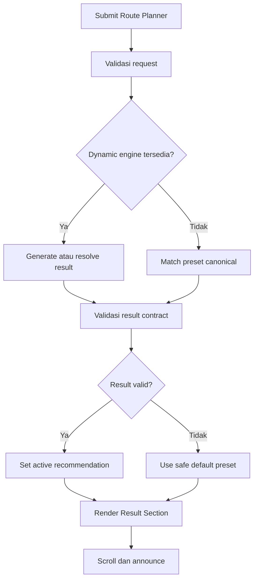
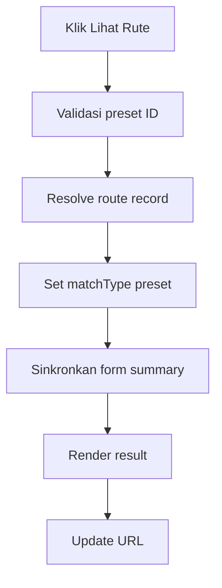

# Planning Lengkap — Section 4 Route Recommendation Result NUSANTARAYA

<aside>
🧭

**Tujuan dokumen:** menjadi source of truth produk, UX, visual, data, engineering, accessibility, analytics, QA, dan demo untuk membangun **Section 4 — Route Recommendation Result** pada halaman **Nusa Route** (`/routes`). Section ini menerima hasil dari Route Planner Form atau Popular / Preset Routes, lalu menjelaskan rute terbaik secara ringkas, meyakinkan, dapat ditelusuri, dan siap diteruskan ke itinerary harian, peta, Passport, serta RANI.

</aside>

---

## 1. Ringkasan Eksekutif

### 1.1 Nama Section

**Route Recommendation Result**

Nama tampilan yang direkomendasikan:

> **Rute yang Kami Rekomendasikan untukmu**
> 

Alternatif:

- Rute Pilihan Berdasarkan Preferensimu
- Perjalanan Nusantara yang Paling Sesuai
- Your Recommended Nusa Route
- Rekomendasi Perjalananmu Sudah Siap

### 1.2 Route, Nomor, dan Posisi

- **Halaman:** Nusa Route.
- **Route:** `/routes`.
- **Nomor section:** 4.
- **Posisi:** setelah Popular / Preset Routes dan sebelum Day-by-Day Itinerary.
- **Anchor:** `#route-recommendation-result`.
- **Peran:** menjadi ringkasan keputusan yang menghubungkan input pengguna dengan detail itinerary.

Urutan halaman:

```
1. Route Hero / Page Header
2. Route Planner Form
3. Popular / Preset Routes
4. Route Recommendation Result ← SECTION INI
5. Day-by-Day Itinerary
6. Route Map + Transport Summary
7. Budget, Culinary, Etiquette, and Checklist
8. Save to Passport + Ask RANI
9. Related Journeys / Final CTA
```

### 1.3 Konsep Produk

```
Explainable Recommendation Dossier
× Editorial Journey Preview
× Heritage Futuristic Light
```

Section ini **bukan itinerary lengkap**. Ia adalah dossier ringkas yang menjawab lima pertanyaan dalam satu viewport:

1. Rute apa yang direkomendasikan?
2. Mengapa rute ini cocok?
3. Wilayah dan stop apa yang dicakup?
4. Seberapa padat, berapa lama, dan kisaran budget-nya?
5. Apa aksi berikutnya?

### 1.4 North Star UX

> Dalam **10–15 detik** setelah hasil muncul, pengguna harus memahami karakter rute, alasan pemilihannya, cakupan perjalanan, status hasil—dinamis, preset, atau fallback—dan dapat memilih untuk melihat itinerary, mengubah preferensi, menyimpan rute, atau meminta penyesuaian.
> 

### 1.5 Hubungan dengan Planning Existing

Planning ini melanjutkan keputusan pada [Planning Lengkap — Section 2 Route Planner Form NUSANTARAYA](https://app.notion.com/p/Planning-Lengkap-Section-2-Route-Planner-Form-NUSANTARAYA-eb2b2fe430854788b534a4c8aebc1344?pvs=21) dan [Planning Lengkap — Section 3 Popular / Preset Routes NUSANTARAYA](https://app.notion.com/p/Planning-Lengkap-Section-3-Popular-Preset-Routes-NUSANTARAYA-d2be071c079546ada697409725682ae6?pvs=21), serta mengikuti [PRD NUSANTARAYA FIX](https://app.notion.com/p/PRD-NUSANTARAYA-FIX-165098210a3c83fea99181f526f0367e?pvs=21) dan [Roadmap & Workflow Pengembangan NUSANTARAYA](https://app.notion.com/p/Roadmap-Workflow-Pengembangan-NUSANTARAYA-02a098210a3c83dfb7688147846399f4?pvs=21).

Keputusan yang wajib dipertahankan:

- Durasi MVP adalah **3, 5, atau 7 hari**.
- Result menerima sumber dari form, preset, Map, Atlas, Journey, Regional Explorer, Passport, dan RANI.
- Rute dinamis tidak boleh menjadi satu-satunya jalur sukses.
- Preset lokal menjadi fallback yang selalu dapat dibuka.
- Result, card preset, itinerary, map, Passport, dan RANI memakai **route ID/version yang sama**.
- Hasil harus explainable dan tidak memakai persentase kecocokan palsu.
- Visual mengikuti **Heritage Futuristic Light** dan tetap optimal di desktop, tablet, serta mobile.

---

## 2. Problem Statement dan Nilai Utama

### 2.1 Masalah Pengguna

Setelah mengisi preferensi atau memilih preset, pengguna membutuhkan kepastian bahwa sistem benar-benar memahami pilihan mereka. Jika hasil langsung berubah menjadi daftar itinerary panjang, pengguna dapat kehilangan konteks:

- tidak tahu mengapa rute tersebut dipilih,
- sulit memahami gambaran besar perjalanan,
- tidak tahu apakah hasil exact match atau penyesuaian,
- tidak yakin apakah budget dan ritmenya sesuai,
- tidak menemukan aksi untuk mengubah, menyimpan, atau melanjutkan.

### 2.2 Masalah Produk

Tanpa satu contract result yang kuat, data mudah terduplikasi antara:

- card preset,
- form summary,
- heading hasil,
- itinerary harian,
- peta mini,
- Passport,
- dan RANI.

Akibatnya, judul, stop, durasi, atau status hasil dapat berbeda antar-section dan menurunkan kepercayaan.

### 2.3 Nilai Utama

1. **Explainable:** alasan rekomendasi dapat dipahami manusia.
2. **Trustworthy:** status dynamic/preset/fallback dijelaskan secara jujur.
3. **Scannable:** gambaran besar terbaca dalam satu viewport.
4. **Actionable:** aksi berikutnya jelas dan tidak saling bersaing.
5. **Consistent:** seluruh section membaca satu source of truth.
6. **Reliable:** hasil tetap tersedia saat API atau AI gagal.
7. **Editable:** pengguna dapat kembali mengubah preferensi tanpa kehilangan konteks.

---

## 3. Tujuan, Non-Goals, dan KPI

### 3.1 Tujuan Utama

- Menampilkan satu rekomendasi utama yang berasal dari result contract tervalidasi.
- Menjelaskan hubungan antara preferensi dan hasil.
- Menunjukkan route overview: durasi, region, provinsi, stop, pace, budget, dan fokus pengalaman.
- Mengarahkan pengguna ke itinerary harian secara natural.
- Menyediakan aksi edit, alternatif, save, share, map, dan RANI sesuai kesiapan fitur.
- Menjamin success/fallback tanpa dead end.
- Menjadi wow moment utility utama saat demo lomba.

### 3.2 Non-Goals

Section ini tidak bertanggung jawab untuk:

- menampilkan seluruh agenda harian,
- menggambar peta geografis interaktif penuh,
- menghitung harga real-time,
- melakukan booking,
- menampilkan jadwal penerbangan/kapal aktual,
- memberi stempel Passport hanya karena result dibuka,
- memperlihatkan banyak rekomendasi utama sekaligus,
- menjadi chat RANI penuh,
- mengklaim AI personalization jika hanya memakai preset,
- menampilkan confidence score yang tidak terkalibrasi.

### 3.3 KPI

| Metrik | Target MVP | Target Polish |
| --- | --- | --- |
| Result render success | 100% dengan fallback | 100% |
| Result comprehension | ≤15 detik untuk memahami overview | ≤10 detik |
| Open itinerary rate | ≥45% | ≥60% |
| Edit preference rate | terukur | ≤25% karena mismatch |
| Save route rate | ≥20% | ≥30% |
| Ask RANI rate | ≥8% | ≥15% |
| Fallback recovery | 100% usable | 100% |
| Accessibility | Lighthouse ≥90 | ≥95 |

---

## 4. Persona dan Skenario Utama

### 4.1 Turis Lokal

> “Saya memilih lima hari, Jawa, budaya dan kuliner. Saya ingin tahu rute mana yang dipilih dan apakah ritmenya masuk akal.”
> 

Result ideal: **Budaya & Kuliner Jawa · Yogyakarta → Solo → Semarang · 5 hari · seimbang**, disertai alasan dan CTA itinerary.

### 4.2 Turis Mancanegara

> “I need a route that explains the pace, cultural context, and what the estimate includes.”
> 

Result ideal: copy praktis, disclosure estimasi, cultural etiquette preview, serta Tourist Mode yang jelas.

### 4.3 Explorer

> “Saya ingin hidden gems dan perjalanan aktif, tetapi tidak ingin hasil generik.”
> 

Result ideal: menunjukkan minat yang memengaruhi hasil, alasan pilihan cluster, dan tombol untuk melihat alternatif atau menyesuaikan lewat RANI.

### 4.4 Juri Lomba

> “Apakah rekomendasi ini benar-benar merespons input dan tetap berjalan tanpa internet?”
> 

Demo ideal:

```
5 hari · Jawa · Budaya + Kuliner · Menengah · Seimbang
→ generate
→ result dengan alasan yang jelas
→ buka itinerary
→ peta mini
→ save ke Passport
→ ubah bersama RANI
→ matikan API / gunakan fallback tanpa flow rusak
```

---

## 5. Input dan Output Section

### 5.1 Input yang Diterima

Section dapat menerima hasil dari:

1. **Route Planner Form** — hasil matching atau generator.
2. **Popular / Preset Routes** — preset canonical.
3. **Map / Province Atlas** — recommendation dengan region/province context.
4. **Recommended Journey / Regional Explorer** — handoff journey/preset.
5. **Passport** — saved route untuk dilanjutkan.
6. **RANI** — route draft atau adjustment yang tervalidasi.
7. **URL / restored state** — route ID dan version yang valid.

### 5.2 Output yang Ditampilkan

- result status dan source,
- judul serta promise,
- alasan rekomendasi utama,
- preference match summary,
- durasi, region, pace, budget,
- route ribbon / stop overview,
- highlight pengalaman,
- disclosure estimasi dan fallback,
- CTA primary dan secondary,
- handoff ke itinerary, map, Passport, serta RANI.

### 5.3 Satu Result Aktif

Pada satu waktu hanya ada **satu active recommendation**. Alternatif ditampilkan sebagai aksi tersier atau section lain; jangan membuat tiga kartu “hasil utama” dengan hierarchy setara.

---

## 6. Arsitektur Informasi

### 6.1 Struktur Section

```
RouteRecommendationResultSection
├── Result Status / Source Bar
│   ├── Match label
│   ├── Source context
│   └── Updated/restored state
├── Recommendation Dossier
│   ├── Editorial Visual / Route Art
│   │   ├── Region image
│   │   ├── Route ribbon
│   │   └── Duration badge
│   └── Recommendation Content
│       ├── Eyebrow
│       ├── Result title + promise
│       ├── Why this route
│       ├── Preference match chips
│       ├── Core metadata
│       ├── Primary CTA
│       └── Secondary actions
├── Adjustment / Fallback Disclosure
└── Handoff to Day-by-Day Itinerary
```

### 6.2 Information Hierarchy

1. **Judul rute dan promise.**
2. **Mengapa rute ini direkomendasikan.**
3. **Durasi dan route overview.**
4. **Preference match dan penyesuaian.**
5. **Pace, budget, transport scope.**
6. **CTA Lihat Itinerary.**
7. **Edit / map / save / RANI.**

### 6.3 Layout Desktop

```
┌──────────────────────────────────────────────────────────────┐
│ Status: Rute terkurasi · Cocok dengan 5 preferensi           │
├──────────────────────────────┬───────────────────────────────┤
│ Editorial route visual       │ Eyebrow                      │
│ Yogyakarta ─ Solo ─ Semarang │ Budaya & Kuliner Jawa        │
│ 5 hari                       │ Promise                      │
│                              │ Why recommended              │
│                              │ Match chips + metadata       │
│                              │ [Lihat Itinerary]            │
│                              │ Ubah · Peta · Simpan · RANI  │
└──────────────────────────────┴───────────────────────────────┘
```

- Gunakan split **5/7** atau **6/6**.
- Konten harus cukup ringkas agar CTA utama terlihat tanpa scroll berlebihan.
- Result status bar menjadi bagian dossier, bukan banner terpisah yang berat.

### 6.4 Layout Tablet

- Split dapat dipertahankan jika lebar cukup; jika tidak, visual di atas.
- Metadata memakai grid dua kolom.
- CTA primary full width atau minimal 60%.
- Secondary actions wrap tanpa horizontal overflow.

### 6.5 Layout Mobile

```
Status/source
↓
Route visual + ribbon
↓
Title + promise
↓
Why recommended
↓
Match chips
↓
Metadata 2 columns
↓
Primary CTA full width
↓
Edit · Map · Save · RANI
↓
Disclosure
```

- Satu kolom.
- Visual tidak melebihi 45–55vh.
- Route ribbon dapat menjadi daftar vertikal ringkas.
- CTA tidak tertutup bottom navigation.

---

## 7. Copywriting Final

### 7.1 Header Result

**Eyebrow**

```
Rekomendasi Perjalananmu
```

**Heading dinamis**

```
Budaya & Kuliner Jawa
```

**Promise**

```
Lima hari untuk menelusuri warisan, rasa, dan kota kreatif Jawa dengan ritme yang tetap memberi ruang untuk menikmati setiap tempat.
```

### 7.2 Why Recommended

Label:

```
Mengapa rute ini cocok
```

Contoh:

```
Rute ini memprioritaskan budaya dan kuliner sesuai pilihanmu, membatasi perpindahan pada tiga cluster yang saling terhubung, serta menjaga ritme tetap seimbang selama lima hari.
```

### 7.3 Status Labels

| Match type | Label pengguna | Disclosure |
| --- | --- | --- |
| `dynamic` | Disusun dari preferensimu | Hasil dibuat dari data rute dan pilihan yang kamu berikan. |
| `preset` | Rute terkurasi | Rute siap pakai yang dapat kamu sesuaikan. |
| `fallback` | Rekomendasi terdekat | Rute dinamis belum tersedia; kami memilih rute terkurasi yang paling mendekati preferensimu. |
| `restored` | Rute tersimpan dipulihkan | Hasil terakhir dari perangkat ini berhasil dimuat kembali. |

### 7.4 CTA

- Primary: **Lihat Itinerary Hari demi Hari**.
- Secondary: **Ubah Preferensi**.
- Map: **Lihat Jalur di Peta**.
- Save: **Simpan ke Passport**.
- RANI: **Sesuaikan bersama RANI**.
- Alternatives: **Lihat Alternatif Rute**.
- Retry: **Coba Susun Ulang**.

### 7.5 Trust Microcopy

```
Estimasi awal · Bukan jadwal atau harga pemesanan · Selalu periksa kondisi perjalanan terbaru
```

---

## 8. Result Status dan Explainability

### 8.1 Prinsip Explainability

Result harus menjelaskan **alasan kualitatif**, bukan skor matematis mentah. Pengguna tidak membutuhkan “92% cocok” jika angka tersebut tidak dikalibrasi.

### 8.2 Reason Codes

Gunakan reason codes yang stabil:

```tsx
export type RouteReasonCode =
  | "REGION_EXACT"
  | "DURATION_EXACT"
  | "INTEREST_OVERLAP"
  | "PACE_COMPATIBLE"
  | "BUDGET_COMPATIBLE"
  | "ORIGIN_CONVENIENT"
  | "CLUSTER_REALISTIC"
  | "CULTURAL_DEPTH"
  | "CULINARY_DEPTH"
  | "FALLBACK_NEAREST"
  | "SCOPE_REDUCED";
```

### 8.3 Tampilan Alasan

Tampilkan:

- satu alasan utama dalam kalimat,
- maksimal tiga reason chips,
- detail tambahan dalam toggle **Lihat cara rekomendasi dipilih**.

Jangan menampilkan:

- bobot internal,
- confidence palsu,
- log engine,
- klaim “dipilih AI” jika proses hanya preset matching.

### 8.4 Adjustment Disclosure

Jika exact match tidak ada:

```
Kami menyesuaikan cakupan dari lintas wilayah menjadi satu cluster agar perjalanan lima hari tetap realistis.
```

Penyesuaian harus menyebutkan apa yang berubah tanpa menyalahkan pengguna.

---

## 9. Preference Match Summary

### 9.1 Isi Minimum

- Durasi: `5 hari`.
- Wilayah: `Jawa`.
- Minat: `Budaya · Kuliner`.
- Budget: `Menengah`.
- Pace: `Seimbang`.
- Origin: opsional.

### 9.2 Match State per Preference

```tsx
export type PreferenceMatchState =
  | "exact"
  | "compatible"
  | "adjusted"
  | "not-applicable";
```

### 9.3 Visual State

- **Exact:** check + label normal.
- **Compatible:** check/tilde + helper singkat.
- **Adjusted:** indicator amber + penjelasan.
- **Not applicable:** tidak ditonjolkan.

Selected state tidak boleh hanya mengandalkan warna.

### 9.4 Contoh

```
5 hari ✓
Jawa ✓
Budaya + Kuliner ✓
Menengah ✓
Seimbang ✓
Origin fleksibel — entry point dipilih otomatis
```

---

## 10. Route Overview dan Ribbon

### 10.1 Tujuan

Memberi gambaran urutan tanpa menggantikan peta geografis atau itinerary.

### 10.2 Isi

- 2–4 route nodes utama.
- Label kota/cluster pendek.
- Province label jika diperlukan.
- Travel window jika ada perpindahan signifikan.
- `+n pengalaman` untuk detail yang disembunyikan.

### 10.3 Guardrail

- Ribbon adalah visual urutan, bukan representasi jarak presisi.
- Jangan memakai garis yang menyiratkan transport nyata tanpa data.
- Jangan menampilkan koordinat atau waktu tempuh buatan.
- Sediakan ordered list accessible.

### 10.4 Contoh

```
01 Yogyakarta
02 Solo
03 Semarang
```

Accessible equivalent:

```
Urutan rute: Yogyakarta, lalu Solo, kemudian Semarang.
```

---

## 11. Metadata Result

### 11.1 Metadata Utama

| Metadata | Contoh | Catatan |
| --- | --- | --- |
| Durasi | 5 hari | canonical 3/5/7 |
| Cakupan | 3 cluster · 2 provinsi | derived dari stop |
| Ritme | Seimbang | bahasa manusia |
| Budget | Kisaran menengah | bukan harga pasti |
| Transport | Darat dominan | hanya jika tervalidasi |
| Mode | Tourist / Explore | opsional |

### 11.2 Budget Preview

Gunakan kategori atau range yang bersumber. Jika belum tervalidasi, tampilkan:

```
Kisaran menengah · Estimasi detail tersedia setelah itinerary
```

### 11.3 Transport Preview

Gunakan summary aman:

- perpindahan lokal dominan,
- kombinasi darat dan laut,
- membutuhkan satu travel window,
- akses awal belum termasuk.

Jangan mengarang maskapai, jadwal, ongkos, atau durasi tempuh.

---

## 12. Visual Direction

### 12.1 Creative Direction

```
Premium journey dossier
× atlas editorial
× route intelligence yang tenang
```

Result harus terasa lebih “resmi” daripada card preset dan lebih ringkas daripada itinerary.

### 12.2 Palet

- Background: `#F8F4EA` / `#FFFDF8`.
- Surface utama: putih hangat.
- Text: `#0D1B2A`.
- Gold accent: `#C9A84C`.
- Success: `#2D5A27`.
- Adjustment: amber/brown yang tetap AA.
- Error: `#8B2020`.
- Focus: `#2D6BE4`.
- Region color hanya aksen garis/node.

### 12.3 Typography

- Result title: Playfair Display/Cormorant Garamond.
- Body, metadata, CTA: Inter.
- Eyebrow uppercase ringan.
- Title maksimal 2–3 baris.
- Alasan rekomendasi maksimal 3–4 baris sebelum detail.

### 12.4 Surface dan Shape

- Radius dossier: 28–36 px desktop, 20–28 px mobile.
- Border tipis `#E8E0CE`.
- Shadow lembut.
- Pattern tenun/batik 3–5% opacity.
- Hindari glassmorphism berat.
- Hindari nested card untuk setiap metadata.

### 12.5 Image / Route Art

Prioritas:

1. editorial image route yang canonical,
2. composite ringan dari maksimal dua scene,
3. static route art/pattern fallback.

Image tidak boleh:

- memakai teks baked-in,
- menjadi kolase ramai,
- mengklaim satu lokasi mewakili seluruh budaya region,
- tidak memiliki alt.

---

## 13. Interaction Flow

### 13.1 Submit Form → Result



### 13.2 Preset → Result



### 13.3 Primary CTA

**Lihat Itinerary Hari demi Hari**:

- scroll ke `#day-by-day-itinerary`, atau
- buka detail route canonical jika arsitektur existing memakai `/routes/[slug]`.

Gunakan link untuk navigasi route dan button untuk scroll/state action.

### 13.4 Ubah Preferensi

- kembali ke Section 2,
- pertahankan semua nilai,
- focus heading/field yang relevan,
- result lama tetap dapat disimpan sementara sebagai comparison state,
- jangan langsung menghapus result sebelum submit baru berhasil.

### 13.5 Lihat Alternatif

MVP:

- scroll ke preset section dengan filter relevan, atau
- tampilkan 2–3 alternatif di section akhir.

Jangan menambahkan modal kompleks hanya untuk alternatif.

---

## 14. State Matrix

| State | Kondisi | Tampilan | Aksi |
| --- | --- | --- | --- |
| Hidden / pristine | belum ada result | section tidak merender atau teaser ringan | isi form/pilih preset |
| Loading | matching/generation berjalan | skeleton stabil + status | tunggu |
| Dynamic success | result dinamis valid | label disusun dari preferensi | itinerary/edit/save |
| Preset success | preset dipilih | label rute terkurasi | itinerary/edit |
| Fallback | engine gagal/tidak ada exact match | nearest preset + disclosure | gunakan/edit/retry |
| Adjusted | scope diubah demi realisme | adjustment note | review/edit |
| Restored | refresh/back/saved route | restored label | continue |
| Stale | route version berubah | update available note | refresh result |
| Error recoverable | detail parsial gagal | summary fallback | retry/form |
| Invalid ID | URL/state rusak | safe default/no result | preset/form |
| Offline | tanpa network | local route + static visual | continue/save locally |

---

## 15. Loading, Transition, dan Focus

### 15.1 Loading UI

- Skeleton mempertahankan ukuran dossier.
- Tampilkan title placeholder, metadata rows, route ribbon, dan CTA placeholder.
- Jangan memakai spinner full-screen.
- Form tetap terlihat tetapi submit dinonaktifkan selama request aktif.

### 15.2 Copy Loading

```
Menyusun rute terbaik dari preferensimu…
```

Untuk preset:

```
Menyiapkan detail rute terkurasi…
```

### 15.3 Timing

- Jangan menambahkan delay palsu yang panjang.
- Jika local matching selesai instan, transition 200–400 ms cukup.
- Jika async, render status segera.

### 15.4 Focus Management

Setelah sukses:

- scroll ke heading result,
- focus heading hanya setelah submit eksplisit,
- jangan mencuri focus ketika result dipulihkan otomatis,
- gunakan `aria-live="polite"` untuk status.

---

## 16. Data Contract

### 16.1 Route Recommendation Result

```tsx
export type RouteMatchType =
  | "dynamic"
  | "preset"
  | "fallback"
  | "restored";

export type RouteResultStatus =
  | "ready"
  | "adjusted"
  | "stale";

export interface RouteRecommendationResult {
  id: string;
  slug: string;
  version: string;
  status: RouteResultStatus;
  matchType: RouteMatchType;
  source:
    | "route-planner"
    | "preset-routes"
    | "map"
    | "province-atlas"
    | "recommended-journey"
    | "regional-explorer"
    | "passport"
    | "rani"
    | "restored";
  locale: "id" | "en";
  travelerMode: "explore" | "tourist" | "learn";
  title: string;
  promise: string;
  summary: string;
  durationDays: 3 | 5 | 7;
  primaryRegionId: RegionId;
  regionIds: RegionId[];
  provinceIds: string[];
  interests: RouteInterest[];
  travelPace: TravelPace;
  budgetLevel: BudgetLevel;
  estimatedBudgetLabel: string;
  transportSummary?: string;
  reasonCodes: RouteReasonCode[];
  primaryReason: string;
  adjustments: RouteAdjustment[];
  stops: RouteResultStop[];
  highlights: RouteHighlight[];
  itineraryRef: string;
  mapRef?: string;
  sourceRefs?: string[];
  asset: RouteResultAsset;
  generatedAt?: string;
  updatedAt: string;
}
```

### 16.2 Stop Contract

```tsx
export interface RouteResultStop {
  id: string;
  order: number;
  provinceId: string;
  cityOrCluster: string;
  shortLabel: string;
  dayStart: number;
  dayEnd: number;
  highlightIds: string[];
  transportToNext?: {
    modeLabel: string;
    isValidated: boolean;
  };
}
```

### 16.3 Adjustment Contract

```tsx
export interface RouteAdjustment {
  code:
    | "scope-reduced"
    | "duration-nearest"
    | "interest-secondary"
    | "budget-compatible"
    | "origin-not-included"
    | "offline-fallback";
  severity: "info" | "notice";
  messageId: string;
  messageEn: string;
}
```

### 16.4 View Model

```tsx
export interface RouteResultViewModel {
  statusLabel: string;
  title: string;
  promise: string;
  primaryReason: string;
  reasonLabels: string[];
  preferenceChips: Array<{
    id: string;
    label: string;
    state: PreferenceMatchState;
  }>;
  metadata: Array<{ label: string; value: string }>;
  stopLabels: string[];
  adjustmentMessages: string[];
  primaryAction: RouteResultAction;
  secondaryActions: RouteResultAction[];
}
```

### 16.5 Validation Rules

- ID, slug, dan version wajib.
- Durasi hanya 3/5/7.
- Semua region/province/interest ID canonical.
- Minimal 1 stop; ideal 2–4 stop overview.
- Order stop unik dan berurutan.
- Rentang hari tidak melewati durasi.
- `itineraryRef` wajib valid.
- `preset`/`fallback` harus menunjuk preset canonical.
- `dynamic` tetap harus berasal dari canonical destination/highlight IDs.
- Asset memiliki alt ID/EN.
- Missing optional data tidak boleh merusak summary.

---

## 17. Source of Truth dan Data Flow

### 17.1 Prinsip

Satu record route dipakai oleh:

- card preset,
- result dossier,
- itinerary,
- map,
- budget/tips,
- Passport saved route,
- RANI context,
- share link.

### 17.2 Rekomendasi Struktur

```
src/components/routes/route-result/
├── RouteRecommendationResultSection.tsx
├── RouteResultStatusBar.tsx
├── RouteResultDossier.tsx
├── RouteResultVisual.tsx
├── RouteResultHeader.tsx
├── RouteReasonPanel.tsx
├── PreferenceMatchSummary.tsx
├── RouteOverviewRibbon.tsx
├── RouteResultMetadata.tsx
├── RouteResultActions.tsx
├── RouteResultDisclosure.tsx
├── RouteResultSkeleton.tsx
├── RouteResultErrorState.tsx
└── index.ts

src/lib/routes/
├── resolveRouteRecommendation.ts
├── validateRouteResult.ts
├── mapRouteResultToViewModel.ts
├── explainRouteRecommendation.ts
├── persistActiveRoute.ts
├── parseRouteResultParams.ts
└── routeResultSchema.ts
```

### 17.3 Data Flow

```
Form/Preset/Context
→ validated request
→ canonical matcher/generator
→ validated RouteRecommendationResult
→ route store activeResult
→ view model
→ Result + Itinerary + Map + Passport + RANI
```

### 17.4 Anti-Duplication Rules

- Komponen tidak membuat title sendiri.
- Route ribbon tidak menyimpan stop terpisah.
- Passport hanya menyimpan ID/version + snapshot minimum.
- RANI menerima ID dan structured context, bukan scraping teks DOM.
- Result tidak mengulang matching logic.

---

## 18. Matching, Dynamic Result, dan Fallback

### 18.1 Resolution Priority

1. Exact canonical route ID dari explicit user action.
2. Valid dynamic result dari generator.
3. Exact preset match.
4. Nearest preset match.
5. Safe editorial default.

### 18.2 Dynamic Enhancement

Dynamic engine boleh:

- memilih kombinasi canonical stop,
- menyesuaikan urutan dari aturan tervalidasi,
- menghasilkan narasi ringkas berdasarkan reason codes,
- menyesuaikan emphasis per mode/locale.

Dynamic engine tidak boleh:

- menciptakan destinasi atau fakta baru,
- mengarang transport/harga,
- mengubah province ID,
- menghapus guardrail durasi,
- menjadi satu-satunya jalan sukses.

### 18.3 Fallback Copy

```
Kami belum dapat menyusun rute dinamis saat ini. Sebagai gantinya, kami menampilkan rute terkurasi yang paling mendekati wilayah, durasi, dan minat pilihanmu.
```

### 18.4 Safe Default

Default lomba yang direkomendasikan:

**5 Hari Budaya & Kuliner Jawa**.

Default hanya dipakai jika seluruh resolution path gagal dan harus ditandai sebagai rute terkurasi, bukan hasil personal exact.

---

## 19. URL, Persistence, dan Recovery

### 19.1 URL Strategy

Pilihan A — query di halaman yang sama:

```
/routes?route=jawa-budaya-kuliner-5&source=preset-routes
```

Pilihan B — canonical detail:

```
/routes/jawa-budaya-kuliner-5
```

Audit arsitektur existing terlebih dahulu. Jangan membuat kedua pola sebagai source of truth yang bersaing.

### 19.2 History

- `push` saat pengguna membuka route bermakna.
- `replace` untuk adjustment/filter internal.
- Back mengembalikan form, preset filters, dan scroll jika adapter existing mendukung.

### 19.3 Persistence

Contoh key:

```
nusantaraya.routePlanner.activeResult.v1
```

Simpan minimum:

- route ID,
- version,
- source,
- preference snapshot,
- timestamp.

### 19.4 Hydration Priority

1. explicit URL route,
2. action terbaru di memory/store,
3. valid saved active result,
4. no result.

### 19.5 Stale Result

Jika version berubah:

- result lama tetap dapat dibaca,
- tampilkan “Pembaruan rute tersedia”,
- tombol refresh tidak boleh menghapus saved state sebelum result baru valid.

---

## 20. CTA Architecture

### 20.1 Primary Action

**Lihat Itinerary Hari demi Hari** selalu menjadi primary jika itinerary tersedia.

### 20.2 Secondary Actions

Urutan rekomendasi:

1. Ubah Preferensi.
2. Lihat Jalur di Peta.
3. Simpan ke Passport.
4. Sesuaikan bersama RANI.
5. Bagikan Rute — hanya jika share flow benar-benar ada.

### 20.3 Progressive Disclosure

Desktop dapat menampilkan 3–4 action. Mobile:

- primary full width,
- dua secondary utama terlihat,
- sisanya dalam menu `Aksi lainnya` yang accessible.

### 20.4 Guardrail Action

- Jangan tampilkan Share jika hanya menyalin URL tidak valid.
- Jangan tampilkan Map jika mapRef tidak tersedia; gunakan static route visual atau sembunyikan CTA.
- Jangan tampilkan RANI success palsu jika integration belum ada.
- Save harus memberi status tersimpan dan Undo/Remove yang jelas.

---

## 21. Integrasi Ekosistem

### 21.1 Route Planner Form

- Result membaca request snapshot.
- Ubah Preferensi mengembalikan form tanpa reset.
- Generate ulang tidak menghapus hasil lama sampai hasil baru valid.

### 21.2 Popular / Preset Routes

- `Lihat Rute` membuka result dengan `matchType: preset`.
- Active preset ditandai.
- `Gunakan Preferensi Ini` tetap menuju form, bukan result otomatis.

### 21.3 Day-by-Day Itinerary

- Membaca `itineraryRef`/route ID yang sama.
- Heading hari tidak mengulang promise panjang.
- Jika itinerary gagal, result overview tetap tampil.

### 21.4 Route Map

- Membaca stop IDs yang sama.
- Route ribbon dan map tidak memiliki urutan berbeda.
- Static visual dipakai jika library/API map gagal.

### 21.5 Province Atlas dan Map

- Province nodes dapat menuju route canonical.
- CTA stop pertama membuka Atlas jika route tersedia.
- Kembali harus mempertahankan result state.

### 21.6 Nusa Passport

- Membuka result tidak memberi stamp.
- Save route menyimpan ID, version, province IDs, dan planned status.
- Completion/stamp mengikuti action canonical terpisah.

### 21.7 RANI

RANI menerima:

```tsx
{
  routeId,
  routeVersion,
  preferenceSnapshot,
  requestedAdjustment,
  locale,
  travelerMode
}
```

RANI tidak menerima HTML result dan tidak boleh mengarang stop di luar dataset.

### 21.8 Bilingual dan Modes

- Explore: keseimbangan cerita dan utility.
- Tourist: transport, etiquette, budget, practical CTA lebih dominan.
- Learn: sumber, konteks sejarah, dan cultural notes lebih dominan.
- ID/EN mengganti copy tanpa mengganti route ID atau state.

---

## 22. Accessibility Plan

### 22.1 Semantik

- `<section aria-labelledby="route-result-title">`.
- Judul result menjadi heading level yang konsisten.
- Status menggunakan `role="status"`/`aria-live="polite"` seperlunya.
- Route overview menggunakan ordered list accessible.
- Link untuk navigasi; button untuk state/scroll.
- Toggle explainability memakai button dengan `aria-expanded`.

### 22.2 Keyboard

- Focus result setelah submit eksplisit.
- Semua CTA dapat diakses Tab.
- Menu action mobile dapat dibuka/ditutup keyboard.
- Escape menutup menu/toggle overlay.
- Tidak ada card click target yang bersarang dengan button.

### 22.3 Screen Reader

- Match type dibacakan.
- Adjustment tidak hanya ditandai warna.
- Route ribbon memiliki urutan teks.
- Loading, success, fallback, dan save status diumumkan.
- Alt visual menjelaskan scene/route art tanpa mengulang title.

### 22.4 Visual

- WCAG AA.
- Focus ring 2–3 px.
- Body minimal 16 px bila memungkinkan.
- Zoom 200% tidak memotong CTA.
- Forced-colors tetap membedakan status/action.
- Reduced motion didukung.

---

## 23. Responsive Specifications

| Breakpoint | Layout | Metadata | Actions |
| --- | --- | --- | --- |
| ≥1280 px | split 5/7 atau 6/6 | inline/grid | primary + 3 secondary |
| 1024–1279 px | split proporsional | 2–3 kolom | wrap |
| 768–1023 px | stack atau split ringan | 2 kolom | primary full/large |
| <768 px | single column | 2 kolom atau stack | primary full + compact menu |

### 23.1 Mobile Guardrails

- Padding 16–20 px.
- Touch target minimal 44×44 px.
- Tidak ada horizontal overflow.
- Route title tidak dipaksa satu baris.
- Status badges wrap.
- Bottom action aman dari safe-area dan bottom navigation.

---

## 24. Motion dan Micro-interaction

- Result reveal: opacity + translateY 12–20 px.
- Route line/node reveal: maksimal 600–900 ms.
- Match chips: stagger sangat ringan atau tanpa stagger.
- Save success: check transition, bukan confetti besar.
- Adjustment disclosure: expand/collapse 180–240 ms.
- CTA arrow: 2–4 px.
- Jangan memakai auto-scroll berulang, parallax berat, atau route animation yang mengganggu baca.
- `prefers-reduced-motion` menonaktifkan reveal non-esensial dan smooth scroll.

---

## 25. Performance Plan

### 25.1 Target

- Local preset result terasa instan.
- Result summary tidak mengimpor map library.
- Interaksi result <100 ms setelah data tersedia.
- Tidak ada layout shift besar saat skeleton → result.
- Result dapat server-render untuk canonical preset route.

### 25.2 Optimasi

- Dynamic import itinerary/map berat.
- Use view model yang sudah derived.
- Image responsive AVIF/WebP.
- Tetapkan aspect ratio.
- Hindari rerender seluruh `/routes` saat satu action berubah.
- Persist dengan debounce bila perlu.
- Gunakan CSS transition sebelum library motion tambahan.

### 25.3 Asset Budget

- Hero/result visual ideal ≤180–250 KB.
- Static route art ≤60–100 KB.
- Icon SVG ≤10 KB.
- Pattern ≤30 KB.

---

## 26. Analytics

### 26.1 Events

```
route_result_loading_viewed
route_result_viewed
route_result_dynamic_loaded
route_result_preset_loaded
route_result_fallback_loaded
route_result_adjustment_viewed
route_result_reason_expanded
route_result_itinerary_clicked
route_result_edit_clicked
route_result_map_clicked
route_result_saved
route_result_unsaved
route_result_rani_clicked
route_result_alternatives_clicked
route_result_retry_clicked
route_result_error
```

### 26.2 Payload Aman

```tsx
{
  routeId,
  routeVersion,
  matchType,
  source,
  durationDays,
  primaryRegionId,
  provinceCount,
  interestCount,
  adjustmentCount,
  travelerMode,
  locale
}
```

Jangan mengirim query bebas, nama pengguna, atau data pribadi.

### 26.3 Funnel

```
Generate/Open preset
→ Result loaded
→ Result viewed
→ Itinerary/Map opened
→ Saved/RANI/Edit
```

---

## 27. Error Handling dan Recovery

| Masalah | Recovery |
| --- | --- |
| Dynamic engine gagal | nearest preset + disclosure |
| Result contract invalid | safe default preset |
| Preset ID invalid | hapus/abaikan param + form/preset recovery |
| Image gagal | static route art/pattern |
| Itinerary detail gagal | overview tetap tampil + retry |
| Map gagal | route ribbon/static map |
| Save gagal | pertahankan result + retry, jangan klaim tersimpan |
| RANI unavailable | sembunyikan/disable jujur atau local adjustment |
| Offline | local preset + local Passport |

### 27.1 Error Copy

```
Rute lengkap belum dapat dimuat. Ringkasan terkurasi tetap tersedia, dan kamu dapat mencoba lagi atau mengubah preferensi.
```

### 27.2 No Dead End

Setiap error state minimal memiliki:

- **Coba Lagi**, dan
- **Kembali ke Preferensi** atau **Pilih Rute Terkurasi**.

---

## 28. Content Safety dan Cultural Integrity

- Alasan rekomendasi tidak boleh memakai stereotip region.
- Fakta budaya berasal dari canonical data/source refs.
- Jangan menjanjikan akses ke ritual, komunitas, atau tempat sensitif.
- Cultural etiquette harus spesifik, hormat, dan bersumber.
- Hidden gems tidak boleh mendorong overtourism.
- Visual masyarakat lokal tidak dipakai sebagai dekorasi eksotis.
- Jangan mengklaim event tersedia sepanjang tahun.
- Bedakan inspirasi itinerary dari informasi operasional real-time.

---

## 29. Security dan Privacy

- Parse dan allowlist semua URL params.
- Validasi result dari API sebelum masuk store.
- Jangan render HTML/model output mentah.
- API key hanya server-side.
- Batasi payload ke AI.
- localStorage versioned dan tidak menyimpan data sensitif.
- Share URL tidak memuat origin pribadi atau query bebas.
- Error log tidak memuat preference yang berpotensi sensitif.

---

## 30. Test Plan

### 30.1 Unit Tests

- validator menerima dynamic/preset/fallback valid.
- validator menolak duration/province/stop invalid.
- stop day range konsisten.
- view model menghasilkan label ID/EN benar.
- reason mapper deterministic.
- adjustment copy benar.
- URL parser aman.
- persistence versioning bekerja.

### 30.2 Component Tests

- hidden state tidak menampilkan result kosong.
- skeleton stabil.
- dynamic/preset/fallback label benar.
- route ribbon memiliki ordered list.
- primary CTA benar.
- edit mempertahankan form values.
- disclosure dapat dibuka keyboard.
- save state berubah setelah success nyata.
- error recovery tersedia.

### 30.3 Integration Tests

1. Form valid → dynamic result → itinerary.
2. Form valid → engine gagal → preset fallback.
3. Preset Lihat Rute → result preset yang sama.
4. Ubah Preferensi → generate ulang → result lama diganti setelah success.
5. Result → Map → Back → state pulih.
6. Result → Save → Passport menerima ID/version.
7. Result → RANI → context benar.
8. Refresh → valid result restored.
9. Invalid URL → tidak crash.
10. ID/EN switch → route sama, copy berubah.

### 30.4 E2E Demo Path

```
Buka /routes
→ pilih 5 hari
→ Jawa
→ Budaya + Kuliner
→ Menengah
→ Seimbang
→ generate
→ result Budaya & Kuliner Jawa tampil
→ jelaskan alasan rekomendasi
→ buka itinerary
→ buka map
→ save ke Passport
→ sesuaikan bersama RANI
```

### 30.5 Failure Demo

```
Nonaktifkan dynamic API
→ submit kombinasi demo
→ fallback terkurasi tampil
→ disclosure jujur
→ itinerary, map statis, dan save tetap berfungsi
```

### 30.6 Device QA

- 360×800.
- 390×844.
- 768×1024.
- 1024×768.
- 1366×768.
- 1440×900.
- Zoom 200%.
- Keyboard only.
- Screen reader spot check.
- Reduced motion.
- Slow 4G.
- Offline.

---

## 31. Implementation Phases

### Fase A — Audit dan Contract

- [ ]  Audit `/routes` composition terbaru.
- [ ]  Audit implementation Section 2 dan Section 3.
- [ ]  Audit active route store/context.
- [ ]  Audit route/preset dataset dan IDs.
- [ ]  Audit itinerary/map/Passport/RANI contracts.
- [ ]  Kunci `RouteRecommendationResult` schema.
- [ ]  Kunci URL strategy.

### Fase B — Resolver dan View Model

- [ ]  Implement result validator.
- [ ]  Implement preset resolver.
- [ ]  Implement dynamic adapter.
- [ ]  Implement fallback chain.
- [ ]  Implement reason mapper.
- [ ]  Implement result view model.

### Fase C — Static UI

- [ ]  Section wrapper dan status bar.
- [ ]  Editorial visual.
- [ ]  Header/promise.
- [ ]  Why recommended.
- [ ]  Preference match summary.
- [ ]  Route ribbon.
- [ ]  Metadata.
- [ ]  CTA group.
- [ ]  Disclosure.

### Fase D — State dan Behavior

- [ ]  Loading/success/fallback/error.
- [ ]  Form submit handoff.
- [ ]  Preset Lihat Rute handoff.
- [ ]  Scroll/focus management.
- [ ]  Edit preferences.
- [ ]  URL/history sync.
- [ ]  Persistence/restore.

### Fase E — Downstream Integration

- [ ]  Day-by-Day Itinerary.
- [ ]  Route Map.
- [ ]  Budget/tips/checklist.
- [ ]  Passport.
- [ ]  RANI.
- [ ]  Share/alternatives bila siap.

### Fase F — Polish

- [ ]  Responsive desktop/tablet/mobile.
- [ ]  Motion/reduced motion.
- [ ]  Accessibility.
- [ ]  ID/EN dan modes.
- [ ]  Analytics.
- [ ]  Performance.
- [ ]  Cultural review.

### Fase G — QA dan Demo

- [ ]  Unit/component/integration tests.
- [ ]  Cross-device QA.
- [ ]  Offline/API failure test.
- [ ]  Browser Back/refresh.
- [ ]  Lighthouse.
- [ ]  Demo rehearsal.

---

## 32. Estimasi Pengerjaan

| Tahap | Estimasi |
| --- | --- |
| Audit dan result contract | 1–2 jam |
| Resolver, validation, fallback | 2–4 jam |
| Static responsive dossier UI | 3–4 jam |
| State, transition, URL, persistence | 2–4 jam |
| Itinerary/map handoff | 2–3 jam |
| Passport/RANI integration | 2–3 jam |
| A11y, i18n, analytics, performance | 2–3 jam |
| QA dan polish | 3–4 jam |

**MVP kuat:** 10–14 jam jika route contract dan itinerary data sudah tersedia.  

**Premium terintegrasi:** 18–26 jam tergantung kesiapan map, Passport, RANI, dan dynamic engine.

---

## 33. Risiko dan Mitigasi

| Risiko | Dampak | Mitigasi |
| --- | --- | --- |
| Result terasa seperti card preset besar | tidak memberi nilai baru | explainability + preference match + action hierarchy |
| Result terlalu padat | sulit dipindai | satu viewport overview + progressive disclosure |
| Data berbeda dari itinerary | trust turun | satu route ID/version/source of truth |
| AI mengarang fakta | kredibilitas turun | canonical IDs + validator + AI hanya enhancement |
| Skor kecocokan palsu | misleading | reason codes kualitatif |
| API gagal | demo berhenti | fallback preset lokal |
| Edit menghapus result lama | frustrasi | replace only after new success |
| Terlalu banyak CTA | decision paralysis | satu primary + progressive actions |
| URL/history rusak | Back/refresh gagal | typed adapter + tests |
| Mobile dossier terlalu panjang | CTA sulit ditemukan | compact metadata + full-width primary |
| Map memperberat result | performance buruk | route ribbon dulu, map lazy-load |
| Fallback disamarkan sebagai personal | trust issue | disclosure jujur |

---

## 34. Acceptance Criteria

### 34.1 Functional

- [ ]  Section menjadi section keempat `/routes`.
- [ ]  Anchor `#route-recommendation-result` tersedia.
- [ ]  Section hidden/teaser sebelum ada result.
- [ ]  Form dapat mengaktifkan result.
- [ ]  Preset `Lihat Rute` dapat mengaktifkan result yang sama.
- [ ]  Dynamic, preset, fallback, dan restored state dibedakan.
- [ ]  Satu active result pada satu waktu.
- [ ]  Judul, stop, durasi, dan metadata berasal dari contract canonical.
- [ ]  Why recommended dan preference match tampil.
- [ ]  Exact/adjusted state dijelaskan.
- [ ]  Primary CTA membuka itinerary yang benar.
- [ ]  Edit mempertahankan form values.
- [ ]  URL/refresh/back tidak crash.
- [ ]  Fallback tersedia tanpa API.

### 34.2 Visual

- [ ]  Terasa sebagai premium recommendation dossier.
- [ ]  Lebih informatif daripada preset card.
- [ ]  Tidak sepadat itinerary.
- [ ]  Hierarchy title → reason → route → CTA jelas.
- [ ]  Route visual/ribbon mudah dipahami.
- [ ]  Heritage Futuristic Light konsisten.
- [ ]  Status dan adjustment tidak berlebihan.

### 34.3 Responsive

- [ ]  Desktop memakai split layout yang seimbang.
- [ ]  Tablet tidak menjadi desktop sempit.
- [ ]  Mobile satu kolom tanpa overflow.
- [ ]  CTA primary mudah ditemukan.
- [ ]  Metadata dan chips wrap aman.
- [ ]  Bottom nav/safe area tidak menutupi action.
- [ ]  Copy ID/EN tidak terpotong.

### 34.4 Accessibility

- [ ]  Section/heading semantic.
- [ ]  Status diumumkan secara tepat.
- [ ]  Focus berpindah setelah submit eksplisit.
- [ ]  Route ribbon memiliki ordered list.
- [ ]  Seluruh action keyboard-friendly.
- [ ]  Adjustment tidak bergantung warna.
- [ ]  WCAG AA.
- [ ]  Reduced motion didukung.

### 34.5 Reliability

- [ ]  Result schema tervalidasi.
- [ ]  Invalid result jatuh ke fallback.
- [ ]  Itinerary/map error tidak menghapus overview.
- [ ]  Save tidak memberi false success.
- [ ]  Offline preset berfungsi.
- [ ]  Tidak ada harga, jadwal, atau confidence palsu.
- [ ]  Versioning route tersedia.

### 34.6 Performance

- [ ]  Result tidak mengimpor map berat di initial bundle.
- [ ]  Skeleton mencegah layout shift besar.
- [ ]  Local preset terasa instan.
- [ ]  Image teroptimasi.
- [ ]  Interaction feedback cepat.
- [ ]  Lighthouse Accessibility ≥90.

---

## 35. Definition of Done

Section dianggap selesai jika:

1. Form dan preset dapat menghasilkan active result yang sama-sama valid.
2. Pengguna memahami hasil dalam 10–15 detik.
3. Match type dan adjustment dijelaskan secara jujur.
4. Why recommended berasal dari reason codes yang stabil.
5. Preference summary konsisten dengan input.
6. Route ribbon konsisten dengan itinerary dan map.
7. Primary CTA membuka detail harian yang benar.
8. Edit tidak menghapus pilihan atau hasil lama secara prematur.
9. Dynamic failure otomatis pulih ke preset.
10. Result dapat dipulihkan setelah refresh/Back.
11. Passport dan RANI menerima route ID/version yang sama.
12. ID/EN serta Explore/Tourist/Learn Mode tidak merusak state.
13. Desktop, tablet, dan mobile selesai diuji.
14. Keyboard, screen reader status, focus, serta reduced motion bekerja.
15. Demo utama dan failure demo berjalan tanpa error mayor.

---

## 36. Rekomendasi Final

<aside>
🏆

Bangun Route Recommendation Result sebagai **Explainable Recommendation Dossier**: satu hasil utama, satu alasan yang kuat, preference match yang transparan, route overview yang ringkas, status dynamic/preset/fallback yang jujur, dan satu CTA dominan menuju itinerary. Prioritaskan **konsistensi data, realisme, reliability, dan clarity** di atas efek visual atau klaim AI yang berlebihan.

</aside>

### Urutan Implementasi Paling Aman

1. Audit Section 2, Section 3, route store, dan detail itinerary existing.
2. Kunci result schema, route ID, version, dan URL strategy.
3. Implement validator, resolver, reason mapper, dan fallback chain.
4. Bangun dossier statis responsif.
5. Hubungkan form submit dan preset `Lihat Rute`.
6. Implement loading, success, adjusted, fallback, restored, dan error states.
7. Hubungkan itinerary dan map dari source of truth yang sama.
8. Tambahkan persistence/history.
9. Integrasikan Passport dan RANI.
10. Selesaikan accessibility, i18n, analytics, performance, dan QA.

### Prinsip Terakhir

> **Jangan hanya menampilkan rute. Tunjukkan bahwa NUSANTARAYA memahami pilihan pengguna, mampu menjelaskan keputusannya, tetap realistis, dan tetap dapat diandalkan ketika seluruh enhancement dinamis gagal.**
>