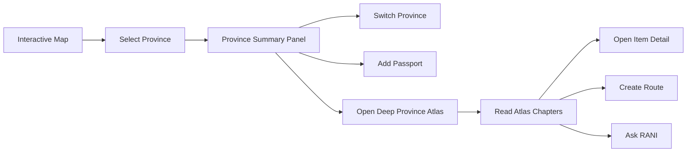

# Planning Redesign — Province Summary Panel + Deep Province Atlas NUSANTARAYA

<aside>
🧭

**Revisi arsitektur final berdasarkan audit tampilan NUSANTARAYA saat ini, screenshot NusaBudaya NusaAtlas, dan riset produk NusaBudaya.** Mulai sekarang pengalaman provinsi dipisahkan tegas menjadi dua lapisan: **Province Summary Panel** untuk orientasi cepat di peta dan **Deep Province Atlas** untuk pembelajaran mendalam pada view tersendiri.

</aside>

---

## 0. Ringkasan Perubahan Besar

Planning lama masih terlalu menyatukan ringkasan dan detail mendalam dalam satu panel. Akibatnya, panel berisiko menjadi sempit, panjang, penuh tab, dan kehilangan fungsi utamanya sebagai ringkasan kontekstual dari peta.

Arsitektur baru:

```
LAPISAN 1 — PROVINCE SUMMARY PANEL
Ringkas · cepat · tetap menjaga konteks peta · mendorong aksi

LAPISAN 2 — DEEP PROVINCE ATLAS
Mendalam · editorial · informatif · ruang baca khusus
```

### Keputusan terpenting

1. **Summary Panel tidak lagi menjadi mini halaman detail.**
2. **Detail mendalam tidak lagi ditampilkan sebagai tab panjang di panel sempit.**
3. CTA utama panel diubah menjadi **Buka Atlas Provinsi**.
4. Deep detail dibuka sebagai **route/view tersendiri**, dengan pengalaman seperti atlas digital premium.
5. Desktop dapat memakai intercepted route/fullscreen atlas overlay; mobile selalu menjadi halaman penuh.
6. Data ringkasan dan data detail dipisah agar UI lebih fokus dan performa lebih baik.

<aside>
🎯

**Formula UX final:** Map untuk memilih → Summary Panel untuk memahami cepat → Deep Atlas untuk belajar mendalam → Passport/Route/RANI untuk bertindak.

</aside>

---

## 1. Dasar Riset

### 1.1 Sumber yang dianalisis

- Tampilan Province Panel NUSANTARAYA saat ini pada `/explore`.
- Tampilan ringkasan provinsi pada [NusaBudaya NusaAtlas](https://nusabudaya.id/atlas).
- Tampilan detail budaya/provinsi lanjutan NusaBudaya pada screenshot yang diberikan.
- Halaman produk [NusaBudaya](https://nusabudaya.id/) yang menjelaskan NusaAtlas sebagai eksplorasi budaya 38 provinsi melalui peta interaktif.
- [Planning Lengkap — Interactive Indonesia Map NUSANTARAYA](https://app.notion.com/p/Planning-Lengkap-Interactive-Indonesia-Map-NUSANTARAYA-a6aef2d2c0cf483a8def5e4df8a65ffb?pvs=21)
- [PRD NUSANTARAYA FIX](https://app.notion.com/p/PRD-NUSANTARAYA-FIX-165098210a3c83fea99181f526f0367e?pvs=21)
- [Konsep Logo & Identitas Visual NUSANTARAYA](https://app.notion.com/p/Konsep-Logo-Identitas-Visual-NUSANTARAYA-a87098210a3c8354abde01087aabdec8?pvs=21)

### 1.2 Temuan produk NusaBudaya

NusaBudaya memosisikan NusaAtlas sebagai fitur untuk menjelajahi kekayaan 38 provinsi melalui peta interaktif dan menemukan kategori budaya seperti rumah adat serta pakaian tradisional. Produk tersebut juga menyebut database dikurasi internal untuk menjaga akurasi dan web app dirancang responsif.

Pelajaran yang diambil bukan gaya visual gelapnya, melainkan **arsitektur informasinya**:

- Peta dan ringkasan berada dalam satu konteks eksplorasi.
- Ringkasan provinsi hanya memberi fakta dan daftar kategori penting.
- Detail objek/provinsi dibuka pada ruang baca yang lebih besar.
- Informasi panjang disusun seperti bab atlas, bukan dipaksakan ke panel kecil.
- User selalu tahu sedang melihat provinsi dan objek budaya apa.

### 1.3 Prinsip inspirasi, bukan imitasi

Yang diadopsi:

- Pemisahan summary dan deep detail.
- Hierarki fakta → kategori → item → pengetahuan mendalam.
- Ruang baca besar untuk detail.
- Heading editorial dan modul media-teks.
- Navigasi kembali yang jelas.

Yang tidak disalin:

- Dark UI NusaBudaya.
- Sidebar dan styling gold yang sama.
- Struktur visual card secara identik.
- Copy, data, ikon, komposisi, dan brand language mereka.

NUSANTARAYA tetap memakai identitas **Heritage Futuristic Light**, ivory, navy, gold, Playfair Display, Inter, motif Nusantara yang halus, dan integrasi Passport–Route–RANI.

---

## 2. Audit Tampilan NUSANTARAYA Saat Ini

### 2.1 Hal yang sudah baik

- Panel sudah terhubung langsung ke provinsi terpilih.
- Quick facts, tabs, Passport, dan contextual tip sudah memiliki fondasi.
- Panel berada di sisi kanan sehingga pola map + detail sudah terbaca.
- Warna navy/gold sudah mengarah ke brand NUSANTARAYA.

### 2.2 Masalah visual utama

1. **Identitas provinsi tidak menjadi focal point.** Pada screenshot, user lebih dahulu melihat quick facts dan tab, bukan nama, hero, atau karakter Kalimantan Timur.
2. **Hierarchy terbalik.** Data sistem seperti tier dan source count lebih dominan daripada cerita provinsi.
3. **Terlalu banyak garis dan nested border.** Panel terasa seperti form administratif, bukan atlas premium.
4. **Tab terlalu kecil dan padat.** Lima kategori berdesakan pada lebar panel sempit.
5. **Konten memiliki area kosong besar.** Card “Mengapa Penting” tampak tidak selesai dan mengurangi kredibilitas.
6. **CTA utama lemah atau tidak terlihat.** Passport hadir, tetapi jalur menuju pengetahuan mendalam tidak dominan.
7. **Panel bertabrakan secara visual dengan toolbar peta.** Banyak container bertumpuk pada area kanan.
8. **Map terlalu pucat ketika panel aktif.** Konteks geografis masih ada, tetapi tidak terasa hidup.
9. **Density tidak seimbang.** Header padat, body kosong, footer kembali padat.
10. **Belum ada pemisahan mental antara preview dan atlas.** User tidak tahu apakah harus scroll panel, membuka tab, atau masuk ke halaman detail.

### 2.3 Masalah UX utama

- Panel mencoba menjalankan terlalu banyak peran sekaligus: ringkasan, category browser, deep detail, tip, dan action center.
- Tab memaksa user memilih kategori sebelum memahami identitas provinsi.
- Deep detail dalam panel sempit menyebabkan scanning sulit.
- Konten panjang meningkatkan risiko nested scroll.
- Mobile berisiko menjadi bottom sheet yang terlalu panjang.

### 2.4 Diagnosis

```
Masalahnya bukan hanya styling.
Masalah utamanya adalah information architecture: summary dan deep detail belum benar-benar dipisahkan.
```

---

## 3. Arsitektur Pengalaman Baru

### 3.1 Dua lapisan yang berbeda

| Aspek | Province Summary Panel | Deep Province Atlas |
| --- | --- | --- |
| Tujuan | Orientasi dan keputusan cepat | Pembelajaran dan eksplorasi mendalam |
| Konteks | Tetap di peta | View/route khusus |
| Durasi | 10–30 detik | 2–8 menit |
| Konten | Identitas, fakta utama, 3–4 preview | Bab atlas lengkap |
| Navigasi | Close, previous/next, CTA Atlas | Back, chapter nav, next chapter |
| Scroll | Pendek, maksimal satu viewport lebih | Long-form terstruktur |
| Visual | Compact editorial card | Immersive editorial reader |
| Mobile | Bottom sheet 42–68% | Full page |

### 3.2 Flow final



### 3.3 Route strategy

Route canonical:

```
/provinsi/[slug]
```

Optional chapter hash:

```
/provinsi/di-yogyakarta#budaya
/provinsi/di-yogyakarta#kuliner
```

Optional item detail:

```
/provinsi/bali/budaya/gapura-candi-bentar
```

### 3.4 Intercepted route — rekomendasi premium

Pada Next.js App Router:

- Klik **Buka Atlas Provinsi** dari peta membuka atlas sebagai fullscreen route modal pada desktop.
- URL tetap berubah ke `/provinsi/[slug]`.
- Refresh/direct access menampilkan halaman atlas standalone.
- Mobile selalu memakai standalone full page.
- Browser Back mengembalikan user ke map beserta selection sebelumnya.

Ini memberi rasa premium seperti referensi, tetapi tetap memiliki URL yang dapat dibagikan dan SEO yang baik.

---

# BAGIAN A — PROVINCE SUMMARY PANEL

## 4. Peran Summary Panel

Summary Panel adalah **quick province briefing**, bukan halaman detail mini.

Pertanyaan yang harus dijawab dalam 10 detik:

1. Provinsi apa yang dipilih?
2. Di wilayah mana dan apa ibu kotanya?
3. Apa identitas paling kuat provinsi ini?
4. Tiga hal apa yang layak diketahui sekarang?
5. Apakah saya ingin membuka Atlas lengkap?

### 4.1 Scope final

Wajib tampil:

- Province hero thumbnail.
- Nama dan region.
- Tagline.
- Ibu kota, bahasa utama, tier/flagship, jumlah materi.
- 3 signature highlights.
- 3 preview lintas kategori.
- Context note singkat.
- CTA Buka Atlas Provinsi.
- Passport.

Tidak lagi tampil di Summary Panel:

- Lima tab deep content.
- Supporting image besar per kategori.
- Artikel panjang.
- Timeline.
- Semua kuliner/destinasi.
- Full Tourist/Learn chapter.
- Detail objek budaya.
- Full snap 93% yang berfungsi sebagai halaman detail.

---

## 5. Layout Summary Panel Desktop

### 5.1 Komposisi final

```
┌──────────────────────────────────────┐
│ [←/next optional]       [Flagship][×]│
│ ┌──────────────────────────────────┐ │
│ │ HERO THUMBNAIL 3:2               │ │
│ │ gradient + province name overlay │ │
│ └──────────────────────────────────┘ │
│                                      │
│ KALIMANTAN TIMUR                     │
│ Kalimantan · Ibu kota Samarinda      │
│ Gerbang Nusantara menuju masa depan  │
│                                      │
│ [Ibu Kota] [Bahasa]                  │
│ [Tier]     [65 Materi]               │
│                                      │
│ SIGNATURE PROVINSI                   │
│ [IKN] [Mahakam] [Budaya Dayak]       │
│                                      │
│ PILIHAN ATLAS                        │
│ [Budaya] Rumah Lamin                 │
│ [Rasa]   Amplang                     │
│ [Alam]   Sungai Mahakam              │
│                                      │
│ Catatan kontekstual singkat           │
│                                      │
│ [ Buka Atlas Provinsi → ]            │
│ [ + Passport ] [ Tanya RANI ]        │
└──────────────────────────────────────┘
```

### 5.2 Dimensi

- ≥1440px: 380–420px.
- 1280–1439px: 360–400px.
- 1024–1279px: 340–380px.
- Max height: tinggi internal map card.
- Target content: selesai dibaca dalam 1–1.4 viewport panel.

### 5.3 Positioning

- Docked di sisi kanan **di dalam map experience**, bukan card terpisah yang menumpuk toolbar.
- Toolbar map pindah ke kiri bawah atau disederhanakan saat panel terbuka.
- Panel memiliki satu shell; hindari border di setiap lapisan.
- Map auto-pan agar selected province tidak tertutup.

---

## 6. Hierarki Konten Summary Panel

### 6.1 Urutan final

1. Hero thumbnail.
2. Province identity.
3. One-line tagline.
4. Quick facts 2×2.
5. Signature highlights.
6. Three atlas previews.
7. Context note.
8. Primary CTA.
9. Secondary actions.

### 6.2 Mengapa hero wajib

Panel saat ini terasa generik karena fakta muncul tanpa atmosfer. Hero thumbnail memberi:

- Pengenalan visual instan.
- Jangkar emosi.
- Pembeda antarprovinsi.
- Area yang natural untuk badge dan nama.

### 6.3 Quick facts

Tampilkan maksimal empat:

- Ibu kota.
- Wilayah atau luas.
- Bahasa utama.
- Jumlah materi/flagship.

`Tier` dapat disembunyikan dari user jika istilah internal tidak memberi nilai. Gunakan label yang lebih manusiawi:

```
Atlas Unggulan
65 Materi Terkurasi
```

### 6.4 Signature highlights

Hanya 3 chips. Hindari label teknis “Signature Highlights” jika copy Indonesia lebih natural.

Rekomendasi label:

```
Ikon Provinsi
Yang Paling Dikenal
Jejak Utama
```

### 6.5 Atlas preview rows

Tiga item lintas kategori, bukan lima tab:

- Ikon/kategori.
- Nama item.
- Descriptor maksimal satu baris.
- Chevron ke chapter terkait.

Contoh:

```
Budaya   Rumah Lamin             Rumah adat komunal Dayak
Rasa     Amplang                 Camilan ikan khas pesisir
Alam     Sungai Mahakam          Nadi kehidupan Kalimantan Timur
```

### 6.6 Context note

Ganti card kosong “Mengapa Penting” dengan satu blok berisi teks nyata.

Contoh:

```
Mengapa penting
Kalimantan Timur mempertemukan hutan tropis, kebudayaan Dayak, jalur Sungai Mahakam, dan pembangunan IKN dalam satu narasi perubahan Indonesia.
```

Jika data belum tersedia, blok disembunyikan—jangan tampilkan card kosong.

---

## 7. Visual Direction Summary Panel

### 7.1 Karakter

```
Compact editorial dossier
```

- Ivory solid 96–98%, bukan glass terlalu transparan.
- Navy untuk heading dan primary CTA.
- Gold sebagai 10–15% accent.
- Regional color hanya pada hairline, icon, atau small badge.
- Border tipis pada shell; inner section memakai whitespace/divider.

### 7.2 Kurangi garis

Gunakan:

- 1 outer border.
- 2–3 divider horizontal lembut.
- Card hanya untuk atlas preview penting.

Hindari:

- Border pada quick facts container + tab + card + tip + footer sekaligus.
- Radius berbeda-beda tanpa sistem.
- Semua informasi dalam kotak.

### 7.3 Typography

- Province name: Playfair Display 28–34px.
- Tagline: Inter Medium 14–15px.
- Section label: Inter Semibold 11px, tracking 0.08–0.12em.
- Body: Inter 13–14px, line-height 1.55.
- Fact value: Inter Semibold 13px.

### 7.4 Spacing

- Shell padding: 16–20px.
- Identity gap: 8–10px.
- Section gap: 18–22px.
- Preview row: 12–14px.
- CTA area: 16px top divider.

---

## 8. Summary Panel Mobile

### 8.1 Bottom sheet baru

Hanya dua meaningful states:

```
Peek 42% · Explore 68%
```

Tidak ada full detail 93%, karena detail mendalam telah pindah ke Deep Atlas.

### 8.2 Peek state

- Drag handle.
- Small hero 96–120px atau thumbnail horizontal.
- Province name.
- Region + capital.
- 3 signature chips.
- CTA “Lihat Ringkasan”.

### 8.3 Explore state

- Hero.
- Identity.
- Quick facts.
- 3 atlas previews.
- Sticky CTA Buka Atlas Provinsi.
- Passport secondary.

### 8.4 Mobile rules

- Tidak ada tab horizontal.
- Tidak ada nested scroll rumit.
- Swipe down menutup.
- CTA sticky berada di atas bottom nav.
- Deep Atlas selalu membuka halaman penuh.

---

## 9. Summary Panel Interaction

### 9.1 Open

```
Select province
→ map selection terlihat
→ panel shell slide 280–360ms
→ hero + identity tampil
→ supporting summary tidak menunggu API
```

### 9.2 Switch province

- Shell tetap terbuka.
- Hero dan identity crossfade.
- Scroll kembali ke atas.
- Map auto-pan ringan.

### 9.3 Preview row click

```
Klik “Rumah Lamin”
→ buka /provinsi/kalimantan-timur#budaya
→ Deep Atlas scroll/focus ke chapter Budaya
```

### 9.4 Open Atlas

```
Klik Buka Atlas Provinsi
→ simpan map state
→ route /provinsi/[slug]
→ desktop intercepted modal / mobile full page
```

### 9.5 Close

- Selection tetap terlihat.
- Focus kembali ke trigger.
- Klik province yang sama membuka kembali panel.

---

## 10. Summary Panel States

### 10.1 Loading

Skeleton hanya untuk:

- Hero.
- Nama.
- 4 facts.
- 3 preview rows.

### 10.2 Partial data

- Hero fallback gradient.
- 3 general highlights.
- Hanya preview yang tersedia.
- CTA Atlas tetap ada jika page valid.

### 10.3 Empty content

Jangan tampilkan empty card. Sembunyikan section dan rapatkan layout.

### 10.4 Error

```
Ringkasan belum dapat dimuat.
[Coba lagi] [Buka Atlas Provinsi]
```

### 10.5 Passport

```
Tambah ke Passport
Tersimpan di Passport ✓
```

State harus idempotent dan tidak mengubah tinggi tombol.

---

# BAGIAN B — DEEP PROVINCE ATLAS

## 11. Peran Deep Province Atlas

Deep Province Atlas adalah **ruang baca digital khusus** untuk memahami provinsi secara terstruktur. Ia bukan sekadar halaman panjang, tetapi pengalaman atlas editorial yang menggabungkan data, foto, narasi, kategori budaya, wisata, kuliner, aksara, dan masa depan.

### 11.1 Target pengalaman

User harus merasa:

```
Saya meninggalkan mode “memilih di peta” dan masuk ke mode “mempelajari provinsi”.
```

### 11.2 Konsep final

```
A Living Atlas Chapter for Every Province
```

Versi Indonesia:

```
Satu provinsi, satu bab atlas hidup.
```

### 11.3 Beda dengan halaman artikel

- Memiliki chapter navigation.
- Informasi terstruktur dan dapat dipindai.
- Media dan data bergantian.
- Item budaya dapat dibuka lebih lanjut.
- Terhubung ke peta, Route, Passport, NusaRasa, Archive, dan RANI.

---

## 12. Container dan Route Deep Atlas

### 12.1 Desktop dari map

Rekomendasi:

- Fullscreen atlas overlay dengan backdrop map yang blur 8–12px dan dim 55–65%.
- Margin viewport 32–56px.
- Max width 1120–1280px.
- Max height `calc(100vh - 64px)`.
- Internal scroll tunggal.
- URL berubah ke route provinsi.

### 12.2 Direct access

Jika user membuka URL langsung:

- Render sebagai full page.
- Navbar compact.
- Breadcrumb kembali ke Nusa Map.

### 12.3 Mobile

- Selalu full page.
- Tidak memakai modal besar di dalam viewport kecil.
- Sticky atlas header.
- Bottom action minimal.

### 12.4 Back behavior

```
Dari map → Back mengembalikan map + province selection + filter + zoom
Direct URL → Back mengikuti browser history normal
```

---

## 13. Anatomi Deep Atlas Desktop

```
┌──────────────────────────────────────────────────────────────┐
│ [← Kembali ke Peta]  Atlas Kalimantan Timur   [Passport][×] │
├──────────────────────────────────────────────────────────────┤
│ KALIMANTAN TIMUR                                             │
│ Gerbang Nusantara menuju masa depan                          │
│ [Region] [Capital] [Language] [65 Materi]                     │
├──────────────────────────────────────────────────────────────┤
│ Chapter Nav: Ringkasan · Sejarah · Budaya · Bahasa · Rasa ...│
├──────────────────────────────────────────────────────────────┤
│                                                              │
│  [Province emblem/visual]      INFORMASI PROVINSI             │
│                                Ibu Kota  Samarinda             │
│                                Luas      ...                   │
│                                Berdiri   ...                   │
│                                Bahasa    ...                   │
│                                                              │
│  Editorial introduction / Mengapa Penting                    │
│                                                              │
│  ───── BAB 01 · SEJARAH ─────                                │
│  Timeline / narrative / archive links                        │
│                                                              │
│  ───── BAB 02 · BUDAYA ─────                                 │
│  [Large image] [Heading + description]                        │
│  [Heading + description] [Large image]                        │
│                                                              │
│  ───── BAB 03 · RASA ─────                                   │
│  Cards / food story / NusaRasa CTA                            │
│                                                              │
│  ...                                                         │
└──────────────────────────────────────────────────────────────┘
```

---

## 14. Header Deep Atlas

### 14.1 Sticky top bar

Isi:

- Back to Map.
- Atlas title.
- Current chapter optional.
- Passport.
- Share.
- Close pada intercepted modal.

### 14.2 Province masthead

- Eyebrow: `Atlas Provinsi`.
- Province name sangat dominan.
- Tagline.
- 3–4 metadata chips.
- Hero landscape atau province emblem/map silhouette.

### 14.3 Chapter navigation

Desktop:

- Sticky horizontal nav di bawah masthead.
- Active chapter mengikuti scroll spy.

Mobile:

- Horizontal scroll chips atau dropdown `Daftar Bab`.

Chapter nav bukan tab yang mengganti semua konten; ia adalah **anchor navigation** pada dokumen panjang.

---

## 15. Struktur Bab Deep Atlas

### Bab 00 — Ringkasan Provinsi

- Emblem/silhouette/hero.
- Ibu kota.
- Luas wilayah.
- Tanggal berdiri atau konteks administratif.
- Bahasa utama.
- Kelompok budaya utama ditulis hati-hati.
- 150–220 kata editorial introduction.
- Mengapa provinsi penting dalam narasi Nusantara.

### Bab 01 — Jejak Sejarah

- Timeline 4–7 titik untuk flagship.
- Era/periode, bukan hanya tanggal.
- Situs sejarah pilihan.
- Hubungan ke Jalur Rempah bila relevan.
- CTA ke archive sejarah.

### Bab 02 — Budaya dan Tradisi

Kategori:

- Rumah adat.
- Pakaian adat.
- Tarian.
- Alat musik.
- Senjata tradisional.
- Upacara/tradisi.
- Kerajinan/motif.

Tampilan menggunakan **editorial story modules**, bukan grid card generik.

### Bab 03 — Bahasa dan Aksara

- Bahasa daerah utama.
- Sapaan/kosakata.
- Audio pengucapan optional, default off.
- Aksara lokal jika ada.
- CTA ke Aksara Lab.

### Bab 04 — Rasa Nusantara

- 3–6 kuliner.
- Flavor profile.
- Cerita asal.
- Bahan/rempah penting.
- CTA ke NusaRasa.

### Bab 05 — Alam dan Destinasi

- 3–6 destinasi.
- Kategori.
- Best time.
- Etika berkunjung.
- Mini map optional.
- CTA Route Planner.

### Bab 06 — Narasi dan Cerita

- Folklore/micro story.
- Kutipan atau narasi orang pertama terkurasi.
- Hubungan dengan identitas provinsi.

### Bab 07 — Masa Kini dan Masa Depan

- UMKM.
- Ekonomi kreatif.
- Smart city/IKN jika relevan.
- Pendidikan/teknologi.
- Green tourism.

### Bab 08 — Rancang Perjalanan

- Preset 3/5/7 hari.
- Tourist tips.
- Cultural etiquette.
- CTA Generate Route.

### Bab 09 — Sumber dan Koreksi

- Sumber resmi.
- Last reviewed.
- Disclaimer konteks budaya.
- Laporkan koreksi.

---

## 16. Editorial Content Modules

### 16.1 Alternating media narrative

Terinspirasi dari keterbacaan referensi:

```
Row A: image 48% · text 52%
Row B: text 52% · image 48%
```

### 16.2 Feature chapter card

- Chapter number.
- Serif heading.
- Category label kecil.
- Gold left rule.
- Deskripsi 80–160 kata.
- Supporting facts optional.

### 16.3 Object detail

Klik item budaya membuka:

- Nested route atau modal di dalam Atlas.
- Judul objek + provinsi.
- Foto besar.
- Kategori.
- Makna.
- Konteks penggunaan.
- Sejarah.
- Sumber.

Jangan langsung menumpuk seluruh detail objek pada page provinsi.

### 16.4 Mobile module

- Image di atas, text di bawah.
- Heading maksimal 2 baris.
- Deskripsi 90–140 kata sebelum “Baca selengkapnya”.

---

## 17. Visual Direction Deep Atlas

### 17.1 Brand expression

```
Museum editorial × premium travel atlas × modern Indonesian interface
```

### 17.2 Palette

- Background: `#FFFDF8`.
- Secondary canvas: `#F8F4EA`.
- Ink/navy: `#0D1B2A`.
- Gold: `#C9A84C`.
- Border: `#E8E0CE`.
- Regional accent maksimal 10% area.

### 17.3 Typography

- Province masthead: Playfair Display 56–80px desktop.
- Chapter title: Playfair Display 34–48px.
- Item title: Playfair Display 25–34px.
- Body: Inter 15–17px, line-height 1.7–1.8.
- Metadata: Inter Medium 12–13px.

### 17.4 Surface

Deep Atlas lebih solid daripada glass:

- Opaque ivory reader surface.
- Shadow hanya pada overlay container.
- Internal section mengandalkan whitespace.
- Gold rule/divider tipis.

### 17.5 Image treatment

- Rasio 4:3 untuk cultural object.
- 16:9 untuk landscape/hero.
- Background putih/neutral untuk artefak.
- Caption + source.
- Focal point dan alt text wajib.

---

## 18. Data Separation

### 18.1 Summary model

```tsx
export type ProvinceSummary = {
  id: string;
  slug: string;
  name: string;
  region: string;
  capital: string;
  tagline: string;
  heroThumb: string;
  heroAlt: string;
  facts: SummaryFact[];
  signatures: string[];
  atlasPreviews: AtlasPreview[];
  whyItMatters?: string;
  isFlagship: boolean;
  materialCount?: number;
  href: string;
};
```

### 18.2 Deep atlas model

```tsx
export type ProvinceAtlas = {
  summary: ProvinceSummary;
  officialProfile: ProvinceOfficialProfile;
  introduction: RichContent;
  history: HistoryChapter;
  culture: CultureChapter;
  language: LanguageChapter;
  culinary: CulinaryChapter;
  destinations: DestinationChapter;
  stories: StoryChapter;
  future: FutureChapter;
  itineraries: ItineraryChapter;
  sources: SourceReference[];
  lastReviewedAt: string;
};
```

### 18.3 Loading boundary

```
Map load        → ProvinceSummary index only
Panel open      → one ProvinceSummary
Atlas open      → ProvinceAtlas for selected slug
Item open       → object detail on demand
```

### 18.4 Tier strategy

- Deep/flagship: seluruh bab.
- Standard: profile + 5 bab utama.
- Basic: profile + highlight + source links.

Jangan membuat bab kosong. Navigation hanya menampilkan bab yang tersedia.

---

## 19. Struktur Komponen Baru

```
src/components/explore/province-summary/
  ProvinceSummaryPanel.tsx
  ProvinceSummarySheet.tsx
  SummaryHero.tsx
  SummaryIdentity.tsx
  SummaryFacts.tsx
  SignatureChips.tsx
  AtlasPreviewList.tsx
  WhyItMatters.tsx
  SummaryActions.tsx
  SummarySkeleton.tsx
  SummaryError.tsx
  index.ts

src/components/province-atlas/
  ProvinceAtlasShell.tsx
  AtlasTopBar.tsx
  AtlasMasthead.tsx
  AtlasChapterNav.tsx
  AtlasOverview.tsx
  AtlasChapter.tsx
  EditorialMediaBlock.tsx
  CultureObjectCard.tsx
  AtlasTimeline.tsx
  AtlasSourceSection.tsx
  AtlasRelatedContent.tsx
  AtlasMobileActions.tsx
  index.ts

src/app/provinsi/[slug]/page.tsx
src/app/@modal/(.)provinsi/[slug]/page.tsx  // optional intercepted route
```

### 19.1 Komponen yang dihapus/dipindah dari panel

- `ProvincePanelTabs` → dihapus dari summary.
- `ProvinceCultureTab` → pindah ke Atlas chapter.
- `ProvinceFoodTab` → pindah ke Atlas chapter.
- `ProvinceDestinationTab` → pindah ke Atlas chapter.
- `ProvinceFutureTab` → pindah ke Atlas chapter.
- Full sheet snap → dihapus.

---

## 20. State dan Handoff

```tsx
type ProvinceExperienceState = {
  selectedProvinceId: string | null;
  isSummaryOpen: boolean;
  selectionSource: "map" | "search" | "keyboard" | "card" | null;
  mapSnapshot: {
    activeLayer: ExploreLayerId;
    activeMode: ExploreModeId;
    zoom: number;
    offset: { x: number; y: number };
  };
};
```

Saat membuka Atlas, simpan:

- Province ID.
- Layer/mode aktif.
- Zoom/offset map.
- Scroll position halaman explore.

Saat kembali:

- Restore map state.
- Reopen summary optional.
- Focus kembali ke selected province.

---

## 21. Copywriting Baru

### Summary Panel

| Elemen | Copy final |
| --- | --- |
| Section label | `Ringkasan Provinsi` |
| Signature label | `Yang Paling Dikenal` |
| Preview label | `Pilihan dari Atlas` |
| Why label | `Mengapa Provinsi Ini Penting` |
| Primary CTA | `Buka Atlas Provinsi` |
| Passport | `Tambah ke Passport` |
| RANI | `Tanya RANI` |

### Deep Atlas

| Elemen | Copy final |
| --- | --- |
| Eyebrow | `Atlas Provinsi` |
| Back | `Kembali ke Peta` |
| Chapter nav | `Jelajahi Bab` |
| Source | `Sumber dan Catatan Kurasi` |
| Correction | `Laporkan Koreksi` |
| Route | `Rancang Perjalanan` |

---

## 22. Accessibility

### Summary

- `aside` dengan label nama provinsi.
- Escape menutup.
- Focus kembali ke map trigger.
- CTA Atlas memiliki nama jelas.
- Preview row berupa link, bukan clickable div.
- Mobile sheet memakai dialog semantics pada state Explore.

### Deep Atlas

- Satu H1 province name.
- Chapter headings berurutan.
- Skip link ke konten dan chapter nav.
- Scroll spy tidak mengubah focus otomatis.
- Intercepted modal memakai focus trap.
- Direct page tidak memakai modal semantics.
- Alt text dan caption berbeda fungsi.
- Source link dapat diakses keyboard.

---

## 23. Performance

### Summary budget

- Data summary seluruh provinsi: ringan.
- Hero thumb 600×400, 60–120 KB.
- Tidak ada supporting image lain sampai Atlas dibuka.
- Open feedback ≤100ms.

### Atlas budget

- Atlas code split per route.
- Hero prioritas; chapter images lazy.
- Chapter data dapat statis atau chunk per slug.
- Item detail lazy.
- Tidak ada audio autoplay.
- Target LCP direct page <2.5 detik.
- Intercepted modal first meaningful content <700ms setelah navigasi pada cache normal.

---

## 24. Content Governance

### 24.1 Kurasi

Mengikuti pelajaran dari NusaBudaya, data budaya harus dikurasi dan tidak semata-mata dikumpulkan otomatis.

Setiap item penting memiliki:

- Nama.
- Kategori.
- Provinsi/komunitas.
- Deskripsi.
- Makna/konteks.
- Source URL/title.
- Last reviewed.
- Reviewer optional.

### 24.2 Bahasa sensitif

- Hindari stereotip.
- Jangan menyamakan provinsi dengan satu kelompok budaya saja.
- Jelaskan bila tradisi dimiliki lintas wilayah.
- Gunakan “berkaitan dengan” bila klaim kepemilikan belum pasti.
- Pisahkan fakta administratif dan narasi budaya.

---

## 25. Analytics

### Summary events

```
province_summary_opened
province_summary_closed
province_summary_preview_clicked
province_atlas_cta_clicked
province_passport_toggled
```

### Atlas events

```
province_atlas_opened
province_atlas_chapter_viewed
province_atlas_item_opened
province_atlas_source_clicked
province_atlas_route_clicked
province_atlas_rani_clicked
province_atlas_returned_to_map
```

Properties:

```tsx
{
  provinceId,
  source,
  activeLayer,
  activeMode,
  chapterId,
  isFlagship,
  viewport,
  entryType: "intercepted" | "direct"
}
```

---

## 26. Acceptance Criteria — Summary Panel

### Functional

- [ ]  Klik provinsi membuka summary yang benar.
- [ ]  Tidak ada deep tabs di panel.
- [ ]  Hero, identity, 4 facts, 3 signatures, dan 3 previews tampil.
- [ ]  Card kosong tidak pernah dirender.
- [ ]  CTA Atlas membuka route yang benar.
- [ ]  Close dan switch province stabil.
- [ ]  Passport tersimpan.

### Visual

- [ ]  Nama dan hero menjadi focal point.
- [ ]  Panel memiliki maksimal satu outer border.
- [ ]  Whitespace lebih dominan daripada nested card.
- [ ]  CTA Atlas jelas terlihat tanpa scroll panjang.
- [ ]  Toolbar map tidak bertabrakan dengan panel.
- [ ]  Map selection tetap terlihat.

### Mobile

- [ ]  Hanya Peek dan Explore state.
- [ ]  Tidak ada full detail di sheet.
- [ ]  CTA sticky aman dari bottom nav.
- [ ]  Atlas membuka full page.

---

## 27. Acceptance Criteria — Deep Atlas

### Functional

- [ ]  Route `/provinsi/[slug]` dapat dibuka langsung.
- [ ]  Dari map, Atlas dapat dibuka sebagai intercepted modal desktop.
- [ ]  Browser Back mengembalikan map state.
- [ ]  Chapter nav dan anchors bekerja.
- [ ]  Item budaya dapat dibuka lebih lanjut.
- [ ]  Bab kosong tidak muncul.
- [ ]  Sources tersedia.

### Visual

- [ ]  Deep Atlas terasa seperti ruang baca premium.
- [ ]  Heading editorial dan body sangat terbaca.
- [ ]  Media-text modules memiliki ritme.
- [ ]  Tidak terasa seperti kumpulan card template.
- [ ]  Ivory/navy/gold konsisten dengan NUSANTARAYA.
- [ ]  Mobile menjadi full page yang nyaman.

### Accessibility/performance

- [ ]  Semantik heading benar.
- [ ]  Keyboard dan focus aman.
- [ ]  Images lazy-loaded.
- [ ]  Direct page memiliki LCP target.
- [ ]  Tidak ada nested modal tak terkendali.

---

## 28. Tahapan Implementasi Baru

### Fase 1 — Cleanup Panel Lama

1. Hapus deep tabs dari summary.
2. Pisahkan data summary/detail.
3. Perbaiki toolbar overlap.
4. Tambahkan hero dan identity focal point.
5. Ganti empty card dengan conditional rendering.

### Fase 2 — Summary Panel Proper

1. Summary shell.
2. Hero.
3. Identity.
4. Quick facts.
5. Signatures.
6. Atlas previews.
7. Why it matters.
8. CTA hierarchy.
9. Mobile two-state sheet.

### Fase 3 — Atlas Foundation

1. Route `/provinsi/[slug]`.
2. Atlas shell.
3. Top bar.
4. Masthead.
5. Chapter navigation.
6. Overview chapter.
7. Source model.

### Fase 4 — Deep Chapters

1. History.
2. Culture.
3. Language.
4. Culinary.
5. Destinations.
6. Stories.
7. Future.
8. Itinerary.

### Fase 5 — Premium Routing

1. Intercepted desktop modal.
2. Direct route fallback.
3. Restore map state.
4. Deep links to chapters/items.

### Fase 6 — Polish dan QA

1. Motion.
2. Responsive.
3. Accessibility.
4. Performance.
5. Data/source review.
6. Demo rehearsal.

---

## 29. Estimasi Pengerjaan Revisi

| Fase | Estimasi |
| --- | --- |
| Audit kode + cleanup lama | 3–5 jam |
| Summary Panel redesign | 6–10 jam |
| Mobile Summary Sheet | 3–5 jam |
| Atlas shell + routing | 6–10 jam |
| Core Atlas chapters | 10–18 jam |
| Intercepted route + restore state | 4–8 jam |
| Accessibility + performance | 5–8 jam |
| QA + fixes | 5–8 jam |

Total recommended:

```
42–72 jam kerja efektif
```

Versi demo prioritas:

```
Summary Panel proper + Atlas overview + 3 bab flagship
24–38 jam
```

---

## 30. Risiko dan Mitigasi

| Risiko | Dampak | Mitigasi |
| --- | --- | --- |
| Atlas kembali terlalu panjang | User lelah | Chapter nav, TOC, anchor, rhythm media-text. |
| Panel masih penuh | Summary gagal | Maksimal 4 facts, 3 signatures, 3 previews. |
| Routing modal rumit | Bug demo | Bangun standalone route dulu, intercepted route setelah stabil. |
| Map state hilang | Flow putus | URL/session state snapshot dan browser history test. |
| Konten 38 provinsi masif | Bab kosong | Tiered atlas; nav conditional. |
| Foto tidak konsisten | Atlas tidak premium | Ratio, focal point, tone, caption, source. |
| Terlalu meniru referensi | Identitas lemah | Adopsi IA, pertahankan visual system NUSANTARAYA. |
| Nested modal item | Focus/scroll rusak | Gunakan nested route atau single detail layer. |

---

## 31. Strategi Demo Juri Baru

```
1. User memilih Kalimantan Timur di map.
2. Summary Panel muncul: hero, facts, signatures, 3 atlas previews.
3. Klik Buka Atlas Provinsi.
4. Fullscreen Deep Atlas terbuka.
5. Tunjukkan overview + Mengapa Penting.
6. Klik chapter Budaya.
7. Tampilkan editorial module Rumah Lamin.
8. Klik chapter Masa Depan.
9. Tampilkan IKN dan smart city.
10. Tambahkan Passport / Buat Rute.
11. Kembali ke peta; selection dan filter tetap tersimpan.
```

Nilai yang terlihat:

- Map interaktif nyata.
- Summary ringkas dan usable.
- Deep content benar-benar informatif.
- Heritage dan future terhubung.
- Routing dan state terasa seperti produk matang.

---

## 32. Definition of Done

Pengalaman provinsi selesai jika:

1. Summary dan Deep Atlas adalah dua UI yang berbeda.
2. Summary tidak memiliki deep-content tabs.
3. Summary dapat dipahami dalam 10 detik.
4. CTA Buka Atlas menjadi primary action.
5. Deep Atlas memiliki route sendiri.
6. Desktop dari map dapat memakai fullscreen route modal.
7. Mobile memakai full page.
8. Browser Back memulihkan map state.
9. Chapter navigation bekerja.
10. Konten budaya memakai editorial modules.
11. Bab kosong tidak muncul.
12. Semua informasi penting memiliki sumber.
13. Passport, Route, dan RANI memiliki handoff kontekstual.
14. Accessibility dan performance memenuhi target.
15. Demo berjalan tanpa broken state.

---

## 33. Keputusan Final

<aside>
🏆

**Arah final yang dipilih: Summary Panel tetap hidup di atas peta sebagai briefing singkat, sedangkan pengetahuan mendalam dipindahkan ke Deep Province Atlas dengan route dan ruang baca tersendiri.** Ini mengambil kekuatan arsitektur NusaBudaya—simple, informatif, mudah dipahami—tanpa menyalin visualnya.

</aside>

### Summary Panel final

```
Hero → Identity → 4 Facts → 3 Signatures → 3 Atlas Previews → Why It Matters → Open Atlas
```

### Deep Atlas final

```
Masthead → Chapter Nav → Overview → History → Culture → Language → Culinary → Destinations → Stories → Future → Itinerary → Sources
```

### Prinsip penutup

```
Jangan membuat panel menjadi atlas.
Biarkan panel mengundang; biarkan Atlas menjelaskan.
```