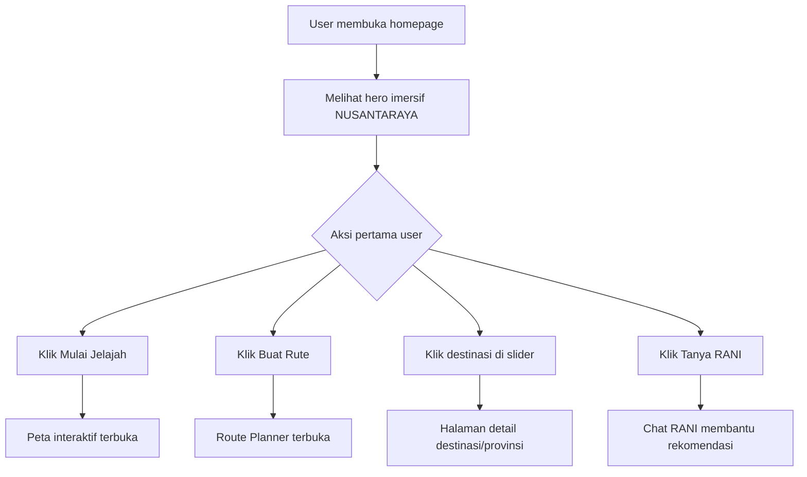

# Planning Lengkap Hero Section NUSANTARAYA

<aside>
🗺️

Dokumen ini merangkum rencana lengkap Hero Section homepage **NUSANTARAYA** dengan menggabungkan dua pendekatan utama: efek visual imersif/parallax ala Red Bull Tenerife dan navigasi destinasi pariwisata ala Wonderful Indonesia.

</aside>

## 1. Tujuan Hero Section

Hero Section NUSANTARAYA harus menjadi **first impression** yang langsung menunjukkan bahwa website ini bukan sekadar katalog wisata, tetapi sebuah pengalaman eksplorasi budaya dan destinasi Indonesia yang terasa sinematik, modern, dan interaktif.

### Target utama

| Aspek | Target Desain |
| --- | --- |
| Kesan pertama | Megah, imersif, premium, dan kompetitif untuk lomba |
| Identitas visual | Nusantara, budaya, eksplorasi, digital twin, peta interaktif |
| Interaksi awal | User langsung paham bahwa mereka bisa menjelajah destinasi, membuat rute, dan bertanya ke AI RANI |
| Referensi visual | Parallax-depth dari Red Bull + navigasi wisata dari Wonderful Indonesia |
| Kinerja teknis | LCP cepat, animasi halus, tetap responsif di desktop dan mobile |

---

## 2. Referensi Utama

### A. Red Bull Tenerife — “Adventure Island”

Referensi: [Red Bull Tenerife Adventure Outdoor Sports Guide](https://www.redbull.com/gb-en/theredbulletin/tenerife-adventure-outdoor-sports-guide)

Elemen yang diambil:

- **Massive typography**: teks raksasa sebagai elemen visual dominan.
- **Depth effect**: sebagian huruf tertutup elemen foreground sehingga terasa 3D.
- **Hero cinematic**: gambar lanskap menjadi panggung utama.
- **Mood adventure**: membuat user merasa “masuk” ke dalam dunia destinasi.

Yang tidak perlu ditiru mentah-mentah:

- Branding terlalu ekstrem/adventure-sports.
- Tipografi yang terlalu “kasar” jika tidak cocok dengan nuansa heritage Indonesia.
- Layout yang terlalu editorial jika mengurangi fungsi navigasi.

### B. Wonderful Indonesia — Homepage Tourism Navigation

Referensi: [Indonesia Travel](https://www.indonesia.travel/id/id)

Elemen yang diambil:

- **Top navigation** yang jelas.
- **Destination carousel** di bagian bawah hero.
- **Language toggle** ID/EN.
- **AI assistant/floating help button** seperti MaiA.
- **Fokus destinasi aktif** seperti Labuan Bajo dengan indikator slider.

Yang perlu dikembangkan ulang:

- Visual harus lebih modern dan khas NUSANTARAYA.
- Carousel tidak hanya menjadi dekorasi, tetapi pintu masuk ke 8 Provinsi Flagship.
- AI assistant perlu diberi identitas sendiri: **RANI**.

---

## 3. Konsep Gabungan Hero Section

### Nama konsep

**“Immersive Nusantara Gateway”**

### Ide utama

Hero Section akan menampilkan lanskap Indonesia yang megah, teks raksasa **NUSANTARAYA**, dan foreground mask berupa elemen budaya/alam yang menutupi sebagian huruf. Di atasnya terdapat navigasi modern, CTA, carousel destinasi, dan tombol AI RANI.

### Narasi visual

User membuka homepage dan langsung melihat:

1. Latar pemandangan Indonesia yang luas.
2. Teks besar **NUSANTARAYA** sebagai identitas utama.
3. Elemen foreground seperti **Kapal Pinisi / gapura candi / siluet rumah adat / tebing karang** yang menembus area teks.
4. Tagline singkat: **“Satu Peta, Ribuan Cerita.”**
5. CTA untuk mulai menjelajah atau membuat rute.
6. Slider destinasi untuk memilih provinsi/destinasi unggulan.
7. Tombol **Tanya RANI ✨** di kanan bawah.

---

## 4. Struktur Visual Hero Section

## 4.1 Layering Strategy

Hero Section dibagi menjadi 4 layer utama.

| Layer | Z-Index | Nama | Fungsi |
| --- | --- | --- | --- |
| --- | ---: | --- | --- |
| Layer 0 | 0 | Background | Lanskap utama, video, atau gambar panorama |
| Layer 1 | 10 | Massive Typography | Teks besar “NUSANTARAYA” |
| Layer 2 | 20 | Foreground Mask | Objek budaya/alam yang menutupi sebagian teks |
| Layer 3 | 30–40 | User Interface | Navbar, CTA, carousel, AI button |

### Layer 0 — Background

Isi:

- Gambar/video pemandangan luas.
- Contoh aset:
    - Laut dan kapal Pinisi.
    - Gunung dan lautan awan.
    - Candi dengan sunrise.
    - Sawah terasering.
    - Pantai dan tebing karang.

Style:

- `position: absolute`
- `inset: 0`
- `z-index: 0`
- `object-cover`
- Gradient overlay:
    - atas: gelap untuk navbar
    - tengah: transparan
    - bawah: gelap untuk carousel

Rekomendasi warna overlay:

```css
background: linear-gradient(
  to bottom,
  rgba(13, 27, 42, 0.65) 0%,
  rgba(13, 27, 42, 0.15) 45%,
  rgba(13, 27, 42, 0.90) 100%
);
```

### Layer 1 — Massive Typography

Isi:

- Teks utama: **NUSANTARAYA**
- Posisi: tengah hero, sedikit di atas center agar CTA bisa berada di bawahnya.

Style:

- Font: `Clash Display`, `Satoshi Black`, `Montserrat Black`, atau `Neue Haas Grotesk Display`
- Ukuran desktop: `text-[12vw]` sampai `text-[15vw]`
- Ukuran mobile: pecah menjadi dua baris atau diperkecil
- Warna:
    - Putih gading: `#F0EAD9`
    - Emas: `#C9A84C`
    - Alternatif: gradient putih → emas

Rekomendasi:

```
Desktop:
NUSANTARAYA

Mobile:
NUSAN
TARAYA
```

### Layer 2 — Foreground Mask

Isi:

- PNG transparan dari objek utama.
- Objek ini harus menutupi sebagian huruf agar efek depth terasa.

Kandidat foreground mask:

| Opsi | Kesan | Cocok untuk |
| --- | --- | --- |
| Kapal Pinisi | Maritim, eksplorasi, Nusantara | Hero utama paling kuat |
| Gapura Candi | Heritage, sejarah, budaya | Mode budaya/sejarah |
| Rumah Gadang | Identitas arsitektur daerah | Segment budaya |
| Siluet penjelajah | Adventure, personal journey | Mode eksplorasi |
| Lautan awan/gunung | Sinematik, luas, spiritual | Hero alam |
| Tebing karang | Dramatis, kuat, adventure | Hero outdoor |

**Rekomendasi utama:** gunakan **Kapal Pinisi** sebagai foreground mask utama karena sangat kuat secara identitas maritim Indonesia dan mudah dikaitkan dengan perjalanan antar-pulau.

Style penting:

```css
pointer-events: none;
user-select: none;
```

Agar layer foreground tidak menghalangi tombol, slider, atau navbar.

### Layer 3 — UI Layer

Isi:

- Header navigation.
- Tagline.
- CTA.
- Destination carousel.
- AI RANI floating button.

Z-index:

- Navbar dan CTA: `z-30`
- Tombol RANI: `z-40`

---

## 5. Layout Hero Section

## 5.1 Struktur Desktop

```
┌─────────────────────────────────────────────────────────────┐
│ Logo NUSANTARAYA        Peta Arsip Rute Cerita      ID/EN   │
│                                                             │
│                                                             │
│                  NUSANTARAYA                                │
│          [Foreground mask menutup sebagian huruf]            │
│                                                             │
│              Satu Peta, Ribuan Cerita                       │
│              [Mulai Jelajah] [Buat Rute]                    │
│                                                             │
│  ←  Sumbar   Borobudur   Bali   Labuan Bajo   Papua  →      │
│                                                 Tanya RANI ✨ │
└─────────────────────────────────────────────────────────────┘
```

## 5.2 Struktur Mobile

```
┌───────────────────────┐
│ Logo           Menu   │
│                       │
│       NUSAN           │
│       TARAYA          │
│   [Foreground mask]   │
│                       │
│ Satu Peta, Ribuan     │
│ Cerita                │
│ [Mulai Jelajah]       │
│ [Buat Rute]           │
│                       │
│ Labuan Bajo       →   │
│ Tanya RANI ✨         │
└───────────────────────┘
```

### Prinsip mobile

- Navbar berubah menjadi hamburger menu.
- Teks NUSANTARAYA bisa dibagi 2 baris.
- Carousel hanya menampilkan 1 destinasi aktif + tombol next.
- CTA ditumpuk vertikal.
- Foreground mask harus diposisikan ulang agar tidak menutupi CTA.

---

## 6. Komponen UI yang Dibutuhkan

## 6.1 Header Navigation

### Isi navbar

| Area | Elemen |
| --- | --- |
| Kiri | Logo NUSANTARAYA |
| Tengah | Peta, Arsip Budaya, Route Planner, Cerita Rakyat |
| Kanan | Toggle ID/EN, tombol menu, ikon pencarian opsional |

### Style

- Glassmorphism:
    - `bg-white/8`
    - `backdrop-blur-md`
    - `border-white/10`
- Radius:
    - Desktop: `rounded-full`
    - Mobile: `rounded-2xl`
- Posisi:
    - `absolute top-6 left-1/2 -translate-x-1/2`
    - Width: `max-w-6xl`

### Microinteraction

- Link hover: garis bawah emas.
- Toggle ID/EN: pill kecil.
- Navbar muncul dengan `fade-down` saat load.

---

## 6.2 Center Content

### Elemen

- Eyebrow kecil:
    - `Digital Twin Pariwisata Nusantara`
- Tagline:
    - **Satu Peta, Ribuan Cerita**
- Deskripsi singkat:
    - “Jelajahi warisan budaya, rute wisata, dan cerita lokal Indonesia melalui pengalaman visual interaktif.”
- CTA:
    - Primary: **Mulai Jelajah**
    - Secondary: **Buat Rute**

### Hierarki teks

| Elemen | Ukuran | Warna |
| --- | --- | --- |
| --- | ---: | --- |
| Eyebrow | 12–14 px | `#C9A84C` |
| Tagline | 32–56 px | `#F0EAD9` |
| Deskripsi | 14–18 px | `#F0EAD9CC` |
| CTA | 14–16 px | putih/emas |

---

## 6.3 Destination Slider

### Fungsi

Slider menjadi pintu masuk menuju **8 Provinsi Flagship** atau destinasi unggulan.

### Struktur data contoh

```tsx
const destinations = [
  {
    id: "sumbar",
    province: "Sumatera Barat",
    label: "Rumah Gadang",
    asset: "/hero/sumbar.webp",
    mask: "/hero/mask-rumah-gadang.png",
  },
  {
    id: "jateng-diy",
    province: "Jawa Tengah & DIY",
    label: "Borobudur",
    asset: "/hero/borobudur.webp",
    mask: "/hero/mask-candi.png",
  },
  {
    id: "bali",
    province: "Bali",
    label: "Subak & Pura",
    asset: "/hero/bali.webp",
    mask: "/hero/mask-pura.png",
  },
  {
    id: "ntt",
    province: "Nusa Tenggara Timur",
    label: "Labuan Bajo",
    asset: "/hero/labuan-bajo.webp",
    mask: "/hero/mask-pinisi.png",
  },
  {
    id: "maluku",
    province: "Maluku",
    label: "Rempah & Laut",
    asset: "/hero/maluku.webp",
    mask: "/hero/mask-rempah-laut.png",
  },
  {
    id: "papua-barat",
    province: "Papua Barat",
    label: "Raja Ampat",
    asset: "/hero/raja-ampat.webp",
    mask: "/hero/mask-karang.png",
  },
  {
    id: "kalimantan-timur",
    province: "Kalimantan Timur",
    label: "Ibu Kota Nusantara",
    asset: "/hero/ikn.webp",
    mask: "/hero/mask-hutan.png",
  },
  {
    id: "sulawesi-selatan",
    province: "Sulawesi Selatan",
    label: "Pinisi",
    asset: "/hero/pinisi.webp",
    mask: "/hero/mask-pinisi.png",
  },
];
```

<aside>
⚠️

Daftar di atas bisa disesuaikan dengan 8 Provinsi Flagship final dari PRD NUSANTARAYA. Struktur teknisnya tetap sama.

</aside>

### Tampilan slider

State aktif:

- Opacity: `100%`
- Font: `font-semibold`
- Ada garis indikator emas
- Background hero berubah sesuai destinasi
- Foreground mask ikut berubah

State tidak aktif:

- Opacity: `40–60%`
- Ukuran lebih kecil
- Tidak ada garis indikator

### Interaksi slider

- Panah kiri/kanan.
- Klik nama destinasi.
- Auto-slide opsional setiap 6–8 detik.
- Pause auto-slide saat user hover.
- Transition:
    - Background: `crossfade`
    - Text: `slide-up`
    - Mask: `slight parallax`

---

## 6.4 Floating AI RANI Button

### Fungsi

Tombol ini menunjukkan bahwa NUSANTARAYA bukan website statis, tetapi memiliki asisten eksplorasi.

### Label

**Tanya RANI ✨**

Alternatif:

- **RANI Guide ✨**
- **Tanya RANI**
- **RANI siap bantu**

### Posisi

- Desktop: kanan bawah
- Mobile: fixed bawah kanan atau menjadi bottom sheet trigger

### Style

- Background: `#0D1B2A`
- Border: `#C9A84C`
- Text: `#F0EAD9`
- Glow halus:

```css
box-shadow: 0 0 24px rgba(201, 168, 76, 0.35);
```

### Animasi

- Pulse sangat halus.
- Jangan terlalu cepat agar tidak mengganggu.
- Durasi ideal: 2.5–3.5 detik.

---

## 7. Sistem Warna

| Nama | Hex | Fungsi |
| --- | --- | --- |
| Deep Navy | `#0D1B2A` | Background gelap, overlay, AI button |
| Nusantara Gold | `#C9A84C` | CTA, indikator slider, aksen premium |
| Ivory Sand | `#F0EAD9` | Teks utama |
| Forest Green | `#2F5D50` | Aksen alam |
| Terracotta | `#B85C38` | Aksen budaya |
| Sky Mist | `#A9C8D8` | Nuansa langit/air |

### Rekomendasi kombinasi

- Hero dominan: Deep Navy + Ivory Sand.
- Aksen interaktif: Nusantara Gold.
- Destinasi alam: Forest Green / Sky Mist.
- Destinasi budaya: Terracotta / Gold.

---

## 8. Sistem Tipografi

## 8.1 Massive Typography

Rekomendasi font:

- `Clash Display`
- `Montserrat Black`
- `Satoshi Black`
- `Neue Haas Grotesk Display`
- `Archivo Black`

Style:

- `font-black`
- `tracking-[-0.08em]`
- uppercase
- bisa diberi texture/noise halus agar tidak terlalu polos

## 8.2 Tagline dan Narasi

Rekomendasi font:

- `Playfair Display`
- `Cormorant Garamond`
- `Lora`
- `Merriweather`

Fungsi:

- Memberi rasa heritage dan elegan.

## 8.3 UI dan Navigation

Rekomendasi font:

- `Inter`
- `Satoshi`
- `Plus Jakarta Sans`

Fungsi:

- Modern, mudah dibaca, cocok untuk tombol dan menu.

---

## 9. Motion & Interaction Plan

## 9.1 Saat halaman pertama kali load

Urutan animasi:

1. Background muncul dengan fade halus.
2. Massive text muncul dari opacity 0 → 1.
3. Foreground mask masuk sedikit dari bawah.
4. Navbar fade-down.
5. Tagline dan CTA fade-up.
6. Slider muncul terakhir.

Durasi:

| Elemen | Durasi |
| --- | --- |
| --- | ---: |
| Background | 700 ms |
| Massive text | 900 ms |
| Foreground mask | 1000 ms |
| Navbar | 600 ms |
| CTA | 700 ms |
| Slider | 700 ms |

## 9.2 Saat scroll

Efek parallax:

| Elemen | Gerakan |
| --- | --- |
| Background | bergerak paling lambat |
| Massive text | bergerak turun lebih cepat |
| Foreground mask | bergerak sedang |
| UI | fade out perlahan setelah 20–30% scroll |

Contoh logika:

```tsx
const textParallax = useTransform(scrollY, [0, 500], [0, 180]);
const maskParallax = useTransform(scrollY, [0, 500], [0, 60]);
const bgParallax = useTransform(scrollY, [0, 500], [0, 30]);
const uiOpacity = useTransform(scrollY, [0, 300], [1, 0]);
```

## 9.3 Saat user mengganti destinasi

Animasi:

- Background crossfade.
- Mask bergerak sedikit ke atas.
- Nama destinasi aktif berubah dengan slide/fade.
- Warna aksen dapat berubah tipis sesuai destinasi.

---

## 10. Rekomendasi Foreground Mask

## Pilihan utama: Kapal Pinisi

Alasan:

- Sangat identik dengan eksplorasi antarpulau.
- Cocok dengan narasi Nusantara.
- Bentuk layar kapal bisa menutupi huruf dengan dramatis.
- Relevan dengan referensi Wonderful Indonesia yang menampilkan Labuan Bajo/kapal.
- Bisa menjadi simbol “gerbang perjalanan” di homepage.

### Komposisi visual yang disarankan

```
Background:
Laut luas + pulau/gunung di kejauhan + langit cerah/senja.

Massive text:
NUSANTARAYA di tengah.

Foreground:
Kapal Pinisi di bawah tengah/kanan, layar kapal menabrak huruf A/R/Y.

UI:
Tagline dan CTA di tengah bawah, slider di paling bawah.
```

## Alternatif mask per mode

| Mode | Foreground Mask | Mood |
| --- | --- | --- |
| Hero utama | Kapal Pinisi | Eksplorasi, maritim, nasional |
| Budaya | Gapura candi / Rumah Gadang | Heritage |
| Alam | Tebing karang / gunung | Adventure |
| Sejarah | Relief candi / arca | Edukatif |
| Rute | Siluet penjelajah | Personal journey |

---

## 11. Asset Production Plan

## 11.1 Kebutuhan aset

| Aset | Format | Ukuran ideal | Catatan |
| --- | --- | --- | --- |
| --- | --- | ---: | --- |
| Background desktop | `.webp` / `.avif` | 2560×1440 atau 3840×2160 | Kompresi tinggi |
| Background mobile | `.webp` / `.avif` | 1080×1920 | Crop khusus mobile |
| Foreground mask | `.png` / `.webp alpha` | mengikuti background | Transparan rapi |
| Noise texture | `.webp` kecil | 512×512 | Opsional |
| Logo | `.svg` | scalable | Harus tajam |
| Icon RANI | `.svg` / `.lottie` | kecil | Opsional |

## 11.2 Proses masking

Langkah:

1. Pilih gambar utama dengan komposisi kuat.
2. Duplikat gambar.
3. Pisahkan objek foreground dari background.
4. Rapikan edge dengan feather 0.5–1 px.
5. Pastikan ukuran foreground mask sama dengan background.
6. Export:
    - background: `.webp` atau `.avif`
    - foreground: `.png` transparan atau `.webp` dengan alpha
7. Test di resolusi:
    - 1440×900
    - 1366×768
    - 1920×1080
    - 390×844
    - 430×932

## 11.3 Checklist kualitas aset

- [ ]  Tidak blur di desktop.
- [ ]  Tidak terlalu berat.
- [ ]  Foreground mask presisi menutup teks.
- [ ]  Tidak menutupi CTA.
- [ ]  Aman untuk mobile crop.
- [ ]  Kontras teks tetap terbaca.
- [ ]  Ada versi fallback jika video/gambar gagal load.

---

## 12. Rencana Implementasi Next.js + Tailwind + Framer Motion

## 12.1 Struktur folder

```
src/
├─ app/
│  ├─ page.tsx
│  └─ layout.tsx
├─ components/
│  ├─ hero/
│  │  ├─ HeroNusantaraya.tsx
│  │  ├─ HeroNavbar.tsx
│  │  ├─ HeroDestinationSlider.tsx
│  │  ├─ HeroRaniButton.tsx
│  │  └─ heroData.ts
├─ public/
│  ├─ hero/
│  │  ├─ labuan-bajo-bg.webp
│  │  ├─ labuan-bajo-mask.png
│  │  ├─ borobudur-bg.webp
│  │  ├─ borobudur-mask.png
│  │  └─ ...
```

## 12.2 Komponen utama

```tsx
"use client";

import { motion, useScroll, useTransform } from "framer-motion";
import { useMemo, useState } from "react";
import { destinations } from "./heroData";
import HeroNavbar from "./HeroNavbar";
import HeroDestinationSlider from "./HeroDestinationSlider";
import HeroRaniButton from "./HeroRaniButton";

export default function HeroNusantaraya() {
  const [activeIndex, setActiveIndex] = useState(0);
  const activeDestination = destinations[activeIndex];

  const { scrollY } = useScroll();

  const bgY = useTransform(scrollY, [0, 500], [0, 30]);
  const textY = useTransform(scrollY, [0, 500], [0, 180]);
  const maskY = useTransform(scrollY, [0, 500], [0, 60]);
  const uiOpacity = useTransform(scrollY, [0, 320], [1, 0]);

  const nextDestination = () => {
    setActiveIndex((current) => (current + 1) % destinations.length);
  };

  const previousDestination = () => {
    setActiveIndex((current) =>
      current === 0 ? destinations.length - 1 : current - 1
    );
  };

  return (
    <section className="relative h-screen min-h-[720px] w-full overflow-hidden bg-[#0D1B2A] text-[#F0EAD9]">
      <HeroNavbar />

      {/* Layer 0: Background */}
      <motion.div style= y: bgY  className="absolute inset-0 z-0">
        
        <div className="absolute inset-0 bg-gradient-to-b from-[#0D1B2A]/70 via-[#0D1B2A]/10 to-[#0D1B2A]/95" />
      </motion.div>

      {/* Layer 1: Massive Typography */}
      <motion.div
        style= y: textY 
        className="pointer-events-none absolute inset-0 z-10 flex items-center justify-center"
      >
        <h1 className="select-none text-center text-[13vw] font-black uppercase leading-none tracking-[-0.08em] text-[#F0EAD9]/90 md:whitespace-nowrap">
          <span className="block md:inline">NUSAN</span>
          <span className="block md:inline">TARAYA</span>
        </h1>
      </motion.div>

      {/* Layer 2: Foreground Mask */}
      <motion.div
        style= y: maskY 
        className="pointer-events-none absolute inset-0 z-20"
      >
        
      </motion.div>

      {/* Layer 3: Center UI */}
      <motion.div
        style= opacity: uiOpacity 
        className="absolute inset-0 z-30 flex flex-col items-center justify-end px-6 pb-36 text-center md:pb-40"
      >
        <p className="mb-3 text-xs font-semibold uppercase tracking-[0.35em] text-[#C9A84C]">
          Digital Twin Pariwisata Nusantara
        </p>

        <h2 className="max-w-4xl font-serif text-4xl font-semibold leading-tight md:text-6xl">
          Satu Peta, Ribuan Cerita
        </h2>

        <p className="mt-4 max-w-2xl text-sm leading-7 text-[#F0EAD9]/80 md:text-base">
          Jelajahi destinasi, warisan budaya, dan rute perjalanan Indonesia
          melalui pengalaman visual interaktif berbasis peta.
        </p>

        <div className="mt-8 flex flex-col gap-3 sm:flex-row">
          <a
            href="#explore"
            className="rounded-full bg-[#C9A84C] px-7 py-3 text-sm font-semibold text-[#0D1B2A] transition hover:scale-105 hover:bg-[#E0BF63]"
          >
            Mulai Jelajah
          </a>

          <a
            href="#route-planner"
            className="rounded-full border border-[#F0EAD9]/40 bg-white/10 px-7 py-3 text-sm font-semibold text-[#F0EAD9] backdrop-blur-md transition hover:scale-105 hover:border-[#C9A84C]"
          >
            Buat Rute
          </a>
        </div>
      </motion.div>

      <HeroDestinationSlider
        destinations={destinations}
        activeIndex={activeIndex}
        onSelect={setActiveIndex}
        onNext={nextDestination}
        onPrevious={previousDestination}
      />

      <HeroRaniButton />
    </section>
  );
}
```

## 12.3 Contoh data destinasi

```tsx
export const destinations = [
  {
    id: "labuan-bajo",
    province: "Nusa Tenggara Timur",
    title: "Labuan Bajo",
    shortLabel: "NTT",
    background: "/hero/labuan-bajo-bg.webp",
    mask: "/hero/labuan-bajo-mask.png",
    alt: "Pemandangan laut Labuan Bajo dengan kapal Pinisi",
  },
  {
    id: "borobudur",
    province: "Jawa Tengah",
    title: "Borobudur",
    shortLabel: "Jateng",
    background: "/hero/borobudur-bg.webp",
    mask: "/hero/borobudur-mask.png",
    alt: "Candi Borobudur saat matahari terbit",
  },
  {
    id: "raja-ampat",
    province: "Papua Barat",
    title: "Raja Ampat",
    shortLabel: "Papua Barat",
    background: "/hero/raja-ampat-bg.webp",
    mask: "/hero/raja-ampat-mask.png",
    alt: "Pulau karang Raja Ampat dari ketinggian",
  },
];
```

## 12.4 Destination Slider Component

```tsx
type Destination = {
  id: string;
  province: string;
  title: string;
  shortLabel: string;
};

type HeroDestinationSliderProps = {
  destinations: Destination[];
  activeIndex: number;
  onSelect: (index: number) => void;
  onNext: () => void;
  onPrevious: () => void;
};

export default function HeroDestinationSlider({
  destinations,
  activeIndex,
  onSelect,
  onNext,
  onPrevious,
}: HeroDestinationSliderProps) {
  return (
    <div className="absolute bottom-8 left-0 z-40 w-full px-6 md:px-12">
      <div className="mx-auto flex max-w-6xl items-end justify-between gap-6">
        <button
          onClick={onPrevious}
          className="grid h-11 w-11 place-items-center rounded-full bg-white/10 text-white backdrop-blur-md transition hover:bg-white/20"
          aria-label="Destinasi sebelumnya"
        >
          ←
        </button>

        <div className="hidden flex-1 items-end justify-center gap-8 md:flex">
          {destinations.map((destination, index) => {
            const isActive = index === activeIndex;

            return (
              <button
                key={destination.id}
                onClick={() => onSelect(index)}
                className={`group relative min-w-24 text-center transition ${
                  isActive ? "opacity-100" : "opacity-45 hover:opacity-80"
                }`}
              >
                <span className="block text-xs uppercase tracking-[0.2em] text-[#F0EAD9]/60">
                  {destination.shortLabel}
                </span>
                <span
                  className={`mt-1 block text-sm ${
                    isActive
                      ? "font-bold text-[#F0EAD9]"
                      : "font-medium text-[#F0EAD9]/70"
                  }`}
                >
                  {destination.title}
                </span>

                {isActive && (
                  <span className="absolute -top-3 left-1/2 h-[2px] w-14 -translate-x-1/2 rounded-full bg-[#C9A84C]" />
                )}
              </button>
            );
          })}
        </div>

        <div className="flex-1 text-center md:hidden">
          <p className="text-xs uppercase tracking-[0.25em] text-[#C9A84C]">
            {destinations[activeIndex].province}
          </p>
          <p className="mt-1 text-xl font-bold text-[#F0EAD9]">
            {destinations[activeIndex].title}
          </p>
        </div>

        <button
          onClick={onNext}
          className="grid h-11 w-11 place-items-center rounded-full bg-white/10 text-white backdrop-blur-md transition hover:bg-white/20"
          aria-label="Destinasi berikutnya"
        >
          →
        </button>
      </div>
    </div>
  );
}
```

---

## 13. Performance Plan

## 13.1 Target performa

| Metrik | Target |
| --- | --- |
| --- | ---: |
| LCP | < 2.5 detik |
| CLS | < 0.1 |
| INP | < 200 ms |
| Hero image size | ideal < 300–500 KB per gambar desktop |
| Mask image size | ideal < 500 KB |

## 13.2 Optimasi gambar

- Gunakan `.avif` untuk background jika memungkinkan.
- Gunakan `.webp` sebagai fallback.
- Preload background pertama.
- Jangan preload semua gambar carousel sekaligus.
- Lazy-load gambar destinasi non-aktif.
- Siapkan versi mobile crop.
- Gunakan `priority` jika memakai `next/image`.

Contoh preload di Next.js:

```tsx
import Head from "next/head";

export default function Page() {
  return (
    <>
      <Head>
        <link
          rel="preload"
          as="image"
          href="/hero/labuan-bajo-bg.webp"
        />
        <link
          rel="preload"
          as="image"
          href="/hero/labuan-bajo-mask.png"
        />
      </Head>

      <HeroNusantaraya />
    </>
  );
}
```

## 13.3 Optimasi animasi

- Gunakan transform: `translate`, `scale`, `opacity`.
- Hindari animasi `width`, `height`, `top`, `left`.
- Batasi blur besar pada mobile.
- Matikan animasi kompleks jika user mengaktifkan `prefers-reduced-motion`.

```css
@media (prefers-reduced-motion: reduce) {
  * {
    animation-duration: 0.001ms !important;
    animation-iteration-count: 1 !important;
    scroll-behavior: auto !important;
  }
}
```

---

## 14. Accessibility Plan

Checklist:

- [ ]  Semua tombol punya label jelas.
- [ ]  Slider bisa dipakai dengan keyboard.
- [ ]  Tombol previous/next punya `aria-label`.
- [ ]  Foreground mask diberi `aria-hidden="true"`.
- [ ]  Kontras teks minimal cukup di atas background.
- [ ]  CTA tidak hanya bergantung pada warna.
- [ ]  Motion bisa dikurangi untuk pengguna sensitif animasi.
- [ ]  Bahasa ID/EN diatur dengan benar.
- [ ]  Gambar background punya alt jika informatif; jika dekoratif bisa dibuat kosong.

---

## 15. Responsive Behavior

## Desktop ≥ 1024 px

- Massive text satu baris.
- Navbar lengkap.
- Slider menampilkan semua destinasi.
- RANI di kanan bawah.
- Foreground mask besar dan dramatis.

## Tablet 768–1023 px

- Massive text bisa tetap satu baris tetapi lebih kecil.
- Navbar ringkas.
- Slider menampilkan 4–5 destinasi.
- CTA tetap berdampingan jika ruang cukup.

## Mobile < 768 px

- Massive text dua baris.
- Navbar menjadi logo + menu.
- Slider hanya menampilkan destinasi aktif.
- CTA vertikal.
- Foreground mask diposisikan agar tidak menutup tombol.
- RANI bisa menjadi floating button kecil.

---

## 16. Content & Copywriting

## 16.1 Hero copy final

### Opsi utama

Eyebrow:

```
Digital Twin Pariwisata Nusantara
```

Headline:

```
Satu Peta, Ribuan Cerita
```

Description:

```
Jelajahi destinasi, warisan budaya, dan rute perjalanan Indonesia melalui pengalaman visual interaktif berbasis peta.
```

CTA:

```
Mulai Jelajah
Buat Rute
```

AI Button:

```
Tanya RANI ✨
```

## 16.2 Alternatif headline

| Opsi | Kesan |
| --- | --- |
| Satu Peta, Ribuan Cerita | Paling kuat dan mudah diingat |
| Jelajahi Nusantara dari Satu Layar | Lebih digital |
| Menyusuri Cerita di Balik Setiap Destinasi | Lebih naratif |
| Peta Hidup Warisan Indonesia | Lebih konseptual |
| Dari Pulau ke Pulau, Dari Cerita ke Cerita | Lebih puitis |

---

## 17. User Journey dari Hero



---

## 18. Roadmap Eksekusi

## Phase 1 — Foundation

- [ ]  Finalisasi 8 Provinsi Flagship.
- [ ]  Tentukan foreground mask utama.
- [ ]  Tentukan palet warna final.
- [ ]  Tentukan font final.
- [ ]  Buat wireframe desktop dan mobile.

Output:

- Wireframe Figma.
- Struktur komponen.
- Daftar aset.

## Phase 2 — Asset Production

- [ ]  Kumpulkan gambar 4K.
- [ ]  Buat background desktop/mobile.
- [ ]  Buat foreground mask transparan.
- [ ]  Export `.webp` / `.avif`.
- [ ]  Test komposisi layer di Figma.

Output:

- Folder aset hero siap implementasi.
- Preview desktop dan mobile.

## Phase 3 — Development

- [ ]  Buat `HeroNusantaraya.tsx`.
- [ ]  Buat `HeroNavbar.tsx`.
- [ ]  Buat `HeroDestinationSlider.tsx`.
- [ ]  Buat `HeroRaniButton.tsx`.
- [ ]  Implementasi parallax Framer Motion.
- [ ]  Implementasi state aktif destinasi.

Output:

- Hero section berjalan di homepage.

## Phase 4 — Optimization

- [ ]  Preload gambar pertama.
- [ ]  Lazy-load destinasi lain.
- [ ]  Test Lighthouse.
- [ ]  Kurangi ukuran aset.
- [ ]  Tambahkan `prefers-reduced-motion`.

Output:

- Hero cepat, stabil, dan responsif.

## Phase 5 — Polishing

- [ ]  Tambahkan microinteraction hover.
- [ ]  Perbaiki spacing mobile.
- [ ]  Tambahkan transisi slider.
- [ ]  Test di berbagai resolusi.
- [ ]  Review final untuk lomba.

Output:

- Hero section siap demo.

---

## 19. Checklist Final Sebelum Presentasi

## Visual

- [ ]  Hero terlihat megah dalam 3 detik pertama.
- [ ]  Teks NUSANTARAYA terbaca.
- [ ]  Foreground mask benar-benar memberi efek depth.
- [ ]  Navbar tidak mengganggu visual.
- [ ]  CTA mudah ditemukan.
- [ ]  Slider destinasi terlihat seperti fitur, bukan dekorasi.

## Teknis

- [ ]  Tidak ada layout shift.
- [ ]  Gambar tidak pecah.
- [ ]  Animasi tidak patah-patah.
- [ ]  Mobile nyaman digunakan.
- [ ]  Button dan slider bisa diklik.
- [ ]  `pointer-events: none` sudah diterapkan pada mask.

## Narasi lomba

- [ ]  Bisa menjelaskan bahwa hero menggabungkan parallax storytelling dan tourism navigation.
- [ ]  Bisa menjelaskan fungsi RANI sebagai AI guide.
- [ ]  Bisa menjelaskan bahwa slider menghubungkan user ke 8 Provinsi Flagship.
- [ ]  Bisa menjelaskan optimasi performa dan aksesibilitas.
- [ ]  Bisa menunjukkan bahwa desain bukan hanya cantik, tetapi mendukung user journey.

---

## 20. Keputusan Desain yang Direkomendasikan

| Elemen | Keputusan |
| --- | --- |
| Foreground mask utama | Kapal Pinisi |
| Background utama | Laut/pulau Indonesia dengan depth kuat |
| Massive text | NUSANTARAYA |
| Tagline | Satu Peta, Ribuan Cerita |
| CTA utama | Mulai Jelajah |
| CTA kedua | Buat Rute |
| AI assistant | Tanya RANI ✨ |
| Warna utama | Deep Navy + Ivory Sand |
| Aksen | Nusantara Gold |
| Slider | 8 Provinsi Flagship |
| Motion utama | Parallax + crossfade destinasi |

---

## 21. Kesimpulan

Hero Section NUSANTARAYA sebaiknya dibangun sebagai **gerbang eksplorasi Nusantara**: visualnya sinematik seperti Red Bull Tenerife, tetapi fungsional dan informatif seperti Wonderful Indonesia. Kombinasi **massive typography**, **foreground mask**, **destination slider**, **CTA eksplorasi**, dan **AI RANI** akan menghasilkan hero yang kuat untuk kebutuhan lomba karena memenuhi tiga aspek sekaligus:

1. **Wow factor visual** melalui efek depth dan parallax.
2. **Kejelasan fungsi** melalui navbar, CTA, dan slider.
3. **Nilai inovasi** melalui integrasi AI RANI dan konsep digital twin pariwisata.

<aside>
✅

Rekomendasi final: mulai dengan hero bertema **Kapal Pinisi + Laut Nusantara** sebagai visual utama, lalu gunakan destination slider untuk mengubah background/mask sesuai provinsi atau destinasi flagship.

</aside>